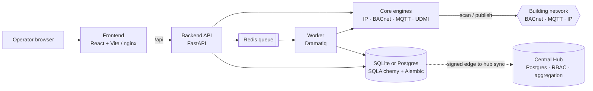

# Smart Commissioning App

> Commissioning and verification platform for smart-building Master Systems Integrators (MSIs) —
> configure a site, discover its devices, validate UDMI/BACnet/MQTT data against what was
> specified, and export signed commissioning evidence.


-orange)


Branded **ELECTRACOM "Smart Commissioning Tool"**, this is the web platform our engineers use to
commission smart buildings: bring up a project's network/BACnet/MQTT/certificate settings, import
the expected register, scan the live building network, confirm every device is publishing
UDMI-compliant data that matches the design, and hand the client a tamper-evident evidence pack.

> 🆕 **New to the project?** Start with **[docs/what-is-this.md](docs/what-is-this.md)** — a
> one-page plain-English explanation of what the app is, what it does, and how to explain it to an
> engineer (both the human "why" and the technical "how").

> 👀 **Here to review the app?** Read **[docs/review-guide.md](docs/review-guide.md)** — how to run
> it (frontend-only or full-stack Docker), what to look at, and what is in scope for this round.

> ⬇️ **On Windows and just want to run it?** Download the prebuilt app from the
> **[latest release](https://github.com/Rvs006/smart-commissioning-app/releases/latest)**
> (`SmartCommissioningApp_Windows_Portable.zip`) — unzip, double-click
> `SmartCommissioningApp.exe`, open <http://127.0.0.1:8000/>. No install, no Docker, no key.

---

## What it does

Commissioning a smart building means proving that hundreds of field devices were installed,
addressed, and configured to match the design — and producing evidence of it. This tool turns that
manual, error-prone checklist into a repeatable five-stage workflow:

| Stage | What happens | Pages |
| --- | --- | --- |
| **1. Configure** | Capture the site's network, BACnet, MQTT broker (with TLS certs), time/NTP and backup settings. Export/import per-project config so the same engineer can jump between projects. | Configuration |
| **2. Import** | Upload the *expected* register (CSV/XLSX) — the devices and points the design says should exist. Every module ships a downloadable template. Registers are flexible: asset ID *or* name, optional Notes/payload-type, `prefix/#` topic wildcards, multiple points per row, and UDMI metadata columns (make/model/GUID/serial/firmware/site/room). | each module |
| **3. Discover** | Scan the live network: IP sweep, BACnet device/object discovery, and MQTT topic capture (MQTT-Explorer-style wildcard subscription with latest-payload export). The IP sweep honours operator port ranges and flags **forbidden** and **unexpected-open** ports; the MQTT subscribe inherits the configured Root Topic and QoS, and `#` / `prefix/#` filters match the concrete publish topics returned by the broker. | IP Scanner, BACnet Discovery, MQTT Discovery |
| **4. Validate** | Check observed data against the design: UDMI payload validation (pointset / metadata / state, expected-vs-observed) and BACnet ↔ MQTT comparison within tolerances. UDMI validates **every asset in the register in one run** and matches make/model/GUID/serial/firmware/site/room. Result is a clear **Pass / Fail** with reasons. | UDMI Validation, BACnet to MQTT Validation |
| **5. Report** | Export a commissioning evidence pack (XLSX / DOCX / ZIP) scoped to the runs you choose, carrying the actual findings and stamped with an integrity signature. | Reports |

A controlled **MQTT config publish** path (multi-point write + read-back confirm, with rollback)
lets an engineer correct a device's setpoints and prove the change took effect.

### In-app onboarding — Brief & Learning

The console is branded in the **Electracom** theme with a **light/dark toggle** in the header, and
ships two standalone onboarding surfaces (linked from the header, or reachable directly):

- **Product Brief** — `/#/brief` — what the tool is and how it works, in four tabs: Basics, Key
  Features, Section Reference, and a role-based **Guided Tour**.
- **Learning** — `/#/learning` — pick-your-role walkthroughs of the exact modules each role
  (Commissioning Engineer, BMS Designer, Project Manager, Integration Engineer) touches on site.

The module tabs are grouped by workflow stage — **Configure → Discover → Validate → Report →
Operate** — so the navigation mirrors the order of the job rather than presenting a flat row of equal
tabs. Each module page is then organised as a **Setup → Run → Results** step flow (a segmented
control at the top of the page), so an operator works one screen at a time rather than scrolling
every control at once. The step advances automatically as a run is queued and completes.

---

## Architecture

One codebase, three deployment profiles. The core scan/validation logic lives in a shared Python
package (`smart_commissioning_core`) used identically by the API and the background worker, so an
in-request "inline" run and a queued worker run behave the same.



**Deployment profiles** (`DEPLOYMENT_ROLE`):

- **`standalone` / portable** — a single Windows `.exe`, SQLite, jobs run inline, bound to
  `127.0.0.1`, no broker/DB/Redis required. For one engineer on one laptop, including air-gapped OT
  networks. (A commissioning tool *must* run on the site network — central-only can't reach
  air-gapped sites.)
- **`edge`** — the on-site instance that does the live scanning, then pushes signed run bundles to a
  hub (online, or offline via a carried `.scbundle` file).
- **`hub`** — a central, multi-project instance (Postgres, company SSO/RBAC) that ingests edge runs
  fail-closed (trusted-edge allowlist, signature + per-run hash verification, immutable upsert).

---

## Tech stack

| Layer | Tech |
| --- | --- |
| Frontend | React 18, TypeScript, Vite, TanStack Query/Router |
| API | FastAPI (Python 3.12), Pydantic v2 |
| Worker | Dramatiq on Redis |
| Core | `smart_commissioning_core` — engines, UDMI/MQTT logic, persistence |
| Persistence | SQLAlchemy 2 + Alembic — SQLite (local) / PostgreSQL (hosted) |
| Packaging | PyInstaller Windows portable bundle; Docker Compose hosted stack |

---

## Quickstart

> The repository is **private** — your engineer needs to be added as a collaborator
> (GitHub → repo → **Settings → Collaborators**) before they can clone it.

```bash
git clone https://github.com/Rvs006/smart-commissioning-app.git
cd smart-commissioning-app
```

### Option A — Hosted stack (Docker, one command)

Brings up frontend + API + worker + Postgres + Redis. Requires Docker.

`API_KEY` is required in this profile — generate one, then start the stack. **Use the block for your shell** (the `export` form is bash/macOS/Linux only; on Windows PowerShell `export` fails with `'export' is not recognized`):

```bash
# bash / macOS / Linux
export API_KEY=$(openssl rand -hex 32)
docker compose -f infra/docker-compose.yml --env-file infra/.env.example up --build
```

```powershell
# Windows PowerShell
$env:API_KEY = (openssl rand -hex 32)
docker compose -f infra/docker-compose.yml --env-file infra/.env.example up --build
```

Then open **http://127.0.0.1:8080** (nginx serves the UI and proxies `/api` → the API). See
[infra/README.md](infra/README.md) for the full hosted runbook.

### Option B — Local dev profile (no broker / Postgres / Redis)

Single-user loopback profile: SQLite, jobs inline, auth bypassed for `127.0.0.1`. Requires
**Python 3.12** and **Node 22**.

```bash
# 1) install the three editable Python packages + the frontend
pip install -e ./core -e ./backend -e ./worker
cd frontend && npm ci && cd ..

# 2) backend API (terminal 1)
cd backend
AUTH_MODE=local JOB_EXECUTION_MODE=inline DEPLOYMENT_ROLE=hub \
  python -m uvicorn app.main:app --host 127.0.0.1 --port 8000

# 3) seed demo data + frontend (terminal 2)
python scripts/seed_demo.py --base-url http://127.0.0.1:8000
npm --prefix frontend run dev      # http://localhost:5173, proxies /api -> 8000
```

> **Enable the engineer action buttons.** Run / Publish / Export are gated on an API key even in
> local mode. Open the app, press **F12 → Console**, run once:
> `localStorage.setItem('sc.apiKey','local-dev')`, then reload. One-command offline smoke:
> `scripts/smoke_local.ps1 -BaseUrl http://127.0.0.1:8000`.

### Option C — Windows portable bundle

Build a self-contained directory bundle (exe + backend + core + frontend) with
`packaging/windows_portable/build.ps1`; double-click `SmartCommissioningApp.exe`. See
[docs/portable-bundle-rebuild.md](docs/portable-bundle-rebuild.md).

---

## Signing in (API key)

On a **hosted deployment** (Option A) the app requires an API key to view real
data and to take any action. Without one you will see **"Authentication required
— set an API key"** on pages like Reports, and Run / Upload / Generate / Export
stay disabled. This is expected — set your key once and it is remembered in the
browser.

> **The key is the `API_KEY` value used to start the stack** — the same value you
> generated for [Option A](#option-a--hosted-stack-docker-one-command). On the
> host you can read it with `grep API_KEY infra/.env`.

**Set it in the app (the only step your engineer needs):**

1. Open the app and click **"Set API key"** at the **top-right** of the header.
2. Paste the key and click **Save**. The page reloads and shows your role.
3. Done — Reports, runs, results, uploads, and network scans now work.

**Better than sharing the admin key — give each engineer their own:** sign in
with the `API_KEY` (it acts as **admin**), open the **Users** tab, create a user
with the right role (e.g. `engineer`), and hand them the **one-time key** shown.
They set it the same way. See [docs/team-pilot-deployment.md](docs/team-pilot-deployment.md).

**What works without any key:** the blank import **templates** (Download
XLSX/CSV) and the **import-profile list** are public format helpers — column
headers plus one example row, no project data — so an engineer can prepare a
register before they have a key.

> **Local dev (Option B) and the portable bundle (Option C)** auto-trust
> `127.0.0.1`, so no key is needed there. To enable the engineer action buttons
> in local dev, see the note under Option B.

---

## Reviewing the V1 design feedback?

[docs/review-comments-verification.md](docs/review-comments-verification.md) maps all **24 design
review comments → ✅ implemented**, each with `file:line` evidence and the exact localhost route to
see it in the running app.

---

## Repository layout

```text
frontend/    React + TypeScript operator UI
backend/     FastAPI HTTP API (smart-commissioning-api)
worker/      Dramatiq background jobs (smart-commissioning-worker)
core/        smart_commissioning_core — engines, UDMI/MQTT logic, DB models, Alembic migrations
infra/       Docker Compose stack (frontend, api, worker, Postgres, Redis)
packaging/   Windows portable bundle (launcher + build.ps1)
scripts/     seed_demo, smoke tests, Phase 5 preflight, edge→hub sync CLI
docs/        architecture, runbook, security posture, on-site validation
device_udmi_payload_validation/   standalone reference UDMI validator
Smart Commissioning Tool Specification.pdf
```

---

## Documentation

| Document | Covers |
| --- | --- |
| [docs/what-is-this.md](docs/what-is-this.md) | Plain-English onboarding: what the app is, what it does, how to explain it |
| [AGENTS.md](AGENTS.md) / [CLAUDE.md](CLAUDE.md) | Agent/contributor quick-reference: setup, the `unittest` test commands CI runs, lint, local run, conventions, gotchas (identical files) |
| [docs/review-guide.md](docs/review-guide.md) | How to review this build: run it, what to look at, scope for this round |
| [docs/production-architecture.md](docs/production-architecture.md) | System model mapping the specification to the production build |
| [docs/runbook.md](docs/runbook.md) | Deploy, operate, and recover (hosted compose + edge/portable profiles) |
| [docs/security-posture.md](docs/security-posture.md) | Threat model, auth, secret handling, scan-safety, IEC 62443 alignment |
| [docs/sync-architecture.md](docs/sync-architecture.md) | Signed edge → hub run + evidence synchronization |
| [docs/observability.md](docs/observability.md) | Structured logs, Prometheus metrics, alerts/SLOs, crash log |
| [docs/backup-restore.md](docs/backup-restore.md) | Backup/restore + retention, RPO/RTO guidance per profile |
| [docs/protocol-conformance.md](docs/protocol-conformance.md) | UDMI/MQTT/BACnet support: tested vs. simulated vs. live-untested |
| [docs/review-comments-verification.md](docs/review-comments-verification.md) | The 24 design-review comments mapped to code + localhost verify steps |
| [docs/phase5-onsite-validation.md](docs/phase5-onsite-validation.md) | On-site validation checklist for live-network/infra paths |
| [docs/team-pilot-deployment.md](docs/team-pilot-deployment.md) | Safe controlled-pilot boundary + hosted setup for the team |
| [docs/SBOM.md](docs/SBOM.md) | Python dependency + license inventory |

---

## Security & safety

- **Auth** — `local` (loopback-only, portable default) or `api_key` mode; per-user **RBAC**
  (`viewer < reviewer < engineer < admin`) gates every route, with a race-safe last-admin guard.
- **Secrets at rest** — broker passwords and TLS keys are Fernet-encrypted (`0600`), masked on read,
  and redacted from API responses; never returned to clients.
- **Scan safety** — live scans are **dry-run by default**, require an explicit authorization flag,
  are rate-throttled, and support cooperative cancellation. No packets leave without consent.
- **Evidence integrity** — reports and backups are hashed (SHA-256) and signed (detached Ed25519);
  restores verify before writing (with a zip-slip guard).
- **Honest status** — live-infrastructure paths that have not been run against real hardware are
  marked as such, never faked. See the honesty rule in [CONTRIBUTING.md](CONTRIBUTING.md).

---

## Project status & roadmap

**Code-complete and hardened, pending on-site sign-off.** Phases 0–4b are built and merged:
persistence, auth + secret encryption, real discovery/validation engines with scan-safety,
observability / evidence-integrity / backup-restore, and signed edge → hub sync. CI is green on the
blocking `python` and `frontend` jobs.

The **only gate to production is Phase 5 on-site validation** — the live paths (active scanning
against real BMS/OT hardware, a real MQTT broker, Postgres/Redis at scale, a remote hub) were
developed without that infrastructure and must be validated on site. A controlled team **pilot**
(config / import / fixture-validation / dry-run / reports) is safe today; see
[docs/team-pilot-deployment.md](docs/team-pilot-deployment.md) and
[docs/phase5-onsite-validation.md](docs/phase5-onsite-validation.md).

---

## Contributing

See [CONTRIBUTING.md](CONTRIBUTING.md) for setup, the exact commands CI runs (tests, lint, type
checks), the npm-lockfile lesson, and branch/PR conventions. Change history is in
[CHANGELOG.md](CHANGELOG.md); third-party notices in [NOTICE](NOTICE).
