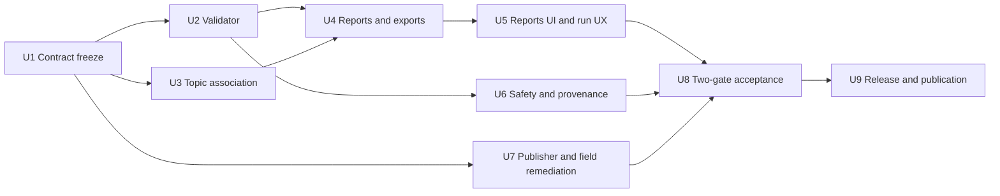

# v0.1.37 Field Acceptance and Release Plan

## Goal Capsule

Ship v0.1.37 only after the application, publisher configuration, evidence capture, and release artifacts agree on the same register, scope, topic contract, payload contract, and run identity.

The v0.1.36 run is a useful diagnostic baseline, not an acceptance result. The report job completed, but the evidence still shows 752 expected assets, 470 observed assets, 282 unobserved assets, 17 registered assets associated with the wrong topic, 0 successfully validated assets, and 2,051 blocking findings. Of the 70 legacy non-publishing assets supplied for comparison, 20 were observed and 50 remained unobserved. The old wrong-topic list contained 18 assets; 11 still overlap the v0.1.36 wrong-topic result, while the remainder changed, so the release plan must prove the final association set from a fresh capture rather than infer improvement from a changed count.

The release objective has two gates:

1. Application gate: the validator, reports, UI, security controls, and automated tests produce correct, explainable results.
2. Field gate: a fresh, unfiltered, full-register run plus the longest required cadence run proves broker-side publishing and association behavior with independently preserved evidence.

The application gate can be completed before the field gate. The release gate cannot.

## Product Contract

The following requirements are the contract for v0.1.37. Each requirement must have both an implementation or field owner and a verifiable acceptance example.

R1. Evidence is anchored to one canonical register, its SHA-256, one approved scope, one run identity, and a recorded start/end window.

R2. The system distinguishes application defects from publisher or field defects. A successful report job is never presented as field acceptance.

R3. Expected topics, points, units, and cadence come from the approved register. Schema validity, payload shape, and field presence are checked independently rather than being silently merged.

R4. Topic association is exact and case-sensitive. The system reports expected-topic, alternate-topic, and no-matching-topic outcomes separately, retains the raw topic, and keeps unexpected devices outside registered-asset metrics.

R5. Missing evidence remains missing. The system never turns an absent payload into a zero, empty observation, or passing result. Numeric zero and boolean false remain valid observed values when they are actually received.

R6. Payload diagnostics are actionable and grouped at the right level. A state-shaped payload on a metadata topic is identified as one likely routing or publisher error with the raw evidence attached, rather than producing a long list of misleading metadata-property errors.

R7. The payload contract covers the confirmed field findings where the register or schema provides authority: timestamp format and timezone handling, metadata timestamp/version/system/location fields, point names and units, point presence, and value mapping. The validator must not invent expected values that the register does not define.

R8. Reports and exports use one frozen title, scope, register identity, and run identity. Report generation, report download, report listing, and run history remain linked after navigation and after an export error.

R9. The Reports page exposes only controls that work and belong there. It does not present obsolete register-import or run-control panels, has a bounded report list, provides clear completion/error/retry states, and does not lose the previous run when the reports view fails.

R10. Indefinite capture remains explicit and safe. Blank, zero, or negative duration means capture until cancellation, while a bounded capture has a clear limit, a working stop path, and a backstop against runaway resource use.

R10a. A cadence gate passes only when the complete required window finishes. Message caps, cancellation, broker interruption, disk failure, resource backstop, or partial evidence are explicit non-pass termination reasons, even when the elapsed time is close to the target.

R11. Evidence and release artifacts contain no credentials, broker secrets, real site identifiers, device identifiers, personnel details, or commercial detail. Mosquitto command columns and command examples are private operator material, never repository or public-release content.

R12. v0.1.37 is published only from the verified commit and exact versioned release artifacts using the repository release script, after the user authorizes publication.

## Planning Contract

### Baseline and issue classification

The supplied v0.1.33 documents and workbooks are treated as historical acceptance inputs. The v0.1.36 JSON and report archive are treated as the current diagnostic baseline. The work must preserve the distinction below:

| Area | Current conclusion | v0.1.37 action |
| --- | --- | --- |
| Indefinite run | The code path and tests support indefinite capture and cancellation. | Keep as a regression gate and test the real browser stop path. |
| Payload and observation filters | Filters exist for payload type and observed/not-observed state. | Retain them, verify counts and empty states against a captured run, and ensure they do not hide raw evidence. |
| Wrong-topic detection | The v0.1.36 report identifies 17 registered wrong-topic assets, but the set differs from the old 18-asset list. | Fix or prove exact association semantics using a fresh full-register capture. |
| Metadata/state diagnosis | One v0.1.36 metadata finding contains unexpected state-like properties, but it is not condensed into a routing diagnosis. | Add the grouped diagnostic and regression test. |
| Payload timestamps and field shape | v0.1.36 contains 313 stale/cadence findings and large counts for system, location, GUID, model, manufacturer, and serial fields. | Separate stale cadence from malformed timestamp and missing-field findings, then verify the publisher contract. |
| Point/value issues | The old run reported missing or repeated values, while v0.1.36 contains no direct `0`/`37` keyword result. | Prove actual received values and expected-point authority; do not treat absence of a keyword as a fix. |
| Reports UI | The v0.1.36 code still renders Reports-page Register Import and Run Controls sections; the generated report table is not bounded by the existing results-scroll treatment. | Remove or relocate obsolete controls, bound the table, and test all report interactions. |
| Report history | Generation/listing linkage is partly implemented, but the prior run must survive report errors and navigation. | Add a regression test for the complete lifecycle. |
| Security and evidence | The supplied command workbook contains credentials and the field checklist requires independent append-only evidence. | Redact private material, add release scans, and make evidence provenance a release gate. |

### Key decisions to keep stable during execution

KTD1. Acceptance is evidence-first and has two gates: full-register scale and longest-cadence behavior.

KTD2. The approved register is authoritative for expected topics, points, units, and cadence. The UDMI schema is checked separately and cannot be weakened to make field payloads pass.

KTD3. Topic matching is exact and case-sensitive. Alternate-topic evidence is retained for diagnosis, but it does not count as an expected-topic match.

KTD4. Unknown is different from zero, false, empty, and not received. The data model and UI must preserve those meanings.

KTD5. A publisher fault is fixed at the publisher or field configuration layer. The application must not hide it by loosening validation or broadening topic matching.

KTD6. The application repository may add diagnostics and capture tooling, but private broker commands and device-specific remediation remain outside public source and documentation.

KTD7. Publishing is a separate authorization step after verification. Preparing a release package does not authorize pushing or publishing it.

## Implementation Units

### U1. Freeze the v0.1.37 evidence and issue contract

Purpose: establish the one source of truth that all implementation and field work will use.

Work:

- Copy the v0.1.36 baseline metrics and the v0.1.33 issue list into a private, sanitized working matrix. Use counts and issue categories in repository documentation; keep real site, asset, topic, and broker details out of committed files.
- Select the canonical 752-row register. Record its SHA-256, revision, approved scope, run operator, machine, broker endpoint reference, and capture window in the field checklist.
- Create the v0.1.37 issue matrix with separate columns for historical symptom, expected contract, owner, evidence source, implementation change, field proof, and release gate.
- Mark each historical item as application defect, publisher/field defect, historical-only, fixed-but-needs-regression, or unproven. Do not mark an item fixed from a changed count alone.
- Define the minimum representative set for fast feedback: at least one asset per payload family and system family, one known expected-topic case, one known alternate-topic case, one no-matching case, one asset with a legitimate zero value, one asset with a legitimate false value, and one missing/late payload case.

Likely paths:

- `docs/v0.1.37-field-acceptance-checklist.md`
- `docs/handoff-v0.1.37-2026-08-04.md`
- `docs/plans/2026-08-04-001-v0.1.37-field-acceptance-and-release-plan.md`
- `scripts/build_v0137_acceptance_manifest.py`

Exit evidence:

- The register hash, scope, acceptance windows, and ownership are recorded.
- A pre-run acceptance manifest binds the canonical register bytes/hash, register import identity, approved scope, application commit, and planned Gate A/Gate B run IDs. The app and independent collector consume the same manifest.
- No real credentials or device/site identifiers are committed.
- Every historical issue has an explicit proof method and owner.

### U2. Repair and extend the core payload validator

Purpose: make payload faults precise without creating false positives or silently accepting invalid field data.

Work:

- Audit timestamp handling for metadata, state, and pointset payloads. Define whether the contract accepts UTC `Z`, an explicit offset, or both, and reject mixed or ambiguous formats only when the contract requires it. Separate malformed timestamp findings from stale/cadence findings.
- Validate metadata timestamp, version, system, and location fields against the approved UDMI contract. Add explicit findings for missing fields and invalid shapes. Keep schema violations distinct from register mismatches.
- Add a state-on-metadata detector based on state-shaped keys such as `operational` and `last_config`. Emit one grouped routing diagnostic containing the raw payload type, raw topic, expected topic, and the relevant key evidence.
- Validate point names and units from the register. Cover the historical unit/name classes, including cubic-metre volume, power/energy units, degree-Celsius spelling, hyphenation, alarm names, and the affected sensor/point families, but only where the register or schema is authoritative.
- Add point-presence and value mapping checks that distinguish missing points, additional points, wrong names, wrong units, and received values. A received `0` or `false` must never be treated as absent. Repeated `37` values must be flagged only when an independent expected-value or cross-point rule exists.
- Review GUID, manufacturer, model, serial, and system/location diagnostics so they point to the failing contract field and do not drown the report in duplicates.
- Add fixtures for valid payloads, malformed payloads, state-on-metadata, missing fields, legitimate zero/false, missing observations, wrong unit, and wrong point name.

Likely paths:

- `core/smart_commissioning_core/udmi_validation.py`
- `core/smart_commissioning_core/udmi_results.py`
- `core/tests/test_udmi_validation.py`
- `core/tests/test_udmi_results.py`
- `core/tests/fixtures/`

Exit evidence:

- Each new finding has a stable category, severity, message, source topic, payload type, and evidence reference.
- The validator never fabricates observations and never fixes a publisher fault by accepting a weaker contract.
- Targeted tests cover all historical payload classes and the zero/false distinction.

### U3. Make topic association and presence semantics authoritative

Purpose: ensure the application says exactly what was received and where it was received.

Work:

- Trace the path from register import to discovery, capture, association, validation, report model, and UI. Confirm that expected-topic matching uses the canonical register topic and exact case-sensitive comparison.
- Preserve three separate outcomes: expected topic received, alternate topic received, and no matching topic received. Do not collapse the latter two into one wrong-topic count.
- Preserve raw topic, receive timestamp, payload type, app association status, expected topic, and any alternate-topic evidence for every absent or unassociated expected payload.
- Keep unexpected devices and topics in a separate diagnostic section. They must not inflate registered-asset issue counts or make the `Assets with issues` metric exceed the register population.
- Confirm that missing payloads do not create synthetic observations or one finding per expected point. Show `Not received` or `Waiting for evidence` until a real payload arrives.
- Add tests for case differences, alternate topic, no match, unexpected device, missing payload, and a payload received after the report view initially renders.

Likely paths:

- `core/smart_commissioning_core/udmi_validation.py`
- `backend/app/services/register_topics.py`
- `backend/app/services/udmi_report_model.py`
- `backend/app/api/routes/validation.py`
- `core/tests/test_udmi_validation.py`
- `backend/tests/test_udmi_register_flow.py`
- `backend/tests/test_udmi_validation_export.py`

Exit evidence:

- A test fixture can produce each of the three association outcomes and the report counts them in the correct bucket.
- Registered metrics never include wildcard or unexpected devices.
- Raw evidence is available for every missing or unassociated expected payload.

### U4. Align report generation, exports, and run history

Purpose: make every generated artifact tell the same story and remain usable after navigation or partial failure.

Work:

- Make the report model use one immutable run title, scope, register identity, and run identity for all XLSX and DOCX outputs.
- Ensure the executive summary, asset schedule, fault matrix, fault details, wrong-topic report, and metric definitions use the same denominators and category definitions.
- Keep report-job status separate from field-acceptance status. A completed export may say `succeeded` while the acceptance status remains `pending` or `failed`.
- Add the grouped state-on-metadata diagnostic and the expected/alternate/no-match topic outcome to machine-readable and human-readable outputs.
- Ensure report generation shows a completion message, preserves the generated report record, and keeps the prior run available when a later report request fails.
- Require report generation to reference an explicitly selected completed run, or make the Reports page list/export-only. The POST payload and persisted artifact must carry source run ID(s), frozen title, scope, register hash, and commit identity; an unscoped report request must fail closed.
- Ensure filtering by payload type and observed/not-observed state affects both the displayed rows and the displayed counts, while the unfiltered report remains the source for acceptance evidence.
- Keep a retry action visible when stale rows are present, and retain the failed format set plus provenance for a labelled “Retry failed formats” action.
- Add regression coverage for the full lifecycle: run, generate all, export, list, navigate away, return, trigger an error, retry, and download an already generated artifact.

Likely paths:

- `backend/app/services/udmi_report_model.py`
- `backend/app/services/validation_export.py`
- `backend/app/services/report_artifacts.py`
- `backend/app/services/run_service.py`
- `backend/app/api/routes/reports.py`
- `backend/tests/`

Exit evidence:

- XLSX and DOCX artifacts have matching title, scope, register hash, and run identity.
- Every summary count can be traced to a defined denominator.
- The prior run remains visible after a reports error or route change.

### U5. Remove stale Reports-page surfaces and complete the run UX

Purpose: make the UI match the actual workflow and ensure every visible control works.

Work:

- Remove the Reports-page `Register Import` and `Run Controls` panels, or move a genuinely required action to one deliberate toolbar location. Do not leave empty or misleading cards.
- The Reports list API must return a bounded page or an explicit limit, and the UI must use a bounded scroll region for the returned page. Add a large-list regression test so “bounded” is a server and browser contract, not only a CSS class.
- Keep the generated report list as the primary Reports-page content. Remove stale `Report Queue` and `Inspector` surfaces if they are not backed by working behavior; otherwise implement their missing behavior before retaining them.
- Put the report table in a bounded scroll container with keyboard access and a visible header. Confirm it behaves with a large report list and at narrow desktop widths.
- Add explicit states for generate-all in progress, completed, failed, partially completed, and retryable. The completion state must identify the generated artifacts.
- Keep a persistent retry action when stale report rows are visible. For partial generation, retain the failed formats, selected run, title, scope, and run ID so retry cannot silently create a different artifact.
- Preserve the previous run and report list across navigation and a single failed report request.
- Keep payload and observation filters, but label them as filters over captured evidence rather than as a replacement for the unfiltered acceptance report.
- Make live indicators status-aware. Do not show a green pulse for every state; label incomplete counts as “observed so far” or “waiting,” expose progress/status through accessible roles and live announcements, and test running, incomplete, succeeded, failed, and cancelled states.
- Test every button, tab, filter, download action, stop action, and retry action with a real click or keyboard interaction. Remove any control that cannot be tested end to end.

Likely paths:

- `frontend/src/features/workflow/ModulePage.tsx`
- `frontend/src/features/workflow/moduleData.ts`
- `frontend/src/features/workflow/operatorData.ts`
- `frontend/src/features/workflow/LiveRunConsole.tsx`
- `frontend/src/styles.css`
- `backend/app/services/run_service.py`
- `frontend/src/features/workflow/ModulePage.test.tsx`
- `frontend/src/features/workflow/LiveRunConsole.test.tsx`

Exit evidence:

- Reports has no obsolete import or run-control panels.
- The report list scrolls within its intended region, remains readable, and survives navigation.
- Generate All, report download, filters, Run, and Stop have tested success and failure states.

### U6. Add safety, provenance, and resource controls

Purpose: prevent a field-run tool from producing misleading evidence or exposing operator secrets.

Work:

- Add a release-contract scan that fails when credentials, private keys, broker passwords, Mosquitto command secrets, or prohibited real-world identifiers appear in source, docs, fixtures, logs, reports, or release notes.
- Redact or remove the command workbook from any committed or distributable evidence. Keep operator commands in a private runbook or secret manager workflow, with credentials supplied through a protected environment or prompt.
- Make capture limits explicit. Indefinite mode must stop on user cancellation and retain a safe backstop for message count, memory, disk, elapsed time, maximum payload bytes, aggregate capture bytes, and persisted evidence size. Oversized payloads, aggregate-limit hits, disk-full errors, and write truncation must have explicit terminal states and tests. Bounded mode must show its limit in the UI and artifact metadata.
- Retain enough raw evidence to explain missing and alternate-topic results without retaining unnecessary credentials or private payload content.
- Add provenance fields to each artifact: version, commit, register hash, scope, run ID, capture start/end, application status, and artifact hash.
- Add a shared pre-run manifest and terminal markers to both the application evidence and the independent collector evidence. Record synchronized start/end acknowledgements, `window_completed`, and a machine-readable `termination_reason`; fail acceptance for interrupted, partial, or cap-terminated evidence.
- Add a regression for a failed report/export request that proves the app does not delete or overwrite the previous run.

Likely paths:

- `backend/app/api/routes/discovery.py`
- `core/smart_commissioning_core/mqtt_settings.py`
- `core/smart_commissioning_core/engines/mqtt_discovery.py`
- `core/smart_commissioning_core/mqtt_transport.py`
- `core/smart_commissioning_core/udmi_validation.py`
- `scripts/check_v0137_release_contracts.py`
- `scripts/test_v0137_release_evidence.py`
- `scripts/validate_v0137_release_evidence.py`
- `scripts/build_v0137_acceptance_manifest.py`
- `scripts/capture_mqtt_evidence.py`

Exit evidence:

- The release contract test fails on a seeded secret and passes on sanitized artifacts.
- Indefinite capture can be cancelled and cannot run without a backstop.
- Every acceptance artifact can be traced to one commit, register, scope, and run.

### U7. Correct publisher and field configuration outside the application repository

Purpose: resolve the actual broker-side causes that the application can only report.

This is a coordinated field workstream, not permission to loosen application checks. Publisher remediation begins only after U1 freezes the register and after U2/U3 freeze the timestamp, payload, and topic-association contracts.

Work:

- Phase 1, after U1: reconcile the canonical register topics against publisher topic roots and diagnose the 17 wrong-topic candidates found in the v0.1.36 evidence and the historical 18-asset wrong-topic workbook. Reconcile the 70 legacy non-publishing assets with a representative subset first. Do not change publisher configuration until the app contracts are frozen.
- Phase 2, after U2 and U3: correct publisher topic and payload behavior, then run the complete register, recording whether each asset is silent, stale, malformed, wrong-topic, unexpected, or correctly observed. The final result must come from a fresh, unfiltered capture.
- Correct publisher payload mappings for metadata, state, and pointset. Confirm the state payload cannot be sent to a metadata topic and that metadata contains the required timestamp/version/system/location fields.
- Correct timestamp generation and timezone policy. Use the agreed UTC or explicit-offset contract consistently and verify cadence independently from timestamp syntax.
- Correct point names and units for the affected MTS, EM, HM, WM, AHU, and EHT payload families. Verify actual received values rather than relying on command files or expected screenshots.
- Correct repeated or missing point values only where the field contract provides a reliable expected relationship. Record unresolved sensor behavior as a field issue instead of marking it as an application success.
- Verify model, serial, manufacturer, GUID, room, location, alarm naming, and system metadata. These must appear as specific field findings when absent or malformed.
- Use private credentials only through the approved secret path. Do not paste broker commands, passwords, or real asset identifiers into repository files, issue trackers, release notes, or public reports.

Exit evidence:

- A representative run shows corrected topic and payload behavior.
- The full-register run accounts for every expected asset and payload as observed, not observed, alternate-topic, or no match.
- Remaining faults have named field owners and are not mislabeled as application defects.

### U8. Run the two-gate v0.1.37 field acceptance

Purpose: produce the evidence that authorizes release consideration.

Gate A, full-register scale:

- Use the canonical unfiltered 752-row register and record its SHA-256.
- Load the pre-run acceptance manifest and fail if the selected register import, scope, or application commit differs. The application must not silently select a newer register after the manifest is frozen.
- Run the complete approved scope with discovery reconciliation first, followed by the independent capture path.
- Preserve paired append-only JSONL evidence from the application and the independent capture process. Both files must contain the shared run ID, register hash, scope, synchronized start/end acknowledgements, terminal status, and termination reason.
- Generate one frozen report set from that run. All XLSX and DOCX outputs must share the same title, scope, register identity, and run ID.
- Reconcile every registered asset and expected payload. For absent or unassociated items, preserve raw topic, receive time, expected topic, association state, and app status.
- Keep unexpected devices separate from registered metrics.
- Run the release contract and credential scans against the exact evidence bundle.

Gate B, longest cadence:

- Run for the required longest cadence. If the contract remains daily payloads, use the documented 24-hour window.
- Keep stale, silent, malformed, schema-invalid, wrong-topic, alternate-topic, and unexpected results separate.
- Require `window_completed` with `termination_reason=window_elapsed` for a pass. A message cap, cancellation, broker interruption, disk/resource backstop, partial JSONL, or any other early termination fails Gate B even if the elapsed time is close to the target.
- Confirm that the app can run for the complete window, can be cancelled safely outside the acceptance window, and does not change the meaning of a missing payload while waiting.
- Reconcile final counts and artifact hashes against Gate A without overwriting the earlier evidence.

Acceptance examples:

- A state-shaped message on a metadata topic produces one grouped routing diagnostic with raw topic and key evidence.
- An expected payload on the exact register topic is an expected-topic match; an alternate topic is not counted as expected; no message is not counted as either.
- A missing point remains missing. A received zero and a received false remain observed values.
- The Reports page has no obsolete import/run-control panels, the report table is bounded, Generate All reports completion, and a previous run survives navigation and a report error.
- The full-register and longest-cadence artifacts have matching provenance and contain no credentials.

Likely paths:

- `docs/v0.1.37-field-acceptance-checklist.md`
- `scripts/capture_mqtt_evidence.py`
- `scripts/build_v0137_acceptance_manifest.py`
- `scripts/validate_v0137_release_evidence.py`
- `scripts/check_v0137_release_contracts.py`

Exit evidence:

- Both gates pass against the exact register hash and approved scope.
- There are zero launch-blocking findings. If an exception is unavoidable, it requires a named approver, written rationale, affected gate, expiry date, and explicit release authorization; ownership alone never closes a blocker.
- The acceptance checklist is signed or otherwise approved by the named acceptance owner.
- The evidence bundle is immutable or append-only, hash-recorded, and sanitized. A final acceptance manifest binds the register hash, import identity, scope, application commit, Gate A/B run IDs, artifact hashes, and later release package hash.

### U9. Prepare, verify, and publish the portable release

Purpose: turn the accepted commit and evidence into a reproducible v0.1.37 release.

Work:

- Update `AGENTS.md` and `CLAUDE.md` byte-for-byte with the v0.1.37 state, including the exact acceptance claim and evidence reference. Do not claim field acceptance if either gate is incomplete.
- Update every runtime and package version source, not only the release notes: `backend/app/main.py`, `backend/app/services/run_context_builder.py`, `backend/app/services/report_artifacts.py`, `frontend/package.json`, and the matching `frontend/package-lock.json` entries. Add a version-identity test that fails if any user-visible or artifact version remains at v0.1.36.
- Add `docs/release-notes-v0.1.37.md`, `docs/release-validation-v0.1.37.md`, `docs/migration-rollback-v0.1.37.md`, and `docs/docker-deployment-rollback-v0.1.37.md` by carrying forward only verified v0.1.36 content and adding the new contract and evidence details.
- Update `CHANGELOG.md` with the user-visible fixes, report semantics, field-run evidence, known limitations, and rollback path.
- Run the complete repository checks and the v0.1.37 release-contract/evidence checks from the exact release commit.
- Add or use a prepare-only path in `scripts/release-portable.ps1` that verifies the selected CI artifacts and prints the final publish command without calling the GitHub release mutation. Pre-authorization execution must use this path only.
- After explicit user authorization, publish with `scripts/release-portable.ps1 -Version v0.1.37 -RunId <WINDOWS_PORTABLE_RUN_ID> -ReleaseGateRunId <RELEASE_GATES_RUN_ID> -NotesFile docs/release-notes-v0.1.37.md`. The script's publish path can make the release public, so record the approval and exact command before invocation. Use the repository's verification mode with the original run ID to confirm the published package; do not hand-roll archives or manifests.
- Re-verify the published bytes with `scripts/release-portable.ps1 -Version v0.1.37 -RunId <WINDOWS_PORTABLE_RUN_ID> -ReleaseGateRunId <RELEASE_GATES_RUN_ID> -VerifyExisting` and record the result beside the final acceptance manifest.
- Verify the package contents, SHA-256, version identity, notes, reports, and credential scan. Confirm that the package points to the accepted commit and not merely the branch tip.
- Create a conventional commit from the verified tree and push the feature branch according to the repository workflow. Do not merge or publish the GitHub release until the user explicitly authorizes that final mutation.

Likely paths:

- `AGENTS.md`
- `CLAUDE.md`
- `CHANGELOG.md`
- `backend/app/main.py`
- `backend/app/services/run_context_builder.py`
- `backend/app/services/report_artifacts.py`
- `frontend/package.json`
- `frontend/package-lock.json`
- `docs/release-notes-v0.1.37.md`
- `docs/release-validation-v0.1.37.md`
- `docs/migration-rollback-v0.1.37.md`
- `docs/docker-deployment-rollback-v0.1.37.md`
- `scripts/release-portable.ps1`

Exit evidence:

- Version, commit, package, notes, and evidence hashes agree.
- All automated and field gates pass.
- The user has explicitly approved publication before the final publish action.

### Dependency flow



U2, U3, and U6 can proceed in parallel after U1. U7 diagnosis can proceed after U1, but publisher remediation and field verification wait for U2 and U3 to freeze the timestamp, payload, and association contracts. U4 depends on the validator and association contracts. U5 depends on the report contract. U8 cannot start its final decision until U2 through U7 have produced their exit evidence.

## Verification Contract

### Automated checks

Run from the repository root unless noted:

```powershell
python -m unittest discover -s core/tests
Set-Location backend
python -m unittest discover -s tests
Set-Location ..\frontend
npm test -- --run
Set-Location ..
ruff check backend worker core
mypy backend/app  # informational only; do not treat existing baseline typing debt as a release blocker unless the changed paths introduce new errors
Set-Location frontend
npm run lint
npm run typecheck
npm run build
Set-Location ..
python scripts/check_v0137_release_contracts.py
python scripts/test_v0137_release_evidence.py
python scripts/validate_v0137_release_evidence.py --evidence-kind hosted --version v0.1.37 --commit <ACCEPTED_COMMIT_SHA> --repository <OWNER/REPOSITORY> --evidence <PATH_TO_RELEASE_EVIDENCE_JSON> --search-root <PATH_TO_EVIDENCE_ROOT>
```

The v0.1.37 validator must preserve the v0.1.36 entrypoint contract. The placeholders above must be replaced with the exact accepted commit, repository slug, evidence JSON, and search root from the release-gate artifact; an omitted or mismatched value is a failure, not a reason to weaken the wrapper.

### Targeted regression matrix

| Check | Proof |
| --- | --- |
| State on metadata | Validator fixture and exported report contain one grouped routing diagnosis with raw evidence. |
| Timestamp | Valid UTC/offset forms pass; malformed format and stale cadence are separate findings. |
| Metadata shape | Missing timestamp/version/system/location fields are reported by field. |
| Point contract | Missing, additional, renamed, and wrongly-unit-ed points are distinct; zero and false pass as observed values. |
| Topic association | Expected, alternate, no match, and unexpected outcomes have separate counts and rows. |
| Metrics | Registered asset issue counts never include unexpected devices. |
| Reports | XLSX/DOCX provenance matches; report generation and listing survive navigation and one failed request. |
| UI controls | Run, Stop, Generate All, filters, download, retry, and report navigation work by pointer and keyboard. |
| Indefinite capture | Blank/zero/negative duration waits for cancellation and stops safely. |
| Security | Seeded secret detection fails; sanitized repository and artifacts pass. |

### Field evidence checks

- Verify the register SHA-256 before each gate and reject an evidence bundle with a different register.
- Verify one approved scope, one run ID, and one frozen report title across all artifacts.
- Compare the app's view with the independent append-only JSONL capture without discarding alternate topics or no-match evidence.
- Reconcile expected payload count, received payload count, absent payload count, wrong-topic count, unexpected count, stale count, and blocking count from source rows rather than screenshots.
- Hash every final artifact and record the hashes in the acceptance checklist.
- Run a final credential and prohibited-identifier scan over source, docs, logs, reports, ZIP contents, and release notes.

## Definition of Done

v0.1.37 is ready for publication only when all of the following are true:

- The issue matrix has zero launch-blocking findings, or each exceptional blocker has a signed approver, rationale, affected gate, expiry date, and explicit release authorization. Ownership alone never closes a blocker. App, publisher, and field causes are clearly separated.
- The validator and report model preserve raw evidence, distinguish missing from zero/false, and report exact topic association outcomes.
- The Reports UI has no obsolete panels, no dead controls, and tested report generation, browsing, download, retry, and run-history behavior.
- Indefinite capture, cancellation, bounded resource use, and evidence provenance are covered by tests.
- The 752-row full-register gate passes against the canonical register hash.
- The longest-cadence gate passes, using the documented 24-hour window when daily payloads are the agreed contract.
- The release contract, evidence validator, full test suite, lint, typecheck, build, package verification, and credential scan pass from the exact release commit.
- The pre-authorization release path verifies artifacts without publishing; the public release command is run only after explicit user approval and includes both workflow run IDs.
- `AGENTS.md` and `CLAUDE.md` are byte-for-byte identical and accurately state the release status.
- All runtime, frontend package, report-renderer, and run-context version sources resolve to v0.1.37.
- The portable package and release notes contain no credentials or prohibited real-world detail.
- Publication is performed only after explicit user authorization.

The immediate next execution step is U1: freeze the canonical register hash, scope, run identity, and issue matrix. Once that contract is recorded, implementation and publisher remediation can proceed in parallel without changing what “fixed” means halfway through the release.
