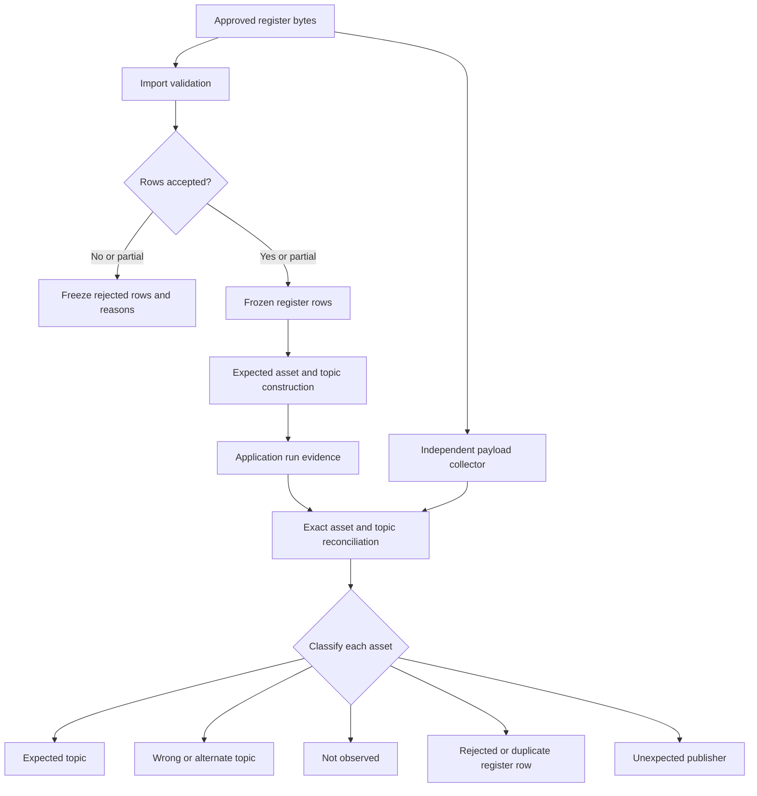

# v0.1.38 Floor column and missing asset reconciliation

## Goal Capsule

- **Objective:** Establish whether the reported missing assets come from the Floor column, the uploaded register, the v0.1.38 artifact actually being run, MQTT topic association, or the independent payload collector, then make the smallest evidence-backed correction.
- **Authority:** The exact approved register bytes and import result define expected assets. The application run and independent collector are separate observations that must be reconciled against that register.
- **Current position:** Floor handling is present in the v0.1.38 source, but it is absent from the v0.1.38 release notes. The available portable smoke evidence is labelled v0.1.38 while its source commit is the v0.1.37 tag and its register identity is null.
- **Stop conditions:** Do not claim that Floor caused the loss, do not choose between the unresolved 752 and 780 asset baselines, and do not call a field run accepted until the approved register, paired collector evidence, and required completed cadence are attached.
- **Expected outcome:** Every source-register asset is assigned one outcome: imported and observed on the expected topic, imported and observed on another topic, imported and not observed, rejected at import, merged as a deliberate multi-row asset, or not present in the approved source register.

---

## Product Contract

### Problem frame

The operator added a `Floor` column to the asset register, saw the import continue, and then removed the column after observing what looked like missing assets. The same result after removal makes Floor an unlikely cause, but the current evidence does not identify which asset rows are missing or whether the application and collector are looking at the same register and release.

The source contains a second risk: the stored v0.1.38 portable smoke report carries `application_version: v0.1.38` but `source_commit: 053dcd59...`, which is the v0.1.37 tag. That smoke run also has no register filename, hash, or import ID. It proves a packaged smoke path, not the v0.1.38 register-driven field path.

### Requirements

- R1. Verify the exact application version, source commit, executable hash, register hash, import ID, run ID, and evidence-set ID before comparing results.
- R2. Treat `Floor` as an optional register column. Adding or removing it must not change accepted row count, expected asset identities, expected topic filters, or asset grouping when all other source bytes and values are unchanged.
- R3. Preserve the raw source register, accepted rows, rejected rows, source column order, and import error records for the exact run under investigation.
- R4. Compare the application run's frozen `register_rows` and `assets` arrays with the source register instead of comparing only the final dashboard count.
- R5. Reconcile collector topics and payloads by exact asset ID and topic, separating expected-topic, alternate/wrong-topic, no-match, missing, and unexpected-publisher outcomes.
- R6. Distinguish a register row rejected before the run from an imported asset that received no payload. Both can appear as “missing” in an operator view but require different fixes.
- R7. Document the existing Floor behavior in the public release notes and user-facing register guidance, with tests that prove the column is accepted, preserved, and reported without changing asset selection.
- R8. Keep field-acceptance wording honest. A local smoke run or a successful automated suite cannot substitute for the approved register and paired independent collector evidence.

### Scope boundaries

Included:

- v0.1.38 release and portable artifact provenance.
- MQTT register CSV/XLSX import, including optional `Floor`.
- Register-driven UDMI expected-asset construction and report annotation.
- Application-versus-payload-grabber reconciliation.
- Release-note and template/test coverage for Floor.

Deferred or outside scope:

- Changing publisher topic configuration before the reconciliation identifies a concrete topic defect.
- Inferring a floor value from `Room` or from a topic segment.
- Reopening unrelated IP, BACnet, MQTT discovery, or whole-application readiness work.
- Declaring the 752 or 780 baseline correct without register-owner approval.

### Acceptance examples

- **A1. Floor-only change:** Given two otherwise identical register files, one with an optional `Floor` column and one without it, the accepted row count, asset IDs, topic filters, and asset count are identical. The version with Floor retains the values in frozen register evidence and report floor metadata.
- **A2. Partial import:** Given a register with rejected rows, the run records the accepted count, rejected count, row numbers, fields, and reasons. Rejected assets do not silently disappear from the explanation.
- **A3. Wrong topic:** Given a registered asset observed under a different but safely associated topic root, the reconciliation links it to the register identity and reports expected and actual topics separately.
- **A4. No observation:** Given an accepted asset with no matching collector or application payload in the window, the result is `not_observed`, not an import failure and not proof that the device is disconnected.
- **A5. Unexpected publisher:** Given a payload whose identity is absent from the approved register, it remains outside registered-asset totals and is listed as an unexpected observation when the diagnostic scope supports that measurement.
- **A6. Stale artifact:** Given a package labelled v0.1.38 but built from a different source commit, the evidence is rejected for comparison until a package built from the v0.1.38 release commit is produced.

---

## Planning Contract

### Confirmed findings

- KTD1. The register is the expected-asset authority. The collector cannot add assets to the expected set, and the application must not infer them from observed payloads.
- KTD2. Floor is metadata, not a topic-routing key. In v0.1.38 it is accepted as an optional MQTT register column, copied into the expected schedule, and aggregated into report floor metadata. It is not part of the core identity checks or capture-topic derivation.
- KTD3. The comparison key is exact asset identity plus exact topic association, with explicit handling for legacy event/pointset aliases. A collector workbook that normalizes slashes, underscores, or topic roots must retain the original topic before normalization.
- KTD4. Provenance is a prerequisite to diagnosis. The available portable smoke artifact is not valid v0.1.38 field evidence because its source commit is `053dcd59e52989c31a514fcc8d640fae81389b87`, the v0.1.37 tag, and its register identity fields are null.
- KTD5. No capture or publisher change is justified from the historical 2026-07-29 payload workbook alone. It predates the v0.1.38 field candidate and must be treated as an earlier diagnostic baseline.

### Likely causes, ranked

1. **Wrong or stale artifact, high confidence.** The available v0.1.38 smoke evidence uses the v0.1.37 source commit. A package made from that commit can accept an unknown Floor header as a generic extra field while not implementing the v0.1.38 Floor reporting path.
2. **Partial or rejected import, high confidence as a mechanism.** `ImportService` only adds error-free rows to `accepted_rows`. Invalid topic syntax, duplicate keys, missing required headers, or a conflicting Asset ID/topic root can reduce the expected set. The run carries rejection facts, but the exact field run is not present here.
3. **Approved-register count mismatch, high confidence as a blocker.** v0.1.38 documentation records both 752 and 780 as possible baselines and explicitly leaves the owner decision open.
4. **Publisher or topic mismatch, medium confidence.** The v0.1.37 baseline already contained wrong-topic and not-observed classes. These are asset reconciliation outcomes, not evidence that the Floor column dropped rows.
5. **Collector scope or normalization mismatch, medium confidence.** The historical workbook contains metadata, pointset, and state sheets with different asset coverage. It cannot be compared safely without preserving raw topics and mapping each row back to the same register identity.
6. **Floor field itself, low confidence.** The v0.1.38 code path does not use Floor to construct topics, select assets, or merge rows. A count difference between the Floor and no-Floor files would therefore indicate a file-edit or artifact problem, not intended Floor semantics.

### Technical flow

### Sequencing

1. Lock release and evidence identity before interpreting counts.
2. Validate source-file integrity and import completeness.
3. Compare the application run's frozen register and expected assets with the source file.
4. Normalize and reconcile independent collector evidence without discarding raw topics.
5. Run the Floor A/B comparison using identical source data apart from the optional column.
6. Select a fix category, update documentation/tests, and rerun the focused and release checks.

---

## Implementation Units

### U1. Lock the v0.1.38 release identity

- **Goal:** Prove that the application under test is built from the v0.1.38 release commit, not merely labelled with the v0.1.38 version string.
- **Files and evidence:** `docs/release-notes-v0.1.38.md`, `docs/release-validation-v0.1.38.md`, `scripts/validate_v0138_release_evidence.py`, `scripts/check_v0138_release_contracts.py`, the portable report artifact, and its `validation_summary.json`.
- **Pattern:** Follow the existing release provenance contract. Compare application version, source commit, EXE hash, ZIP hash, and report evidence before accepting the run.
- **Test scenarios:**
  1. A v0.1.38-labelled artifact built from the v0.1.37 commit is rejected for field comparison.
  2. An artifact built from `a994b8a07002cd2496712ba1eee4a6a4478ebffa` carries that commit in report provenance.
  3. A register-driven run has non-null register filename, SHA-256, import ID, and source-row count.
- **Verification:** Run the v0.1.38 release contract and evidence validators against the final artifact set. Keep the existing smoke artifact marked as an invalid field-evidence baseline.

### U2. Prove import completeness and Floor neutrality

- **Goal:** Identify whether rows are being rejected, duplicated, merged intentionally, or never reaching the run.
- **Files and patterns:** `backend/app/services/import_service.py`, `backend/app/api/routes/imports.py`, `backend/app/api/routes/validation.py`, `backend/tests/test_udmi_register_flow.py`, `backend/tests/test_v1_review_contracts.py`, and `backend/tests/test_import_templates.py`.
- **Test scenarios:**
  1. Upload the approved register with Floor and record total rows, accepted rows, rejected rows, missing columns, warnings, and every rejection reason.
  2. Upload the same register without Floor and compare accepted rows and rejection records.
  3. Confirm `Floor` appears in the generated MQTT register template and is retained in the source snapshot.
  4. Confirm an Asset ID reused across different topic roots is surfaced as a conflict rather than silently merged.
  5. Confirm multiple payload-type rows for one asset and one topic root merge into one expected asset entry by design.
- **Verification:** Compare `register_columns`, `register_rows`, `register_import_id`, `register_sha256`, `register_rejected_rows`, and `assets` from the run response. A changed count requires a row-level diff before any code change is proposed.

- **Implementation decision:** The newest register import is authoritative for a
  register-driven run, even when it has zero accepted rows. The validator must
  refuse that run and surface the import rejection details instead of falling
  back to an older accepted register, which can make new assets appear to be
  missing.

### U3. Reconcile application results with the independent payload grabber

- **Goal:** Explain every difference between the application result and the independent collector without conflating missing payloads with missing register rows.
- **Files and patterns:** `backend/app/services/register_topics.py`, `core/smart_commissioning_core/udmi_validation.py`, `backend/app/services/udmi_report_model.py`, `scripts/capture_mqtt_evidence.py`, and the private collector export.
- **Reconciliation fields:** Preserve raw topic, normalized topic, payload type, asset ID, receive time, retained flag, source run ID, expected topic, actual topic, and classification.
- **Test scenarios:**
  1. Every accepted register asset appears in exactly one expected-asset row, unless the report explicitly records a duplicate-ID conflict.
  2. Every observed collector asset maps to expected topic, wrong/alternate topic, or unexpected publisher.
  3. Every not-observed asset has no matching payload in the collector scope and is not merely absent from one payload-type sheet.
  4. Topic aliases such as `events/pointset` and `event/pointset` are reconciled without losing the original topic.
  5. Counts are calculated separately for assets and payload facets, so missing state does not make an asset disappear when metadata or pointset was observed.
- **Verification:** Produce a private row-level reconciliation table keyed by asset ID. Do not place broker credentials, site identifiers, device identifiers, or operator details in this public repository.

### U4. Apply the smallest evidence-backed correction

- **Goal:** Fix only the category proven by U1 to U3.
- **Decision branches:**
  - If only documentation is missing, update `docs/release-notes-v0.1.38.md`, `CHANGELOG.md`, and the register guidance in `README.md`, then add Floor round-trip coverage.
  - If rows are rejected, improve the import error presentation or validation rule only after the exact rejected rows are known.
  - If the app's expected asset list differs from its accepted register rows, fix the register-to-run freeze or merge logic and add a regression test using the failing shape.
  - If the app and collector disagree only on topics, preserve the current separate wrong-topic outcome and correct the register or publisher configuration outside the application code.
  - If the collector scope is incomplete, fix the collector run or scope contract before changing application metrics.
- **Current implementation slice:** Fix the stale-register fallback in
  `backend/app/api/routes/validation.py`, add regression coverage for a newer
  fully rejected import superseding an older accepted import, add Floor A/B
  register-flow coverage, and update the v0.1.38 release notes, changelog, and
  README register guidance.
- **Verification:** Re-run the targeted backend/core suites, the frontend suite if UI changes are made, release contracts, and a fresh v0.1.38 package built from the release commit.

---

## Verification Contract

| Gate | Command or evidence | Pass condition |
| --- | --- | --- |
| Release identity | `python scripts/check_v0138_release_contracts.py` and `python scripts/validate_v0138_release_evidence.py` | Artifact version, source commit, and evidence metadata agree with v0.1.38. |
| Import and register flow | `cd backend/tests; python -m unittest test_udmi_register_flow test_v1_review_contracts test_import_templates` | Floor A/B, rejected-row, duplicate-ID, and per-payload merge scenarios pass. |
| Core validation | `cd core/tests; python -m unittest test_udmi_validation` | Expected, missing, wrong-topic, unexpected, and applicability semantics pass. |
| Backend report/export behavior | `cd backend; python -m unittest discover -s tests -p "test*.py"` | Report and annotated-register evidence preserve the source register and Floor metadata. |
| Frontend behavior | `cd frontend; npm test -- --run; npm run lint; npm run typecheck; npm run build` | Import outcome and rejection details remain visible and usable. |
| Paired field reconciliation | Private application run plus independent payload-grabber export | Same approved register hash, run identity, evidence-set identity, and complete row-level classification. |
| Cadence gate | Controlled field run | `window_completed=true` and `termination_reason=window_elapsed`; cancellation or partial capture is not acceptance evidence. |

The repository's local targeted tests currently pass when invoked from their expected directories: 51 backend register/review tests and 178 core validation tests. The initial combined invocation failed only because the backend test module could not resolve its local `harness` import from the repository root.

---

## Definition of Done

- The tested package is proven to come from the v0.1.38 release commit, and the older smoke artifact is not used as field evidence.
- The approved register identity, import ID, source hash, total rows, accepted rows, rejected rows, and row-level rejection reasons are frozen with the run.
- The Floor A/B comparison shows whether Floor changes anything beyond preserved metadata and report floor reporting.
- Every apparent missing asset is classified as an import rejection, intentional merge, expected-topic observation, wrong/alternate topic, no observation, or unexpected publisher.
- Release notes and user guidance mention the optional Floor column and its limited role.
- Tests cover Floor preservation, import completeness, duplicate/conflict handling, row merges, and report annotation.
- No public artifact contains site names, broker credentials, device identifiers, personnel details, or commercial information.
- No field-acceptance claim is made until the approved register, paired collector evidence, and completed cadence gate are present.

---

## Appendix

### Source evidence inspected

- `backend/app/services/import_service.py:530-574` includes `Floor` in the optional MQTT register columns in v0.1.38.
- `backend/app/api/routes/validation.py:169-200` copies Floor into the expected schedule but does not use it for topic derivation.
- `backend/app/services/udmi_report_model.py:1204-1207` and `:1899-1903` read Floor only for report metadata.
- `backend/app/services/register_topics.py:15-153` derives capture topics from Expected topic and payload applicability, not Floor.
- `core/smart_commissioning_core/udmi_validation.py:550-615` contains identity checks for make, model, serial, firmware, GUID, site, and room. Floor is not a payload identity check.
- `docs/release-notes-v0.1.38.md` does not mention Floor.
- `docs/v0.1.38-baseline-comparison.md` and `docs/v0.1.38-reconciliation-decision-log.md` do mention optional Floor handling, while the field decision remains open.
- `docs/release-validation-v0.1.38.md` records 752 versus 780 as unresolved and says no paired v0.1.38 field run is available.
- `build/portable-smoke-v0138-rerun/data/artifacts/...zip` reports v0.1.38 but records source commit `053dcd59e52989c31a514fcc8d640fae81389b87`, which is the v0.1.37 tag, and has null register identity fields.
- `.tmp_payload_forensics_20260729/payload_grabber_data_output.xlsx` is a historical 2026-07-29 workbook, not v0.1.38 evidence. It contains 492 metadata rows, 505 pointset rows, and 23 state rows. Its paired historical report contains 554 expected assets, 485 observed, 69 not observed, and 13 wrong-topic assets. Those figures are useful as a comparison pattern only, not as the current release result.

### Required private inputs for the next pass

- The exact v0.1.38 package or hosted image used in the field run.
- The original register file before and after the Floor edit.
- The import response and rejection-details response.
- The application run export containing frozen register rows, asset entries, and evidence provenance.
- The independent payload-grabber export with raw topics and receive times.
- The agreed 752 or 780 asset baseline and payload applicability matrix.
