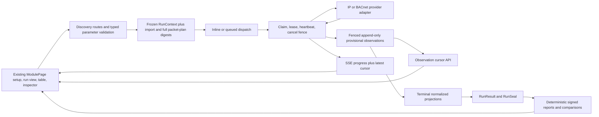

# v0.1.41 IP Scanner and BACnet Discovery

## Goal Capsule

- **Objective:** Extend the post-v0.1.40 application into an evidence-first IP Scanner, then harden and complete BACnet discovery, while preserving the existing run lifecycle, import authority, Windows portable delivery, and truthful field-acceptance rules.
- **Baseline:** Build from `5e40d3a751788009648f1f268174b0ca236625e1`, after PR #133 and the focused PR #132 cache promotion in PR #134. The v0.1.40 tag remains historical and must not be moved.
- **Release target:** U1-U9 form the v0.1.41 candidate. Create the tag only after its automated, Windows, accessibility, security, packet, lab, and required field gates pass; otherwise keep the affected capability UNPROVEN. U10 scheduled soak remains a follow-up after one-shot IP and BACnet acceptance.
- **Sequence:** Shared run and evidence contracts first, IP Scanner second, and BACnet third. Each protocol ships ordinary sealed-run history and pair comparison with its evidence UI. Scheduled longitudinal aggregation and soak wait until both one-shot paths have field evidence.
- **Source authority:** The meeting transcript, the IP Scanner and BACnet review packs, the prior six-document review, the HTML mock-up's information architecture, the current repository, the EDQ Nmap implementation at commit `76364b59780579da07d995a8a0422c287eb87b15`, and this conversation define the requested outcome. The mock-up and EDQ are implementation references, not specifications to copy wholesale.
- **Safety position:** A dry run sends no traffic. A live run requires an authenticated engineer, an approved target set, a named change-window authorization, server-side rate limits, and a working Stop path. Silence is inconclusive. Discovery must never be presented as proof that a device is offline.
- **Expected outcome:** An operator can define and preview an authorized IPv4 scope, scan every target progressively with the built-in provider or the optional internal operator-managed Nmap provider, reconcile it against one frozen register revision, inspect the evidence behind each result, export sealed reports, and repeat the same evidence-led workflow for BACnet/IP across local, directed, and foreign-device lanes.

---

## Product Contract

### Problem frame

The current product has useful foundations, but the operator experience is incomplete:

- `core/smart_commissioning_core/engines/ip_scan.py` already performs dependency-free TCP-connect scanning, binds to a selected source IP, scans every target, incorporates register ports, and reports honest no-response rows. It accepts only one target shape, drops `/udp` semantics while still using TCP, reduces network errors to a Boolean result, buffers all results until the run ends, and cannot produce service versions.
- `core/smart_commissioning_core/engines/bacnet_discovery.py` already supports local broadcast, foreign-device discovery through a BBMD, and directed register-target Who-Is. It does not publish progressive device or point rows, reads the complete object list in one operation, collects only `present-value`, and can collapse different devices or points because its identity keys are too weak.
- The shared lifecycle already provides frozen execution context, queued and inline execution, claim/lease/heartbeat ownership, cooperative cancellation, insert-once terminal results, and evidence seals. New discovery work must use those contracts rather than bypass them.
- The frontend already has the module shell, terminal discovery table, filters, run reattachment, native dialog, persistent inspector, and non-color labels. The new screens should extend that framework. They should not copy the mock-up's fixed three-column layout or its sample styling.
- Nmap is not a free redistributable dependency for this proprietary Windows product. The first shipped IP provider remains the application-owned TCP-connect engine. An internal-only deployment may optionally use an operator-installed official Nmap/Npcap copy; the EXE never contains, downloads, installs, updates, or silently deploys either component. External/customer distribution still requires Nmap OEM terms.
- EDQ proves the internal host-scanner pattern: a background service accepts bounded targets, runs Nmap with list-form arguments, applies limits, and parses XML. Smart Commissioning will reuse those mechanics, but not EDQ's Docker-installed Nmap, PATH lookup, winget/UAC setup, generic argument endpoint, risky flag/script allowlist, silent provider fallback, direct-PID kill, or truncated raw evidence.

### Users and decision owners

| Role | Authority |
| --- | --- |
| Commissioning engineer | Builds a dry-run plan, submits an approved live run, cancels it, inspects evidence, and exports results. |
| Viewer | Reads run state, evidence, history, comparisons, and reports. Cannot start or cancel active network work. |
| Register owner | Approves the IP register, BACnet device register, and BACnet point manifest used as expected-state authority. |
| Network or site owner | Approves target CIDRs, ports, source interface, scan profile, change window, and any off-VLAN or BBMD path. |
| Release owner | Accepts clean-box packaging, automated gates, packet-capture evidence, and field evidence for a release candidate. |
| Internal deployment owner | Records that the installation is organization-internal, enables the operator-managed provider, controls the approved Nmap path/version/profile policy, and prevents the mode entering an external bundle. |
| Licence owner and product counsel | Decide any external/customer Nmap/Npcap execution, parsing, or redistribution model and record written OEM terms or a written licensor waiver before that mode ships. |

### Authority model

| Question | Canonical authority |
| --- | --- |
| Which packets may be sent? | The full effective packet plan frozen into `RunExecutionContext`: project/site, targets/exclusions, protocols/ports, provider/technique, effective pacing, source NIC, BACnet lanes/destinations/instance range/BBMD TTL, base read set, authorized property ceiling, and total budget. |
| Which IP devices and ports are expected? | One selected `ip_register` import revision, including accepted and rejected rows. |
| Which BACnet devices are expected? | One selected `bacnet_register` import revision. |
| Which BACnet points are expected? | One selected `bacnet_points` manifest. A device count is not a substitute. |
| What was observed? | Provider observations with protocol, source lane, timestamps, error taxonomy, and raw-evidence provenance. |
| What passes or fails? | The canonical comparison code, including `point_validation.py` for BACnet points. UI code does not invent verdicts. |
| Did the run finish successfully? | The token-fenced lifecycle owner and terminal result seal. Traffic, row count, and progress cannot declare success. |
| What can be reported? | Final sealed evidence. Cancelled or failed partial evidence remains explicitly partial. |

### Functional requirements

#### Shared run and evidence requirements

- **SR1.** Dry run is a separate sealed preview run. It expands, normalizes, deduplicates, caps, and displays the same targets, transports, port sets, profiles, source interface, register revisions, and estimated work proposed for a later live run, while sending no packets, starting no external process, and reserving no protocol slot. Large plans return counts, digests, grouped ranges, and bounded samples rather than millions of target tuples.
- **SR2.** Live discovery must reference a stored authorization approved by an admin or configured scoped site/network approver and bound to one sealed preview. Its approved project/site, approver, ticket/purpose, preview ID, full effective packet-plan digest, and start/end window are immutable. Revocation state, remaining uses, and audit timestamps change only through fenced, audited transitions. Live create verifies the same preview, rebuilds the plan, and creates the linked run while consuming one use in one transaction. Claim fails if queue delay reaches the end of the approved window, and the executor rechecks the window before every dispatch. Expiry stops new traffic, retains partial evidence, and cannot produce success.
- **SR3.** The backend must enforce target, port, total Cartesian probe budget, request-rate, per-target and global concurrency, retry, timeout, output-size, and duration ceilings. Request values may narrow policy and cannot widen it.
- **SR4.** The selected source NIC must use the existing `source_ip` and BACnet `local_address` contract. It is frozen before the run is saved and shared by inline and queued execution. A missing or down interface fails loudly before traffic.
- **SR5.** Imported expectations must be bound once at run creation. The selected immutable import record is the normalized authority snapshot. Parameters and reports carry its import ID, source filename, source SHA-256, accepted-row SHA-256, accepted count, rejected count, and schema version. Execution reloads only that record and verifies its digest; it does not copy tens of thousands of rows into both preview and live context JSON. Optional fields from older imports must never be mixed into the selected revision.
- **SR6.** Active runs must publish append-only provisional observations under the current owner token and attempt. Final discovered-device and discovered-point tables remain terminal projections, and `RunResult` plus `RunSeal` remain insert-once evidence.
- **SR7.** Progressive traffic and progressive rows must not renew the run lease. The executor heartbeat remains the only liveness signal.
- **SR8.** Stop must be cooperative, fail closed, and measurable. No new packet may be dispatched more than two seconds after a persisted Stop; built-in TCP/BACnet work must become terminal within the longest in-flight application deadline plus two seconds; an enabled operator-managed Nmap process tree must be gone within five seconds. A cancelled or failed run keeps completed observations, marks incomplete work, seals an honest terminal result, and never becomes `succeeded` because some rows exist.
- **SR9.** Browser reconnect, tab reload, and the ten-minute SSE reconnect boundary must reattach to the same run and resume from a durable observation cursor without starting another scan. Access scope is rechecked while SSE polls, and a revoked grant closes the stream.
- **SR10.** Results, comparisons, and exports must distinguish expected, observed, unexpected, mismatched, missing, unproven, cancelled, and not-attempted states. Zero and false values remain valid observations rather than missing data.
- **SR11.** Every observation must expose enough provenance to answer who ran it, when, from which interface, with which profile/provider/version, against which frozen register, and through which transport lane.
- **SR12.** Viewer-facing errors are sanitized. Project-scoped observation APIs may carry the normalized device identifiers needed for the authorized table and inspector, including IP address, BACnet instance, BACnet network, and normalized name. Raw provider strings, packet captures, imported XML, secrets, unrestricted site identifiers, and local paths remain protected evidence and never enter normal logs, public exports, or ordinary observation payloads. APIs return opaque artifact IDs, never local paths.
- **SR13.** A process or host restart never silently resumes network traffic. An unfinished attempt becomes interrupted or loses ownership with partial evidence retained; an engineer must authorize a new retry run.
- **SR14.** One active live IP scan may use a given source interface or default route at a time, and one active BACnet run may use a given bind-address/UDP-port pair at a time. A conflicting Start is rejected with the active run ID so the browser can reattach; the app never starts a replacement and cancels the old run afterward.
- **SR15.** A deterministic engine failure or operator retry creates a new run linked by a `run_links` row of type `retry`; the child context also snapshots the parent ID. Only outbox publication recovery and duplicate delivery may continue the same frozen run under the existing attempt rules.
- **SR16.** A live run links to one sealed preview run, rebuilds the effective context, and rejects any full-plan drift, including imports/hashes, configuration/policy version, provider capability, NIC, protocol/port, pacing, BACnet lane/property settings, or authorization validity. The preview remains immutable evidence and is never converted into the live run.
- **SR17.** Every create, list, read, observation, SSE, Stop, comparison, child-run, import, report, raw-evidence, and retention action is authorized against the owning project/site as well as the global role. Inaccessible IDs return 404 and are excluded from lists. A whole-runtime backup has no single project/site owner, so its API and restore path are global-admin-only; project/site users receive only scoped reports and evidence exports.
- **SR18.** Loss of cancellation, ownership, or authorization state fails closed for active network work. A store or grant-check error stops new dispatches within the Stop SLO instead of being interpreted as “not cancelled” or “still authorized.”

#### IP Scanner requirements

- **IP1.** The first product slice supports numeric IPv4 targets expressed as multiple CIDRs, inclusive ranges, and single addresses, plus exclusions. Overlaps are deduplicated after exclusions, with deterministic numeric ordering.
- **IP2.** Target preview shows unique host count, estimated probe count, selected source address/prefix, included and excluded ranges, policy caps, and any target rejected by policy before the engineer can start.
- **IP3.** The scanner evaluates every authorized target independently of the register. The register supplies expectations and identity, not the scan universe unless the operator explicitly chooses “register addresses”.
- **IP4.** The built-in provider performs staged TCP-connect observation. A structured result distinguishes `connected`, `connection_refused`, `timed_out`, `network_unreachable`, `host_unreachable`, `permission_denied`, `cancelled`, and `provider_error` instead of returning one Boolean.
- **IP5.** Positive reachability evidence can come from a successful TCP connection or another provider's explicit positive result. A DNS name or cached ARP entry is enrichment and does not independently prove current reachability.
- **IP6.** All targets receive a row. No answer on probed ports is `unconfirmed`, never `offline`. ICMP-blocked hosts that accept an approved TCP service are reachable.
- **IP7.** Port observations retain protocol. TCP and UDP entries must never be silently collapsed. The built-in provider rejects unsupported UDP probes. BACnet UDP/47808 uses the BACnet Who-Is/I-Am path, not a generic “open port” claim.
- **IP8.** The default live OT profile is conservative and uses the existing centrally configured ceilings. Named profiles can only narrow policy. Aggressive timing, broad `-Pn`, full TCP, and full UDP are unavailable in the first field release.
- **IP9.** The first shipped provider probes the configured common TCP ports plus the selected register revision's expected and forbidden TCP ports. Ports removed by a cap are listed as not attempted.
- **IP10.** Service names inferred only from a port number are labelled `port_hint`. `detected_service` and `detected_version` require protocol evidence from an approved provider. Unknown remains unknown.
- **IP11.** The first field release sends no reverse-DNS traffic and starts no ARP subprocess. Hostname and MAC enrichment come only from the frozen register, scan-protocol evidence, or a proven no-traffic operating-system neighbor-cache adapter with an application deadline and Stop check. If that passive adapter is unavailable, values remain unknown; routed devices are not penalized for lacking a MAC address.
- **IP12.** Register matching first uses the expected IP. Asset ID, hostname, and MAC can corroborate or expose a wrong-IP candidate, but weak or duplicated evidence must result in an ambiguous review state rather than an automatic reassignment.
- **IP13.** An expected asset observed at a different address is `wrong_ip` and requires review. Both expected and observed addresses remain visible.
- **IP14.** An expected TCP port is “closed” only after a definitive connection refusal. Timeout, unreachable, cap removal, cancellation, and provider error remain unconfirmed or not attempted.
- **IP15.** A forbidden port that positively accepts a connection is a confirmed policy failure. An unexpected open port is a review item. Silence cannot create either verdict.
- **IP16.** The four headline metrics are: Expected Devices, Reachable Devices, Register Matches, and Unexpected / Unregistered Hosts. “Rogue” is not used because discovery alone cannot establish malicious intent. Without a frozen IP register, the three register-derived metrics display `Not configured`, not zero or failure.
- **IP17.** Metrics update during the run with visible pending and finalized counts. Final percentages use frozen denominators and never count pending or unconfirmed targets as passed.
- **IP18.** The results table supports search, evidence/status filters, column selection, run history, sealed-run comparison, server-generated export, and keyboard selection. Each row links to Overview, Evidence, and Diagnostics inspector views.
- **IP19.** The inspector shows target origin, identity match basis, port-by-port result and reason, provider capability, source interface, timestamps, register differences, and raw-evidence references.
- **IP20.** A comparison between two sealed runs lists added and removed responders, address changes, newly open or closed ports, register-verdict changes, and provider/profile differences. It refuses incomparable project/site or register authority unless the user explicitly views them as separate baselines.
- **IP21.** Nmap XML can be normalized only through an isolated adapter with DTD and external entities disabled, size and depth limits, version capture, malformed/truncated handling, and fixtures. Human output and deprecated grepable output are not integration formats.
- **IP22.** The Nmap process provider and XML import are disabled by default and can run only in an explicit `internal_operator_managed` deployment where an operator installed the official copy separately. Detection reads official uninstall registry metadata and protected standard install roots, then requires one-time administrator confirmation of the executable, installed data directory, publisher, version, file/manifest hashes, and installed NPSL version/licence digest. It accepts no raw command fragments, arbitrary paths, or operator files, searches no `PATH`, uses fixed profile builders, has a parent deadline and Stop handling, never raises its own privileges, and reports raw/Npcap capability honestly. External/customer mode rejects execution and parsing unless written OEM terms or a written licensor waiver covers the exact use and version.

#### BACnet requirements

- **BAC1.** Preserve the three existing, non-substituting discovery lanes: local broadcast, optional foreign-device discovery through an explicitly configured BBMD, and directed unicast Who-Is to silent register targets.
- **BAC2.** A live run records a lane-level plan and outcome: destination, source interface, UDP port, instance range, start/end, responses, error, and whether the lane was skipped. A failed foreign-device request cannot be relabelled as local discovery.
- **BAC3.** Foreign-device mode is opt-in. The run must wait for successful registration before discovery, expose rejection or timeout, and attempt TTL-zero unregister in `finally` before closing sockets.
- **BAC4.** Local BACnet/IP requires an interface address with prefix/CIDR so the broadcast address is valid. A source address without subnet data fails preflight.
- **BAC5.** Discovery is read-only. The allowed packet/service set is Who-Is/I-Am, ReadProperty, ReadPropertyMultiple, and the foreign-registration lifecycle. WriteProperty, BBMD-table mutation, generic APDU entry, and write-like maintenance services are absent.
- **BAC6.** The transport observation key preserves device instance, source address, BACnet network, lane, and response time. The canonical expected-device identity is project, site, internetwork, and device instance.
- **BAC7.** Duplicate device instances at different addresses are preserved and flagged as an identity conflict. No dict overwrite or early deduplication may hide either response or enrich two rows from one register record.
- **BAC8.** The canonical point identity is device identity plus object type and object instance. Object name is display metadata and can never be the global comparison key.
- **BAC9.** `point_validation.py` remains the verdict owner. Discovery supplies observations; it does not create a second point-comparison implementation.
- **BAC10.** Device-level validation uses the accepted `bacnet_register`. Point-level green requires an accepted `bacnet_points` manifest; a device register or expected point count alone can report coverage but cannot prove point-level conformance.
- **BAC11.** Initial discovery reads bounded device identity properties, object-list length, indexed object-list entries, and a bounded base property set. Unsupported RPM, APDU size, segmentation, reject, abort, error objects, and unexpected `None` results become explicit outcomes with RP fallback where safe.
- **BAC12.** Initial point properties are the frozen `base_read_set`: object name, present value, units, status flags, reliability, and out-of-service where supported. Description and wider property inventories sit only in a separately approved `authorized_property_ceiling`.
- **BAC13.** An on-demand property read is a separate child run linked to the sealed discovery run. Its destination can narrow the parent scope and its read set can expand beyond `base_read_set` only within the parent's `authorized_property_ceiling`; the child has its own sealed preview and authorization and never mutates parent evidence.
- **BAC14.** Each request has an application-level deadline, small semaphore, total per-device and per-run caps, cancellation checks, and cleanup. BACpypes transaction timers are not treated as the UI deadline.
- **BAC15.** Five consecutive property failures must not erase a discovered device. The device remains visible with partial coverage and a circuit-breaker diagnostic.
- **BAC16.** No answer is `unconfirmed`, not offline. Firmware and protocol revision are observations. “Outdated” requires a separately approved baseline.
- **BAC17.** The four headline metrics are Expected Devices, Discovered Devices, Objects Discovered, and Unmatched / Unexpected. Each carries pending and finalized counts during a run. Without a frozen BACnet device register, register-derived metrics display `Not configured` and inventory remains observation-only.
- **BAC18.** The BACnet table supports device search, filters, run history, sealed comparison, server export, and a responsive inspector with Overview, Points / Live Data, and Diagnostics. Large point lists use bounded server paging and virtualization without hiding content when JavaScript or animation is delayed.
- **BAC19.** MS/TP devices are in scope only when an existing BACnet/IP router or BBMD makes them observable through BACnet/IP. Direct serial adapter support is outside this plan.
- **BAC20.** BACpypes3 remains exactly pinned at 0.0.106 until a separate upgrade plan passes tagged-source contract tests, packaging tests, and hardware gates.
- **BAC21.** Every I-Am response is checked against frozen lane-specific response-source CIDRs, BACnet network predicates, and directed destinations before follow-on property traffic. Out-of-policy responses remain quarantined evidence and are never contacted.

### Status and evidence semantics

Status is orthogonal. Persistence, filters, metrics, inspectors, comparisons, and exports use the same canonical values rather than flattening them into one color:

| Axis | Canonical values | Display and counting rule |
| --- | --- | --- |
| Run lifecycle | `queued`, `running`, `cancelling`, `succeeded`, `failed`, `cancelled`, `interrupted` | A terminal banner never changes a completed row's observation. Failure, cancellation, and interruption keep partial evidence. |
| Work state | `pending`, `started`, `finalized`, `cancelled`, `not_attempted` | Pending and started work receive no percentage credit. `cancelled` means dispatched work stopped; `not_attempted` means no packet or property request was sent. |
| Observation outcome | `observed`, `connected`, `connection_refused`, `unconfirmed`, `unsupported`, `provider_error`, or a typed protocol error | Silence, timeout, unreachable path, and unsupported properties stay inconclusive. A definitive TCP refusal may support closed; a port hint cannot support detected service. |
| Authority state | `configured`, `not_configured`, `rejected`, `missing_authority` | `not_configured` displays as Not configured and removes the derived metric from pass/fail denominators. `missing_authority` produces validation outcome `unproven`, not `unconfirmed`. |
| Comparison verdict | `match`, `review`, `fail`, `unproven`, `not_applicable` | Match requires unique positive evidence and every required check. Review covers ambiguity, wrong IP, positive unexpected evidence, or partial coverage. Fail requires a positive contradiction. |

Display precedence is deterministic: show terminal run state at page level; at row level show `cancelled` or `not_attempted` work before observation and comparison; otherwise show the strongest evidence-backed comparison verdict and its reason. Color always accompanies text and iconography. Exports retain every axis and reason code. Frozen planned totals form denominators, finalized eligible items form numerators, and pending, unconfirmed, unproven, cancelled, and not-attempted items never receive pass credit.

### Scope boundaries

Included in the first implementation sequence:

- Shared progressive discovery observations, cursors, cancellation truth, and final projection.
- IPv4 multi-target planning, built-in TCP-connect scanning, register provenance, evidence taxonomy, responsive UI, sealed export, and sealed-run comparison.
- BACnet three-lane hardening, identity correction, bounded object/property reads, canonical point validation, progressive UI, reports, and hardware gates.
- Windows portable, accessibility, security, field evidence, the pinned user-supplied UI-law verification, and a separate repository `AGENTS.md` check.

Deferred or separately gated:

- IPv6 target execution.
- Full TCP 1-65535 and broad UDP sweeps.
- Nmap/Npcap bundling, download, update, silent install, PATH discovery, external/customer process execution or XML parsing, and external capability marketing without written OEM terms or a written licensor waiver.
- Free-form Nmap arguments, arbitrary NSE, `-A`, `-sC`, `--script=all`, and NSE categories `auth`, `broadcast`, `brute`, `dos`, `exploit`, `external`, `fuzzer`, `intrusive`, `malware`, or `vuln` inside the commissioning app. Operators may use Nmap's own CLI separately under their internal policy.
- NSE, `-A`, `-sC`, OS fingerprinting, vulnerability scans, SSH inspection, TLS/cipher audits, brute force, fuzzing, exploit, or denial-of-service scripts.
- Direct BACnet MS/TP serial attachment, write operations, BBMD table management, and arbitrary APDUs.
- In-app register CRUD. Import, validate, select, and freeze remain the first-release workflow.
- Indefinite continuous monitoring. A bounded scheduled soak is a later unit after one-shot field acceptance.
- Mutable operator notes or annotations. A later audited annotation resource may reference immutable run evidence, but it cannot be added as an unowned field inside the first release.
- Visual redesign outside the IP and BACnet module surfaces. The mock-up informs information hierarchy only.

### Initial policy profiles

These are checked-in product starting points for lab qualification, not values mandated by NIST, Nmap, or BACnet. Deployed configuration remains the upper authority, and a request can only narrow it.

| Profile | Starting limits and behavior |
| --- | --- |
| Gentle OT, default | At most 256 hosts and 64 selected TCP ports per host, with a separate 6,000 total-dispatch ceiling including retries. Use `min(8, configured limit)` global connects, one active connect per target, at least 100 ms between probes to one target, zero retries, a 1.5-second local or 3-second routed timeout, a 40-minute dispatch phase, and a 45-minute run deadline. No service-version probes, OS detection, scripts, raw packets, or generic UDP. |
| Planned extended | Preserve the existing 4,096-host and 4,096-port schema-axis ceilings but cap one live plan at 14,000 total dispatch attempts including retries. Use at most the current configured 16 global connects and 10 starts/second, two active connects per target, at least 25 ms per-target spacing, one retry, a 45-minute dispatch phase, and a 50-minute run deadline. Require an explicit risk acknowledgement and site-approved window. |
| Full TCP, future high-impact | Unavailable in the first field release. Requires an approved provider, separate lab qualification, small target batches, planned downtime, and its own authorization. It cannot be combined with version detection, OS detection, scripts, or UDP in one run. |
| General UDP | Curated protocol-aware probes only. BACnet uses Who-Is/I-Am. Full-range UDP remains disabled. |

Initial BACnet pacing is four APDUs globally, one per device, at least 100 ms per-device spacing, a three-second application deadline, and one retry. Local discovery sends one Who-Is with one delayed retry; directed discovery has at most four endpoints active and 1,024 frozen register endpoints per run. Object-list enumeration starts with RPM groups of 8 to 16 identifiers, a 10,000-object per-device budget, a 50,000-object observation budget, a 3,500 total APDU-attempt ceiling including retries, a 44-minute dispatch phase, and a 50-minute run deadline. Larger inventories are marked truncated and require an explicit child continuation.

Axis limits and total-attempt ceilings are independent safety bounds, not a promise that their full Cartesian product is executable. Preview derives a lower executable attempt maximum from start rate, concurrency, the longest selected timeout, per-target or per-device spacing, retry backoff, dispatch-phase duration, and the reserved cleanup margin. It rejects any plan above that derived maximum or beyond the authorization/executor window. These values must be adjusted downward if packet capture or lab hardware shows stress.

### Acceptance examples

| ID | Scenario | Expected result |
| --- | --- | --- |
| A1 | Two overlapping CIDRs, one range, two singles, and exclusions are previewed. | The sealed preview contains one deterministic set and policy rejections; linked live creation rebuilds the identical full effective packet-plan digest. |
| A2 | A 4,097th host or port is requested under the current hard policy. | Creation is rejected or the preview identifies the exact cap before authorization. Nothing is silently truncated. |
| A3 | The chosen source NIC disappears between setup and execution. | The run fails preflight with the saved source IP and sends no scan traffic through another interface. |
| A4 | A device blocks ICMP but accepts TCP/443. | It is reachable through TCP evidence. ICMP absence does not change that result. |
| A5 | Every selected TCP port times out. | The target row is retained as unconfirmed with all reasons. It is not offline and expected ports are not called closed. |
| A6 | TCP/23 accepts a connection and the frozen register forbids it. | The row records a confirmed forbidden-port failure with exact register and observation provenance. |
| A7 | A registered asset is positively observed at another address through unique corroborating identity. | Expected and observed IPs remain visible and the result is wrong-IP review, not an automatic register rewrite. |
| A8 | A newer IP import omits hostnames that existed in an older import. | The run freezes only the newer import. Older hostname values cannot leak into comparison. |
| A9 | Stop arrives halfway through one host's port list. | Completed probes remain, unattempted ports are labelled, no missing-port verdict is fabricated, new packets stop within two seconds, and terminal status becomes cancelled within the in-flight deadline plus two seconds. |
| A10 | The browser reloads during a 20-minute run. | It restores the same run, obtains deltas after its cursor, and does not enqueue another run. |
| A11 | Internal operator-managed mode is off, Nmap is absent or outside the configured absolute path, Npcap is unavailable/admin-only, or the deployment is external. | Capability preflight explains the exact state. The built-in provider remains available; the app never downloads, installs, searches PATH, or prompts for elevation. |
| A12 | Operator-managed Nmap XML contains a DTD, external entity, unknown element, truncation, or excessive size. | The parser disables external resolution, rejects unsafe or invalid content, preserves a sanitized diagnostic, and never treats human output as evidence. |
| A13 | BACnet local broadcast receives a device that the register later probes directly. | Lane observations are preserved, the same physical response can be correlated, and lane provenance is not discarded. |
| A14 | Foreign-device registration is rejected or expires. | The lane fails explicitly, unregister/cleanup is attempted, and the run is not labelled as a successful local scan. |
| A15 | Two BACnet devices reply with the same device instance from different addresses. | Both observations remain visible and the canonical identity is flagged ambiguous. Neither overwrites the other. |
| A16 | Two devices each expose an object named “Supply Air Temp”. | Point comparison uses device plus object type/instance, so neither result overwrites the other. |
| A17 | RPM is unsupported or object-list is too large for one APDU. | The adapter reads length then bounded indexes, falls back to RP where allowed, and retains partial coverage and protocol errors. |
| A18 | A BACnet point returns an Error, Reject, Abort, unexpected `None`, or an unsupported property. | The normalized property result retains the distinct outcome. The UI does not display a fabricated null value. |
| A19 | A BACnet device is discovered without an accepted point manifest. | Inventory can be reported, while validation stays unproven and never turns green from object count alone. |
| A20 | A report is regenerated for the same sealed run. | Deterministic content and SHA-256 match, report provenance names the exact imports/provider/profile, and protected raw artifacts remain outside public exports. |
| A21 | One field bound by a preview/authorization is changed before live Start, including rate, port, NIC, BBMD TTL, or property depth. | The server rebuilds a different full-plan digest and rejects the live run before consuming traffic authorization or sending packets. |
| A22 | Two clients concurrently try to consume the final allowed use of one authorization. | Exactly one linked live run is created; the other request receives a scoped conflict with no run or network traffic. |
| A23 | A user from another project guesses a run, observation cursor, report, import, artifact, or Stop URL. | Every route returns 404, lists reveal nothing, and a revoked grant closes an already-open SSE stream. |
| A24 | The cancellation or ownership store becomes unavailable during active work. | New dispatch fails closed within two seconds, in-flight work is bounded, partial evidence is retained, and the run cannot report success. |
| A25 | A local, foreign, or directed I-Am arrives from a source outside the frozen lane response policy. | The response is retained as quarantined evidence, no property request is sent to it, and the run records the exact policy reason. |
| A26 | The active scan authorization or initiating user's project/site grant is revoked mid-run. | The executor stops new packets within two seconds, bounds in-flight work, retains partial evidence, and cannot finish as succeeded. |
| A27 | A queued run reaches its approved end time before claim, or the window expires during execution. | A late claim sends no packet. An active run stops new dispatches within two seconds, retains partial evidence, records `authorization_expired`, and cannot finish as succeeded. |

---

## Planning Contract

### Completed prerequisites

- PR #132 was merged into `feature/evo-observatory` at `ec4f7c436c52b30fc279370ac0726bb8c8648fd4`.
- PR #133 was merged into `main` at `96799881208fdca44458d4d13037cab0a3876097`.
- The single production cache change from PR #132 was promoted through PR #134 and merged into `main` at `5e40d3a751788009648f1f268174b0ca236625e1`.
- All required checks for PR #134 passed before merge, including Python, frontend, BACpypes contract, SBOM, Windows Server smoke, and portable EXE acceptance.

### Key technical decisions

- **KTD1. Completed baseline landing.** Keep Evo Observatory out of `main`; merge #132 into its own feature branch and promote only its cache commit to `main`. **(session-settled: user-approved — chosen over merging the full Evo Observatory branch into main: the scanner baseline needs only the isolated MQTT cache change)**
- **KTD2. Extend the shipped modules.** `ip_scan.py`, `bacnet_discovery.py`, the shared discovery routes, `ModulePage.tsx`, and the report system are the owning paths. A parallel scanner application or second frontend shell would duplicate proven contracts.
- **KTD3. IP first, BACnet second.** Shared evidence plumbing lands first. IP reaches field acceptance before BACnet UI expansion. Ordinary sealed-run history and pair comparison ship with each protocol; scheduled longitudinal aggregation and soak follow both one-shot paths.
- **KTD4. Mock-up as information architecture.** Preserve its setup, four metrics, searchable table, history/export, and Overview/Live Data/Diagnostics concepts. Recompose them inside the existing application under repository conventions and the pinned user-supplied UI law; do not copy its compiled React/Tailwind implementation or fixed layout.
- **KTD5. One frozen register revision per type.** Select the newest in-scope revision or an explicit operator selection, even if it has zero accepted rows. Never search backward per optional column and never silently use an older non-empty import.
- **KTD6. Application-owned provider first.** The built-in TCP-connect provider is the production default. It gains a structured result taxonomy and progressive events without adding a binary dependency.
- **KTD7. Nmap is an internal operator-managed provider, not a hidden prerequisite.** Land it in its own PR after the built-in IP field candidate. It runs only when the deployment owner enables `internal_operator_managed`, the app detects an operator-installed official copy through trusted registry/standard-root evidence, and an administrator confirms the executable, data, and licence identity once. The app never bundles, downloads, installs, updates, searches PATH for, or silently deploys Nmap/Npcap. External/customer execution and XML parsing remain blocked until written OEM terms or a written licensor waiver covers the exact use and version. **(session-settled: user-directed: internal deployment with one-time operator installation; chosen over bundling or automatic installation)**
- **KTD8. Conservative live default.** Keep server-clamped concurrency, rate, timeout, and host/port caps. The default profile cannot select aggressive options, full UDP, broad full TCP, NSE, or arbitrary arguments. Internal Nmap profiles are separate explicit authorizations and may add bounded SYN, selected UDP, service/version, OS, traceroute, or a curated `safe`/`discovery` script allowlist; they never accept a raw CLI or unsafe NSE category.
- **KTD9. Append-only provisional evidence.** Add a dedicated observation stream instead of rewriting final `discovered_devices`, `discovered_points`, `RunResult`, or `RunSeal` during execution. The current owner token and attempt fence every append.
- **KTD10. Executor heartbeat owns liveness.** Observation traffic and progress updates never renew the lease. Ownership loss blocks further observations and finalization, and creates a lifecycle conflict record.
- **KTD11. Truthful negative states.** Timeout, unreachable path, UDP silence, unsupported property, cap, and cancellation are unconfirmed or not attempted. Red requires positive contradictory evidence.
- **KTD12. Preserve BACnet lanes.** Local, foreign-device, and directed unicast remain separate outcomes. Foreign registration is explicit and cannot silently fall back.
- **KTD13. Fix identity before adding properties.** Preserve raw response keys, model canonical BACnet device identity as project/site/internetwork/device-instance, and point identity as device/object-type/object-instance. Duplicates are conflicts, not overwrite candidates.
- **KTD14. Keep one verdict owner.** Extend `point_validation.py` and comparison helpers to use composite keys. UI and discovery adapters consume its result.
- **KTD15. Bounded base reads, child-run deep reads.** Initial BACnet discovery executes only `base_read_set`. Its authorization also freezes a broader `authorized_property_ceiling`; a separately previewed and authorized child may expand within that ceiling while narrowing device/destination scope. Completed parent evidence stays immutable.
- **KTD16. Full-width evidence table.** At wide viewports the table owns the page and opens a docked inspector only after selection. At narrow widths the inspector becomes a focus-managed drawer or inline region. No live content depends on an entrance animation.
- **KTD17. Reports are server-generated terminal projections.** Extend the existing deterministic JSON/ZIP/XLSX/DOCX/PDF pipeline and signing. Client-side ad hoc export is not authoritative.
- **KTD18. Monitoring is a later lifecycle.** A bounded soak repeats an approved one-shot profile with fixed interval, duration, and storage limits. It does not become an unbounded background scanner.
- **KTD19. Field evidence is a release gate.** CI, simulation, and a portable smoke run cannot claim BACnet or IP site acceptance. The status stays UNPROVEN until packet capture and authorized hardware evidence are attached.
- **KTD20. Validation jobs do not reserve a network slot.** Correct `run_context_builder.py` so network-free `bacnet_validation` cannot unnecessarily block BACnet discovery.
- **KTD21. Reject conflicting active scans.** Freeze a set of resource keys. IP uses the stable source-NIC identity or resolved default-route identity. BACnet reserves one normalized bind-address/UDP-port key for every requested lane, including 47808 and 47809 where applicable. All keys are reserved atomically before dispatch and released together. A second Start returns the active run ID for reattachment; it does not replace or cancel the first run.
- **KTD22. Retries are new evidence.** A user retry creates a linked run with a new authorization check and timestamps. Transport/outbox redelivery can reuse the same run only under the existing ownership and idempotency rules.
- **KTD23. Preserve the RunContextV1 envelope.** Put the versioned `scan_contract_v1`, preview link snapshot, provider state, and immutable authority snapshot references and digests inside existing `engine_parameters`; use existing `imports`, `network_interface`, `connection_settings`, and `schema_versions` fields. Full accepted-row arrays remain in the selected immutable import records and are verified by digest at execution and report time. Bound context bytes and benchmark the 25,000-point case. Do not add top-level V1 defaults or rewrite stored contexts because their canonical bytes are already hashed and sealed. Historical V1 fixtures must remain readable and verifiable. Introduce a separately discriminated V2 only if a future requirement cannot fit the existing extension fields.
- **KTD24. Providers never own persistence.** Providers yield typed observations to an executor-owned sink exposed by `OwnedRunStore`. A provider cannot write the database, renew its lease, finalize a run, or choose evidence retention.
- **KTD25. Seal an atomic observation cutoff.** Finalization stops and drains the provider, closes the sink, then uses the lifecycle transaction to record a high-water cursor, fold final projections, write terminal result and seal, and release every reserved resource slot. The seal includes observation count, terminal cursor, and stream digest. Late or stale appends become lifecycle conflicts.
- **KTD26. Keep terminal and provisional APIs distinct.** Existing `/results` semantics stay terminal-only. Active views use cursor observations and an explicitly versioned live-snapshot endpoint. On terminal SSE, the frontend verifies and loads the sealed result before replacing its provisional view.
- **KTD27. Lane success is plan-driven.** Every requested required BACnet lane must reach its defined completion state for the aggregate run to succeed. Foreign registration refusal/timeout fails the run and field acceptance while retaining any other lane evidence. A lane can be skipped only when the frozen plan excludes it; directed fallback starts after prior discovery windows close and silent expected targets are calculated.
- **KTD28. Store run relationships relationally.** Preview, retry, BACnet property expansion, and soak iteration links use a constrained run-link table, with the relationship also snapshotted in context. Enforce same project/site, allowed sealed-parent rules, no cycles, and defined sync, retention, report, and deletion behavior.
- **KTD29. Bound executor time and authorization window.** Every profile freezes a dispatch-phase duration, cleanup margin, total network-dispatch ceiling including retries, and lower derived executable maximum. Preview computes the conservative bound; the authorization window, inline deadline, and worker actor limit must cover it. Claim fails after the window closes, and active executors treat window expiry like revocation before every dispatch.
- **KTD30. Authorize response-derived BACnet traffic.** Discovery responses can create evidence, but only sources admitted by the frozen lane policy can receive follow-on property reads.
- **KTD31. Keep one frontend shell with smaller feature boundaries.** Retain the existing module shell, then extract shared run orchestration and typed IP/BACnet setup, result, and inspector components before adding the new progressive states. Do not add a second application shell.
- **KTD32. Reuse the EDQ host-scanner pattern with stronger controls.** EDQ commit `76364b59780579da07d995a8a0422c287eb87b15` is evidence for typed target validation, list-form process arguments, fixed product profiles, XML parsing, rate/concurrency limits, capability reporting, scanner provenance, and background cancellation. Do not copy its PATH/Get-Command trust, automatic winget/UAC setup, Docker-installed Nmap, generic raw-argument API, `-A`/`-sC`/`-p-`/`-T5` exposure, dangerous NSE category allowlist, silent SYN-to-connect fallback, network-visible host helper, direct-PID kill, or 50,000-character evidence truncation.

### Known external gates

| Gate | Work that can continue | Work that remains blocked |
| --- | --- | --- |
| Internal Nmap deployment record | Built-in scanning, parser/provider tests, and an internal operator-managed process/XML-import mode using a separately installed official copy. | Any Nmap/Npcap file in the EXE/ZIP, automatic download/install/update/elevation, PATH discovery, or external/customer execution/parsing. |
| External Nmap/Npcap OEM decision | The internal-only provider remains isolated and external builds assert execution and parsing disabled. | External/customer process execution, parsing, redistribution, silent install, Npcap bundling, or external marketing claims. |
| Site-approved scan policy | Dry plans, simulation, unit/integration tests, conservative lab profile. | Field target/rate/port defaults and any advanced profile. |
| Approved IP/BACnet registers | Import validation, schema tests, synthetic comparison. | Field match percentages and accepted mismatch decisions. |
| Real BBMD policy and capacity | Local and directed lab work, fake BBMD contract tests. | Foreign-device field acceptance. |
| Versioned hardware qualification manifest | Synthetic adapter and packet fixtures. | U7 transport qualification and final IP/BACnet acceptance until the release owner names device/BBMD/router models, firmware, topology cells, object-count bands, repetitions, and required evidence. |
| Durable soak scheduler decision | One-shot history, comparison, and manual repetition. | U10 implementation until portable and hub ownership, leader election, restart behavior, clock policy, and overlap prevention are approved in a follow-up architecture record. |
| Release version decision | Feature branches, PRs, CI, local candidate builds. | Final tag and published installer/bundle. |

---

## High-Level Technical Design

### Component and evidence flow



### Run and observation state model

```mermaid
stateDiagram-v2
  [*] --> PreviewRunning: create sealed no-traffic run
  PreviewRunning --> PreviewSealed: dry plan finalized
  PreviewSealed --> Queued: verify same preview and plan; consume authorization and create linked live run atomically
  Queued --> Running: owner token claimed
  Running --> Running: heartbeat only renews lease
  Running --> Cancelling: Stop requested
  Running --> Succeeded: owner finalizes complete result
  Running --> Failed: vetted terminal failure
  Running --> OwnershipLost: lease or token conflict
  Cancelling --> Cancelled: partial evidence finalized
  OwnershipLost --> Failed: stale owner cannot write
  Succeeded --> Sealed
  Failed --> Sealed
  Cancelled --> Sealed
```



The diagram uses conceptual milestones around the existing persisted run statuses. Database status remains compatible with `queued`, `running`, `succeeded`, `failed`, and `cancelled`; preview, cancelling, ownership-loss, interruption, and sealed evidence are expressed through run kind, stage, timestamps, result, and seal fields unless a separate migration explicitly extends the enum. Each observation carries `planned`, `started`, and a final outcome such as `observed`, `closed`, `unconfirmed`, `error`, `cancelled`, or `not_attempted`. The run state and observation state are separate. A stream of observations does not imply the run completed.

### Run monitor interaction contract

| State | Visible message and actions | Recovery and focus |
| --- | --- | --- |
| Connected and running | Show live cursor age, pending/final counts, and one Stop action. Start is unavailable. | Row focus and inspector selection remain on stable entity keys. |
| Reconnecting or catching up | Keep the last partial rows visible, label them stale with last update time, keep Stop available through the normal HTTP route, and do not offer Start. | Resume after the last acknowledged cursor; announce reconnection once without moving focus. |
| Active-run conflict | Show the scoped active run ID and a Reattach action. Never start or cancel a replacement automatically. | Reattach to the existing run and restore its selected row when possible. |
| Stop requesting or cancelling | Disable repeated Stop submission, show the persisted request time and last packet-dispatch time, and keep partial rows readable. | Focus remains on the status heading until sealed cancellation arrives. |
| Stop failed or control state lost | State that new dispatch is being failed closed and that terminalization is pending. Do not claim cancellation until sealed. | Offer retry of the status request, not a second scan. |
| Access revoked | Remove active evidence from the view, close SSE, and explain that access changed. | Move focus to the page heading; do not disclose whether the run continues. |
| Authorization window expired | State that no new traffic is being sent and that partial evidence is awaiting a sealed failed outcome. | Keep authorized partial rows visible; any retry is a new linked run with a current preview-bound authorization. |
| Terminal sync failed | Keep provisional rows labelled unverified and disable report/comparison actions. | Retry the terminal result fetch and seal verification for the same run. |
| Sealed terminal | Replace provisional rows only after verified terminal `/results` loads. Enable report and compatible comparison actions according to role. | Preserve the selected entity when its terminal key still exists. |

### IP Scanner sequence

```mermaid
sequenceDiagram
  actor E as Engineer
  participant UI as IP module
  participant API as Discovery API
  participant R as Import and run repositories
  participant X as Executor owner
  participant P as IP provider
  participant O as Observation stream

  E->>UI: Add CIDRs, ranges, addresses, exclusions, profile, ports, NIC
  UI->>API: Request dry plan
  API->>R: Select one register revision and freeze context
  API-->>UI: Sealed preview run, full plan digest, caps, estimates, capability
  E->>UI: Select a matching preview-bound authorization and start
  UI->>API: Create linked live run with preview and authorization IDs
  API->>R: Rebuild context; atomically consume authorization and create/link run
  API->>X: Dispatch frozen run
  X->>X: Claim only inside window; preflight NIC and provider
  X->>P: Scan staged targets with active-control check before each dispatch
  loop Each bounded observation
    P->>X: Yield typed host or port observation
    X->>O: Append after owner, attempt, lease, and size checks
    O-->>UI: Cursor-backed delta after SSE notice
  end
  X->>P: Stop and drain provider, then close observation sink
  X->>R: Atomically cut stream, fold, project, finalize, seal, release resource slots
  R-->>UI: Final rows, metrics, comparison, reports
```

### BACnet sequence

```mermaid
sequenceDiagram
  actor E as Engineer
  participant UI as BACnet module
  participant API as Discovery API
  participant X as Executor owner
  participant B as BACpypes adapter
  participant V as Canonical validator
  participant O as Observation stream

  E->>UI: Select NIC, UDP settings, instance range, BBMD mode, registers
  UI->>API: Create sealed no-traffic preview
  API-->>UI: Lane plan, full digest, authority and capability
  E->>UI: Select a matching preview-bound authorization
  UI->>API: Reference preview and authorization IDs
  API->>API: Rebuild plan; atomically consume authorization and create/link run
  API->>X: Dispatch frozen transport and register context
  X->>X: Claim only inside window; check active control before every outbound call
  X->>B: Local Who-Is
  opt Foreign Device enabled
    X->>B: Register, verify success, Who-Is, unregister in finally
  end
  X->>B: Directed Who-Is for silent register targets
  B->>X: Yield every lane and device response
  X->>O: Append through the fenced owner sink
  X->>X: Admit response source against frozen lane policy
  loop Each device with bounded reads
    X->>B: Device properties, object-list length/indexes, base point properties
    B->>X: Yield device, object, property, and protocol-error deltas
    X->>O: Append through the fenced owner sink
  end
  X->>V: Compare composite identities against frozen manifests
  V-->>X: Device and point verdicts
  X->>API: Finalize terminal projections and seal
  API-->>UI: Final inventory, coverage, diagnostics, reports
```

### Data changes

Add linear, additive Alembic revisions after `core/alembic/versions/a7b8c9d0e1f2_sync_v2_immutable_evidence.py`, owned by the PR that first uses each table. Upgrade performs no observation or relationship backfill, and writers remain feature-flagged off until the matching code is deployed.

#### `run_discovery_observations`

An append-only provisional event table:

| Column | Purpose |
| --- | --- |
| `id` | Monotonic integer cursor returned to clients. |
| `run_id` | Cascading FK to `runs.id`, indexed with `id`. |
| `attempt` | Execution attempt that produced the row. |
| `protocol` | `ip` or `bacnet`. |
| `entity_kind` | `lane`, `host`, `port`, `device`, `object`, `property`, or `diagnostic`. |
| `entity_key` | Stable projection key, bounded and indexed per run/attempt. |
| `entity_version` | Positive producer-defined state version for this projection key. |
| `event_key` | Stable idempotency identity for one logical event. |
| `phase` | Planned, reachability, enrichment, comparison, or finalize. |
| `outcome` | Typed outcome, never a UI color. |
| `payload_schema_version` | Version discriminator for normalized payload parsing. |
| `payload` | Sanitized normalized JSON, with protected raw artifacts referenced by opaque artifact ID and digest. |
| `payload_sha256` | Canonical digest used to detect conflicting replay. |
| `observed_at` | Actual network/provider observation time, nullable for planned work. |
| `created_at` | Store append time. |

Repository rules:

- Use a cross-database 64-bit identity cursor. Make run, attempt, protocol, entity kind/key/version, event key, phase, outcome, payload schema/digest, and creation time non-null; check positive attempt/version and canonical SHA-256 format; bound every string and payload before insert.
- Enforce unique `(run_id, attempt, event_key)` and `(run_id, attempt, entity_kind, entity_key, entity_version)` constraints plus paging and fold indexes.
- An append transaction verifies running state, current attempt, owner token, unexpired lease at database write time, absent terminal result, payload limits, and unique keys. It never renews the lease.
- An identical replay returns the existing cursor. A different payload for the same event/version is rejected and audited as a lifecycle conflict.
- The cursor orders transport pages only. Entity state folds by explicit `entity_version`; event identity remains separate so duplicate BACnet responses can remain evidence.
- Cursor reads use a short read-only SQLite path that does not acquire the writer reservation used by mutations. Bound page rows, response bytes, replay rate, and attempt scope.
- Finalization records and verifies `(attempt, terminal_cursor)` in the lifecycle transaction. It writes projections, `RunResult`, `RunSeal`, terminal run state, and the full resource-slot release set atomically. A changed cursor rolls back and requires a refold.
- `RunResult.result_payload`, verified by `RunSeal`, is report and sync authority. Terminal projections are guarded against later replace/mutation and must match the sealed payload.
- Default provisional-event retention is 30 days after seal, configurable upward by the administrator. Active, unsealed, evidence-held, or legal-hold runs are never pruned. Cleanup is bounded and audited; run deletion still cascades.
- Downgrade aborts unless new writers are disabled, all active discovery runs are terminal, and the provisional table is empty. Application rollback uses feature flags and leaves additive evidence tables in place; no manual export receipt can authorize automatic evidence deletion.

#### `run_links`

Store `parent_run_id`, `child_run_id`, and relation type (`preview`, `retry`, `property_expansion`, or `soak_iteration`) with uniqueness, same-project/site validation, allowed sealed-parent rules, and cycle prevention. Define export, hub sync, retention, legal-hold, and delete behavior. The relationship is also copied into the child's frozen context for evidence, but JSON is not the query authority.

#### `active_protocol_slots`

Retain `protocol_key` as the primary resource key, remove the one-slot-per-run uniqueness restriction, and permit a run to reserve several rows. Freeze `resource_keys` inside `scan_contract_v1`; the create transaction inserts every row or none. IP keys identify the stable source NIC or resolved default route. BACnet keys identify every requested bind-address/UDP-port pair. Claim updates all rows for the run with the same owner token, and finalization, cancellation, failed dispatch, and recovery release them together.

#### `scan_authorizations`

Store a constrained sealed `preview_run_id`, project/site, full effective packet-plan SHA-256, approver, ticket/purpose, start/end window, maximum uses, use count, revoked state, grantor/revoker, and timestamps. Creation derives scope and digest from the verified preview rather than accepting them from the client. Approved scope fields are immutable; only fenced use consumption and audited revocation change lifecycle fields. A live create transaction checks that exact preview, project/site scope, window, revocation, use count, and rebuilt plan digest, then creates the linked run and consumes one use atomically.

#### `user_scope_grants`

For named-user or hub/API-key deployments, bind active users to project/site permissions with uniqueness, constrained foreign keys, server-stamped grantor, revoker, reason, and audit timestamps. Admin-only management in the existing user surface supports grant, narrow, and revoke. Enforcement is default-deny after a rollout preflight confirms at least one global admin and the required project/site grants. Local loopback/shared-key admin remains a documented standalone trust mode only. A central scoped-object loader applies grants to create, list, read, SSE, observation, Stop, comparison, child-run, import, report, raw-evidence, and retention routes without revealing foreign object existence. Whole-runtime backup and restore bypass project/site ownership only through explicit global-admin authority.

#### Frozen run context additions

Preserve the top-level `RunContextV1` schema and place a versioned `scan_contract_v1` inside its existing `engine_parameters`. Continue using existing import, network-interface, connection-settings, and schema-version fields. Do not introduce mutable configuration lookups during execution or rewrite historical context bytes:

- `scan_contract_version`
- normalized target and exclusion expressions
- expanded-target SHA-256 and count
- provider request plus capability snapshot
- selected profile and effective server-clamped throttle
- maximum duration, total dispatch/APDU attempt budget including retries, and conservative runtime bound
- source interface identity, address, and prefix
- relational-link snapshot, including retry parent ID when an engineer starts a replacement run
- selected immutable import-record references for `ip_register`, `bacnet_register`, and `bacnet_points`
- accepted/rejected counts, import/source/accepted-row hashes, and authority schema versions
- authorization identity, authorization record ID, and full effective packet-plan digest
- `resource_keys` reserved atomically for the live run
- lane plan for BACnet, including approved `internetwork_id`, response-source CIDRs/network predicates, directed destinations, `base_read_set`, and `authorized_property_ceiling`

The nested scan contract has a 256 KiB canonical JSON ceiling. The existing immutable import record owns accepted rows and cannot be edited in place; deletion is unavailable while a run references its ID/digest. Preview, live creation, report generation, sync, backup, and restore verify the accepted-row digest. U1 benchmarks the 25,000-point manifest on Windows SQLite and Postgres so hashing and snapshot lookup stay within the create/restore budgets.

#### Normalized terminal attributes

- IP host attributes: target origin, probe plan, reachability evidence, address/hostname/MAC observations, register match basis, expected/forbidden/open/closed/unconfirmed/not-attempted ports, detected services, provider/version, and status explanation.
- BACnet device attributes: internetwork, instance, address, network, lane observations, identity properties, object coverage, register match, duplicate conflict, protocol errors, and property coverage.
- BACnet point attributes: device key, object type/instance/name, value, units, status flags, reliability, out-of-service, read outcome, comparison result, and manifest provenance.

### API changes

Keep existing route families and role dependencies.

| API | Change |
| --- | --- |
| `POST /api/v1/discovery/ip/runs` | Create a no-traffic preview or, for live mode, require a sealed preview and authorization ID, rebuild the full context, reject drift, consume one authorization use, freeze one register revision, link the runs, and dispatch. |
| `POST /api/v1/discovery/bacnet/runs` | Create a no-traffic preview or linked live run with the same drift/authorization rules, then freeze device/point registers and lane plan. |
| `POST /api/v1/discovery/authorizations` and revoke route | Admin or configured site/network approver references one sealed preview; the server derives scope/digest and creates or revokes its authorization. |
| Admin scope-grant routes | Global admin grants, narrows, lists, and revokes project/site permissions with an audit reason; ordinary users cannot enumerate grants outside their scope. |
| `GET /api/v1/discovery/capabilities` | Return built-in and BACnet availability plus a documented Nmap state such as disabled, internal-mode-off, missing, path-rejected, connect-only, Npcap-unavailable, raw-capable, or external-OEM-blocked. Binary presence alone never enables execution. |
| `GET /api/v1/discovery/runs/{run_id}/observations?after={cursor}&limit={n}` | Return scoped, bounded normalized deltas, next cursor, attempt, terminal marker, and `has_more`; never return raw paths/provider strings. |
| `GET /api/v1/discovery/runs/{run_id}/live-snapshot` | Return a versioned, bounded provisional fold for an active run. It is never accepted by reports or evidence verification. |
| `GET /api/v1/runs/{run_id}/events` | Add latest observation cursor and progressive metric counts to the scalar SSE payload. Keep rows out of SSE and preserve polling fallback. |
| `GET /api/v1/discovery/runs/{run_id}/results` | Preserve terminal-only semantics and return projections only after a verified terminal seal. |
| `GET /api/v1/discovery/runs/{run_id}/points` | Return a seal-verified terminal point page ordered by stable `(position, id)` keyset cursor, with bounded limit, normalized search/filter parameters, total/count metadata, next cursor, and scoped 404 behavior. Preserve legacy point fields in `/results` during migration. |
| `GET /api/v1/discovery/runs/{run_id}/comparison?against={other_run_id}` | Compare only sealed compatible runs and return typed additions, removals, and changes. |
| `POST /api/v1/discovery/bacnet/property-runs` | Create a child preview, then a separately authorized live child for one sealed parent device. The destination narrows the parent scope; the requested read set may expand beyond `base_read_set` only within the parent's frozen `authorized_property_ceiling`. |
| Existing backup route and restore CLI | Change whole-runtime backup from engineer to global admin; disable named-user/hub download until a recipient-encryption key is configured. Restore stays an offline/global-admin operation. Project/site users use scoped report and evidence exports instead. |

Compatibility rules:

- Additive response fields are optional to old clients.
- Historical `RunContextV1` bytes and hashes remain unchanged and load through fixtures after upgrade.
- Final `DiscoveryResultsResponse` preserves current devices, points, topics, and `discovered_assets` during migration.
- SSE retains current progress fields and event names.
- Every object route uses the central project/site scoped loader. Inaccessible IDs return 404, and an SSE stream rechecks scope while polling and closes after grant revocation.
- An older database is upgraded by the normal startup migration and portable bundle path.

### Provider boundaries

#### Built-in IP provider

Refactor the current injected `ConnectProbe` into a provider protocol that yields structured observations. Keep `asyncio.open_connection(..., local_addr=(source_ip, 0))`, the existing target and port caps, throttle, and cancellation seams. Remove active reverse-DNS and `arp.exe` enrichment from the first-release live path. A later passive neighbor-cache adapter must use a fixed operating-system API, send no traffic, start no process, and honor an application deadline and Stop check. Add the total-attempt budget before expansion reaches execution. Do not infer service versions from `_SERVICE_HINTS`.

#### Nmap boundary

Four states are explicit:

1. `disabled`: default in every deployment.
2. `operator_xml_import`: only a recorded `internal_operator_managed` deployment may accept bounded XML that an authorized internal operator produced with their separately installed Nmap CLI. Import never launches a process and retains source/version provenance.
3. `internal_operator_managed`: an internal deployment owner enables an operator-installed official copy. Detection uses official uninstall registry metadata and protected standard roots, an administrator confirms the executable/data/licence identity once, and the app verifies containment, publisher, version, installed NPSL identity, and configured file/manifest digest policy immediately before each launch. It never accepts an arbitrary path, searches PATH, or manages installation.
4. `external_oem`: reserved for a later separately licensed customer-distribution design; it cannot be selected without recorded OEM terms or a written licensor waiver and its own release work. Until then, external builds reject process execution and XML import/parsing even when Nmap is installed locally.

The internal process adapter invokes `--noninteractive --no-stylesheet -oX -`, drains stdout/stderr concurrently, spools XML to an owner-only bounded temporary artifact, and parses only after process close. It records `nmaprun@version` and `xmloutputversion`, disables XML DTD/external entity/XInclude/stylesheet resolution, and never accepts arbitrary flags. Named discovery and qualification profiles may expose bounded TCP connect or SYN, selected UDP, service/version detection, OS detection, traceroute, and individually curated scripts when capability and authorization permit. The allowlist always excludes `-A`, `-sC`, `--script=all`, arbitrary script paths/arguments, forced rate floors, broad UDP, and unsafe NSE categories. Operators who need unrestricted Nmap use its own CLI outside the app under internal policy.

#### BACpypes adapter

Keep 0.0.106 behind one adapter. It owns address construction, registration-state handling, Who-Is timeouts, RP/RPM normalization, object-list indexed fallback, application-level deadlines, semaphores, cancellation, unregister, and socket close. Tagged-source contract tests decide behavior where unversioned prose docs are ambiguous.

---

## Implementation Units

### U1. Freeze discovery input and authority contracts

**Goal:** Make target, NIC, register, authorization, and transport inputs immutable and reproducible before adding progressive execution.

**Requirements:** SR1-SR5, SR14-SR18, IP1-IP3, IP7-IP9, BAC1-BAC4.

**Owning paths:**

- `backend/app/api/routes/discovery.py`
- `backend/app/schemas/jobs.py`
- `backend/app/services/run_context_builder.py`
- `backend/app/services/interface_service.py`
- `backend/app/services/import_service.py`
- `backend/app/services/engine_dispatch.py`
- `backend/app/core/auth.py`
- `backend/app/api/routes/runs.py`
- `backend/app/api/routes/imports.py`
- `backend/app/api/routes/reports.py`
- `backend/app/api/routes/evidence.py`
- new central project/site scope and scan-authorization services
- `backend/app/api/routes/users.py`
- `frontend/src/features/workflow/UsersPage.tsx`
- their backend/frontend user-management tests
- `core/smart_commissioning_core/run_context.py`
- `core/smart_commissioning_core/db/models.py`
- `core/smart_commissioning_core/db/repositories.py`
- `core/smart_commissioning_core/db/run_lifecycle.py`
- `core/alembic/versions/`
- `core/smart_commissioning_core/engines/bacnet_params.py`
- `frontend/src/api/`
- `frontend/src/features/workflow/ModulePage.tsx`

**Changes:**

1. Introduce versioned Pydantic models for IP target expressions, exclusions, provider choice, profile, protocol-aware ports, and BACnet lane, `base_read_set`, and `authorized_property_ceiling` parameters while retaining the outer `JobCreateRequest` envelope.
2. Normalize multiple IPv4 expressions server-side. Reject malformed, reversed, disallowed, broadcast, or over-cap targets before run creation. Freeze the expanded digest rather than thousands of duplicate parameter strings where the existing context size would be excessive.
3. Replace `_ensure_ip_targets`, `_ip_register_by_address`, `_resolve_expected_ports`, `_resolve_forbidden_ports`, `_resolve_expected_hostnames`, and `_resolve_asset_ids` with one selected immutable import record, one accepted-row digest, and one normalized mapping pass. Guard import records from in-place mutation and bound context JSON rather than copying accepted rows into it.
4. Apply the same selected-import contract to BACnet devices and points. Add approved `internetwork_id` to the site/network configuration and templates, then normalize device/point duplicates by project, site, internetwork, device instance, object type, and object instance. Keep no-register BACnet broadcast valid, but record that no expected authority was selected.
5. Preserve the shipped NIC contract and prefix. Validate source bind and address family before persistence for a dry plan, then again immediately before live I/O.
6. Separate `bacnet_validation` from active BACnet protocol-slot reservation because it is network-free.
7. Extend active protocol slots to support an atomic set of resource keys per run. IP uses the stable NIC or resolved default route; BACnet reserves each requested bind-address/port pair. Failed insert, claim, finalization, cancellation, and recovery handle the set as one unit.
8. Add project/site grants, admin grant management, activation preflight, and a central scoped-object loader. Apply it to every owning route, list query, SSE loop, report/evidence action, cancellation, and retention path; preserve local/shared-key admin only as a documented standalone mode. Make whole-runtime backup/restore global-admin-only and require recipient encryption before named-user/hub downloads.
9. Add scan authorizations whose immutable approval fields are derived from one sealed preview. Live creation presents that same preview, revalidates the plan, and atomically consumes a use while creating the run and `preview` link. Claim revalidates that the approved window is still open; revocation/use counters remain fenced and audited.
10. Fix `build_throttle()` so requested rate, timeout, retries, dispatch phase, cleanup margin, and total dispatch ceiling cannot exceed configured policy, and reject NaN, infinity, negative, and overflow values. Derive the lower executable maximum from concurrency, rate, longest deadline, spacing, retry backoff, and dispatch-phase time. Ensure the conservative preview duration plus cleanup fits the authorization window and executor limit.
11. Preserve the top-level `RunContextV1` model and hashes. Store the bounded nested `scan_contract_v1`, authorization, resource-key, relation, and authority-reference snapshots through existing extension fields and add historical context/seal fixtures.
12. Add the `run_links` migration and repository behavior for preview and retry relations in this unit so preview/live creation is complete before progressive observations begin.
13. Return a deterministic sealed preview with effective caps, optimistic/conservative runtime, counts, bounded samples, profile, provider state, lanes, response-source policy, imports, and full packet-plan digest.
14. Add one executor-owned active-control query that checks cancellation, current owner/lease, scan-authorization revocation and end time, initiating-user/grant state, and control-store health. Call it before every outbound attempt. Any denial, expiry, or read error stops new dispatch under SR8 and cannot yield success.

**Tests:**

- Extend `core/tests/test_ip_scan.py`, `backend/tests/test_engine_dispatch_ip_enrichment.py`, `backend/tests/test_discovery_source_interface_guard.py`, `backend/tests/test_engines_api.py`, and BACnet route/parameter tests.
- Cover overlapping targets, exclusions, deterministic ordering, IPv6 rejection, Cartesian-budget and derived-runtime rejection, invalid prefix, preview/live full-plan drift for every bound field, preview-bound authorization, concurrent consumption, queue delay beyond the authorization window, mid-run window expiry, revoked/expired/wrong-site authorization, oversized/NaN/infinite throttle input, worst-case cap arithmetic, newest empty/rejected import, missing optional columns, explicit older import selection, accepted-row digest tamper, a 25,000-point context-size/lookup/backup benchmark, multi-key BACnet slot atomicity, IP/BACnet conflict and reattachment, inline/worker parity, no-register BACnet, grant bootstrap/revocation/deactivated-user behavior, whole-runtime backup role/encryption checks, historical V1 hash verification, and the A23 cross-scope matrix.

**Done signal:** A stored run can be reconstructed without current configuration and by reading only the exact immutable import snapshots named and digest-verified by the run; dry/live parameter hashes match for the same approved request.

### U2. Add progressive, token-fenced discovery observations

**Goal:** Publish durable partial rows without weakening terminal evidence or executor ownership.

**Requirements:** SR6-SR10, SR13-SR18, IP17, BAC2, BAC17.

**Owning paths:**

- `core/smart_commissioning_core/db/models.py`
- `core/smart_commissioning_core/db/repositories.py`
- `core/smart_commissioning_core/db/run_lifecycle.py`
- `core/smart_commissioning_core/owned_run_store.py`
- `core/alembic/versions/`
- `backend/app/api/routes/events.py`
- `backend/app/api/routes/discovery.py`
- `backend/app/services/run_dispatch.py`
- `worker/app/tasks.py`
- `frontend/src/features/workflow/useRunEvents.ts`
- `frontend/src/features/workflow/runIsolation.ts`

**Changes:**

1. Add `run_discovery_observations`, its database constraints/indexes, and repository methods for idempotent fenced append, cursor paging, bounded fold, and retention. Consume the `run_links` and multi-resource slot contracts already landed by U1.
2. Expose an executor-owned observation sink through `OwnedRunStore`. Providers yield observations but cannot persist. Each append verifies owner token, attempt, live lease, running state, absent terminal result, event/version uniqueness, scope, and payload limits inside the write transaction.
3. Keep heartbeat renewal in the inline/worker executor. Observation append and run progress update do not touch heartbeat or lease fields.
4. Extend SSE with the latest cursor and progressive counts. Fetch rows through a scoped, paged, read-only SQLite path so the SSE frame stays small and polling cannot reserve the writer lock. Use `Cache-Control: no-store` and close on scope revocation.
5. Add a discovery lifecycle finalizer. After the live executor stops and drains, record a candidate cutoff and fold outside the write lock; the final transaction rechecks owner, attempt, live lease, state, absent result, and unchanged cursor, then writes projections, terminal payload, stream digest, result, seal, terminal state, and every resource-slot release atomically. Lease recovery folds the expired attempt's committed prefix without claiming it drained a dead process.
6. Make `RunResult.result_payload` report and sync authority. Guard terminal projections from later replacement and reject report generation when projection parity fails.
7. Reattach by run ID and cursor after reload, SSE timeout, focus changes, and network interruption. Deduplicate logical events by event key and projection state by entity version; the global cursor is paging order only.
8. Add a 30-day configurable post-seal provisional-event retention job through the existing preview/confirm retention service. Active, unsealed, evidence-held, and legal-hold runs are excluded; cleanup is bounded, restartable, scoped, and audited.
9. Store normalized viewer-safe payloads and opaque artifact IDs only. Raw XML, stderr, packets, credentials, and local paths use separately scoped evidence records and endpoints.

**Tests:**

- Add fresh/upgraded SQLite and Postgres migration/model/repository tests plus lifecycle integration tests for quiet scans, identical/conflicting replay, out-of-order events, concurrent readers, cancellation, transient SQLite lock across lease expiry, ownership loss, stale append/finalization, retry and relation isolation, heartbeat cleanup, atomic failure injection at every finalization write, terminal immutability, projection mutation, cursor paging/replay storms, retention/legal hold, and downgrade preflight.
- Before merging the shared observation schema, run a thin fake-adapter BACnet proof through the sink, cursor, fold, and finalizer for local and directed lanes, duplicate and late I-Am events, and partial property errors. This is a contract proof, not BACnet field acceptance.
- Extend `backend/app/api/routes/events.py` tests and `frontend/src/features/workflow/useRunEvents` / `runIsolation` tests for cursor recovery and polling fallback.

**Done signal:** A long quiet run retains ownership through heartbeat, a noisy or expired owner cannot write, polling stays below the lock budget, a reconnecting scoped browser reconstructs the same partial view, and every terminal outcome has either no committed finalization or one complete sealed observation prefix.

### U3. Refactor and extend the built-in IP Scanner

**Goal:** Deliver the first safe IP field candidate without Nmap or Npcap.

**Requirements:** IP3-IP17, SR2-SR4, SR8, SR10-SR11, SR17-SR18.

**Owning paths:**

- `core/smart_commissioning_core/engines/ip_scan.py`
- new provider/model modules under `core/smart_commissioning_core/engines/ip/` if the refactor warrants a package
- `core/smart_commissioning_core/engines/base.py`
- `backend/app/services/engine_dispatch.py`
- `core/tests/test_ip_scan.py`

**Changes:**

1. Define normalized host, port, reachability, service, and diagnostic observations with schema versions.
2. Change the TCP probe from `bool` to a typed result that keeps positive refusal distinct from silence and network errors.
3. Execute staged work: target planned, host started, each port finalized, optional no-traffic enrichment, register comparison, host finalized. Append deltas between stages. Disable the current reverse-DNS and `arp.exe` paths; any later passive neighbor-cache adapter must prove by packet and process instrumentation that it emits no traffic and starts no process.
4. Preserve protocol in the port parser. Reject UDP in the TCP provider with an actionable capability result. Route BACnet/UDP through BACnet discovery when selected.
5. Keep the built-in port hints but rename them as hints. Never put them in detected service/version fields.
6. Scan all authorized targets, including register-absent targets, and retain one final row for every completed or unconfirmed target.
7. Add conservative profile selection that only narrows global policy. List any skipped register port or target as not attempted.
8. Use the U1 active-control query between target expansion batches, hosts, retries, and before every port dispatch. Mid-run Stop, authorization expiry/revocation, grant loss, ownership loss, or control-store error stops scheduling, cancels safe in-flight tasks, records the control reason and `last_packet_dispatched_at`, and meets SR8 without fabricating unattempted results.

**Tests:**

- Connected, refused, timeout, host/network unreachable, permission denied, provider error, bind failure, cancellation while connecting, queue delay beyond the authorization window, mid-run authorization expiry/revocation, grant revocation, cancellation-store outage, ownership loss, abort-SLO packet measurement, derived cap, mixed expected/forbidden/unexpected ports, silent registered/unregistered hosts, routed no-MAC host, wrong-IP candidates, hostname ambiguity, protocol rejection, deterministic ordering, and provisional event order.
- Packet-free dry-run assertion and injected fake-provider tests remain the default CI path. A live packet/process instrumentation test asserts no DNS request and no `arp.exe` launch; a later passive cache adapter must pass the same test.

**Done signal:** The integrated U1-U3 slice satisfies A1 to A10; the built-in provider produces progressive rows and generates no stronger negative claim than its evidence supports.

### U4. Add the internal operator-managed Nmap provider

**Goal:** Use a separately installed official Nmap copy in the background for an internal deployment, without putting Nmap/Npcap or a downloader inside the Smart Commissioning package.

**Requirements:** IP7-IP10, IP21-IP22, SR2-SR4, SR8, SR11-SR13, SR17-SR18.

**Dependencies:** U1-U3 and the built-in IP controlled-lab proof. The built-in provider stays the default and fallback.

**Owning paths:**

- new `core/smart_commissioning_core/engines/ip/nmap_xml.py`
- new Nmap detector, profile, runner, and provider modules under `core/smart_commissioning_core/engines/ip/`
- `backend/app/api/routes/discovery.py`
- `backend/app/core/config.py`
- `backend/app/services/engine_dispatch.py`
- frontend provider capability/configuration types and focused module tests
- core/backend provider, XML, configuration, process, and packet fixtures
- `packaging/windows_portable/build.ps1` and `.github/workflows/windows-portable.yml` absence assertions only

**Entry gate:**

1. Record `internal_operator_managed` as an organization-internal deployment mode. Store the deployment owner, operator-install responsibility, permitted machines/sites, update owner, reviewed version policy, and acknowledgement that no Nmap/Npcap file may enter an external/customer package.
2. An operator or IT installs the official Nmap Windows package and Npcap once outside the application. The app performs no download, installer launch, update, repair, driver change, or elevation.
3. Keep `external_oem` disabled. Any later customer-distribution mode requires its own OEM decision, plan amendment, packaging work, and PR.

**Changes:**

1. Add admin-only configuration for deployment mode, detected and confirmed executable identity, installed data-directory manifest, Nmap/Npcap versions, installed NPSL version and licence digest, permitted publishers/versions/SHA-256 values, profile policy, and review date. Ordinary engineers can view capability but cannot confirm or replace the installation.
2. Detect candidates through official 32-bit/64-bit Windows uninstall registry metadata and protected standard install roots. Resolve the canonical executable and installed data directory, reject user-writable/reparse paths, display publisher/version/hash/licence identity, and require one-time administrator confirmation. Never accept an arbitrary path or search `PATH`, Downloads, a user profile, `%APPDATA%`, or the current directory.
3. Revalidate executable and data-directory containment, ACL ownership, reparse state, Authenticode publisher, version, licence identity, and configured file/manifest digest policy immediately before every launch. Always pass the confirmed data directory through `--datadir`. Any changed executable, licence, database, or script file returns `provider_unavailable` until an administrator confirms the new fingerprint.
4. Preflight Nmap version, Npcap installation/service/admin-only state, interface visibility, and current-token capability without sending network traffic. Publish distinct states for connect-only, raw-capable, Npcap missing, Npcap admin-only, version rejected, path/data rejected, and external-mode blocked. When Npcap is admin-only and the current token lacks the required rights, raw profiles are unavailable and no Nmap child is launched. Never enter a path expected to invoke Npcap's UAC helper or silently fall back from a requested raw profile to TCP connect.
5. Build arguments only from a typed `NmapScanPlan`. The application may create one owner-only `-iL` file containing only final expanded, deduplicated, post-exclusion literal IPv4 addresses from the sealed preview. Reject operator-supplied filenames, target/exclusion files, hostnames, provider-side target expressions, and positional targets. Generate evidence paths internally, use no shell, pass a minimal environment and null stdin, inherit no handles, and reject every unknown option or profile field.
6. Provide server-clamped named discovery and qualification profiles: TCP connect inventory; approved host discovery; TCP SYN inventory; selected-port UDP; bounded service/version detection; OS detection with `--osscan-limit`; traceroute; and individually reviewed first-party NSE scripts. Each profile freezes exact probes, target/port limits, interface, timing, retries, host timeout, output ceiling, and privilege requirements. Exclude `-A`, `-sC`, `--script=all`, category/wildcard selectors, arbitrary script paths/arguments, unsafe NSE categories, broad UDP, forced aggressive timing, spoofing, decoys, fragmentation, and evasion flags.
7. Keep unrestricted Nmap in the operator lane. In recorded `internal_operator_managed` deployments only, add a scoped `operator_xml_import` path for bounded XML produced by Nmap's own CLI; preserve the full file as protected evidence, normalize only supported inventory fields, and keep arbitrary script text opaque rather than turning it into a commissioning verdict. External builds reject the upload before parsing.
8. Always invoke `--noninteractive --no-stylesheet -oX -`, drain stdout and stderr concurrently, and spool stdout into an owner-only bounded temporary artifact while enforcing byte and elapsed-time limits. Record the exact selected profile plus Nmap/Npcap versions and XML schema version. Parse only after process close; disable DTD, external entities, XInclude, and stylesheet resolution and enforce depth, element, attribute, text, host, and port limits. Retain the complete bounded XML artifact by digest rather than truncating it.
9. On Windows, create the process suspended, assign it to a kill-on-close Job Object before resume, and hold the job handle through finalization. Stop, deadline, authorization expiry/revocation, ownership loss, or control-store failure terminates the process tree. Nonzero exit, forced termination, truncation, or output-limit breach produces partial evidence and cannot authorize service/version/OS claims.
10. Feed normalized observations through the executor-owned sink and existing claim/heartbeat/finalization contract. The provider never writes persistence, renews a lease, decides comparison, or releases resource slots.
11. Add provider selection and capability explanations to the existing IP setup. Show the one-time admin-confirmed executable identity and exact traffic profile in dry preview, authorization digest, live state, inspector, report, and evidence manifest.
12. Add release assertions that the EXE/ZIP/SBOM contains no `nmap.exe`, Nmap data file, Npcap installer/DLL/driver, download URL, installation command, or automatic elevation path. External/customer configuration must reject Nmap execution and XML import/parsing even when a local binary is present.
13. Port only the pinned EDQ reference patterns named in KTD32. Add comparison fixtures for EDQ's target injection, fixed profile, XML, rate/concurrency, capability/provenance, and cancellation cases, then prove the Smart Commissioning provider rejects EDQ's PATH trust, automatic setup, generic raw arguments, risky profiles, semantic fallback, network-visible helper, direct-PID-only kill, and truncated-evidence behavior.

**Tests:**

- XML: empty and normal IPv4, future unknown elements, invalid UTF-8, malformed/truncated, DTD/entity/XInclude/stylesheet, extreme nesting/strings, payload/cardinality/time limits, arbitrary script output, scoped upload, raw-evidence ACL, and sanitized errors.
- Detection and trust: 32/64-bit registry candidates, missing/stale uninstall entry, protected/custom install root, one-time confirmation, publisher/version/hash/licence mismatch, binary or data-file replacement after preflight, user-writable path, reparse escape, `%APPDATA%`/current-directory/PATH poisoning, external mode, and administrator-only configuration.
- Process: exact argument snapshots for every named profile, injection characters, application-generated literal-IP `-iL`, rejection of external filenames/targets, concurrent stdout/stderr drain, bounded complete XML spool, oversized stderr/XML, nonzero exit, suspended Job assignment, child-process-tree kill, Stop/deadline/control loss, no inherited handles, no shell, missing binary, and restart recovery.
- Capability and traffic: Npcap absent/admin-only, standard/admin user, connect-only versus raw, no-child/no-UAC result when raw rights are absent, multi-NIC/interface mismatch, firewall, authorized target/port/rate packet capture, selected UDP, version/OS/traceroute probes, curated script names, and proof that denied flags/scripts never run.
- Packaging: clean-box internal workstation with operator-installed Nmap, clean-box workstation without it, external-build rejection of execution and XML parsing, and byte/name/SBOM scans proving every distributed artifact remains Nmap/Npcap-free.

**Done signal:** An internal operator installs Nmap once, an administrator confirms the detected executable, data and licence identity once, and authorized background scans use the existing lifecycle and Stop controls. The built-in provider still works without Nmap, unrestricted CLI use stays outside the app, and external bundles contain no Nmap/Npcap component and expose no Nmap execution or parsing route.

### U5. Deliver the progressive IP Scanner interface

**Goal:** Turn the existing IP module into a clear commissioning workflow that remains usable at field scale.

**Requirements:** IP1-IP3, IP16-IP20, SR1-SR2, SR8-SR10, SR16-SR18.

**Owning paths:**

- `frontend/src/features/workflow/ModulePage.tsx`
- `frontend/src/features/workflow/discoveryRows.ts`
- `frontend/src/features/workflow/RunHistoryPage.tsx`
- `frontend/src/features/workflow/ModulePage.test.tsx`
- `frontend/src/features/workflow/discoveryRows.test.ts`
- new test-covered shared run controller and protocol-specific setup/result/inspector components under `frontend/src/features/workflow/`
- frontend API client/types and existing module styles
- new tracked UI-law acceptance checklist copied from the exact anti-slop law supplied with this Aug 10 request

**Changes:**

1. First extract the existing module shell and run orchestration into a shared typed controller, then move IP and BACnet setup/result/inspector state into protocol-specific components. Preserve current behavior and tests; this is a boundary extraction inside one application, not a new shell or visual redesign.
2. Replace the one-target override with a repeatable CIDR/range/address editor plus exclusions, register-address option, profile, protocol-aware ports, source NIC, and provider capability summary.
3. Make dry preview the required step before live authorization. Display target/probe counts, optimistic/conservative runtime, caps, imports, source interface, provider, and exact full packet-plan digest.
4. Add a preview-bound authorization section. It lists only valid records for the same project, site, preview, and digest. A configured approver can create or revoke within the existing admin boundary; an engineer selects one before Start. Define no-access, none-available, not-started, expired, revoked, exhausted, and drift-invalidated states. An engineer cannot self-approve unless their explicit role grants that authority.
5. Show the sealed preview ID, authorization window/use state, and any drift field. A live Start references both records and cannot reuse stale UI values.
6. Render the four metrics with pending/final counts and the orthogonal status model. Do not use color alone or “rogue” as a finding.
7. Implement the run-monitor state/action table for reconnect, catch-up, active-run conflict, Stop request, cancelling, control loss, access revocation, authorization-window expiry, terminal sync, and sealed replacement. The last partial rows remain visible and explicitly stale while reconnecting.
8. Keep the results table full width. Support search, filters, column chooser, keyboard row selection, export, and visible Stop while active.
9. Extend `RunHistoryPage` with a module/project/site-scoped Compare action. Select one sealed baseline and one compatible sealed candidate; disable incompatible choices with the server reason, keep the pair in the URL, open typed comparison in the owning module, and provide Return to current run.
10. Open the inspector only after selection. At wide widths use a measured docked panel that does not crush table columns. At 768 CSS pixels or below, including layouts reached at 200% zoom, use inline detail immediately after the table, move focus to its heading, and return focus to the same stable row on close. Overview, Evidence, and Diagnostics contain real data and working controls.
11. Keep all content visible by default. Motion may update a progress marker or selected-row state, but it cannot begin at opacity zero or gate content on JavaScript.
12. Preserve focus across progressive row updates, announce material status/count changes through a restrained live region, and respect reduced motion.
13. Before UI implementation begins, commit the exact user-supplied Aug 10 anti-slop design law as a versioned or SHA-256-pinned acceptance checklist. The repository's current `AGENTS.md` remains coding guidance and is not falsely cited as containing that full law. Complete every checklist item as pass or not applicable with evidence after U5 and again after U9.

**Tests:**

- Vitest/Testing Library coverage for target editing, preview-bound authorization states, dry/live digest change, capability states, active Stop and Stop failure, reconnect/catch-up/revocation/window-expiry/terminal-sync states, cursor deltas, row stability, search/filter/columns, keyboard selection, inline inspector focus return, reload reattachment, history pair selection and URL restoration, incompatible comparison, empty/error/partial states, and no color-only labels.
- Browser QA at 360, 768, 1280, and 1600 CSS pixels, 200% zoom, keyboard-only, reduced motion, Windows high contrast, long IPv4/register/error strings, and large result sets.

**Done signal:** Every visible control works with a real click/keyboard action, every live result remains readable without animation, and no table or inspector content is clipped.

### U6. Extend IP reports, comparisons, and field evidence

**Goal:** Make IP results reproducible and ready for an authorized field decision.

**Requirements:** IP18-IP20, SR5, SR10-SR12, SR17.

**Owning paths:**

- `backend/app/services/run_service.py`
- `backend/app/services/udmi_report_model.py` only where shared report metadata is reused
- `backend/app/api/routes/reports.py`
- `backend/app/services/report_artifacts.py`
- `backend/app/services/reports_integrity.py`
- `backend/app/services/backup_service.py`
- `backend/app/api/routes/evidence.py`
- `backend/tests/test_reports_discovery_inventory.py`
- backup, restore, retention, and evidence-route tests
- release evidence scripts and docs under `scripts/` and `docs/`
- `packaging/windows_portable/run_smart_commissioning_app.py`
- `scripts/smoke_windows_portable_release.py`

**Changes:**

1. Extend `report_snapshot_v2` from verified `RunResult.result_payload` with full packet-plan digest, provider/capability, effective throttle, NIC, import provenance, per-port outcome, match basis, incomplete markers, terminal cursor, observation-fold digest, and opaque raw-artifact IDs/digests.
2. Generate deterministic JSON/ZIP/XLSX/DOCX/PDF from sealed terminal data. Never regenerate from current register, current settings, or mutable projection rows. Reject a projection parity mismatch.
3. Add sealed-run comparison with compatibility checks and typed differences.
4. Add an IP field-evidence manifest binding source commit, EXE/ZIP hashes, SBOM, target/import/context/result hashes, run/evidence-set IDs, packet capture digest, start/end/outcome, report hashes, and operator/site approval references.
5. Replace the launcher's fixed browser delay with bounded API readiness polling. Preserve occupied-port selection, clean shutdown, fresh/upgraded database migration, and clear startup failure evidence.
6. Classify normalized versus raw evidence, apply owner-only filesystem ACLs and containment/reparse checks to raw directories and restored files, audit scoped raw downloads, and keep raw evidence out of ordinary exports. Verify restored artifact ID, media type, size, and digest before serving it.
7. Make whole-runtime backup/restore global-admin-only. In named-user or hub mode, disable bundle download until recipient encryption is configured; the bundle contains the database, secrets, keys, imports, and artifacts and is never treated as a project/site export.
8. Add coordinated raw-evidence lifecycle rules. Raw packet/XML/stderr defaults to 30 days after seal unless a release evidence set or legal hold extends it. Preview and confirm deletion, remove database references and files together, reconcile orphans, audit partial failure, and resume safely after interruption.
9. Neutralize spreadsheet formula prefixes and control characters in imported or network-observed text for every XLSX cell while preserving the unmodified value only in protected normalized/raw JSON evidence.

**Tests and field matrix:**

- Local subnet and routed/off-VLAN ranges.
- Multiple NICs, VPN present, firewall variations, and selected-interface removal.
- ICMP-blocked TCP responder, definitive refused port, silent target, wrong-IP asset, forbidden service, unexpected host, duplicate/ambiguous identity, cancellation, and clean restart.
- Packet capture proves target/port/rate bounds and absence of unapproved UDP, NSE, Nmap, or broad probes.
- Clean Windows portable launch from a new data directory as standard user, with no developer tools or internet access.
- Backup bundle role/encryption denial, restored raw-directory ACLs, digest mismatch, orphan reconciliation, legal hold, interrupted cleanup, and malicious formula values across every spreadsheet export.

**Done signal:** A field candidate is labelled UNPROVEN until the authorized packet capture and hardware run are attached. Once attached, every metric and verdict can be traced to frozen authority and positive/negative evidence.

### U7. Harden BACnet transport and dependency lifecycle

**Goal:** Make the existing three-lane BACnet/IP path explicit, bounded, and cleanly packaged.

**Requirements:** BAC1-BAC5, BAC14, BAC16, BAC20-BAC21, SR2-SR4, SR8, SR11, SR17-SR18.

**Owning paths:**

- `core/smart_commissioning_core/engines/bacnet_discovery.py`
- `core/smart_commissioning_core/engines/bacnet_params.py`
- BACpypes backend adapter modules
- `backend/app/services/configuration_service.py`
- `backend/app/api/routes/discovery.py`
- `core/tests/test_bacnet_discovery.py`
- `core/tests/test_bacnet_failure_legibility.py`
- `core/tests/test_bacpypes3_contract.py`
- `backend/tests/test_engine_dispatch_bacnet_backend.py`

**Changes:**

1. Before transport implementation starts, require the release owner to approve the versioned hardware qualification manifest and mark every unavailable cell UNPROVEN.
2. Model each lane as an independent planned session with evidence key, destination, source, start/end, deadline, registration/cleanup state, response count, and terminal outcome. Preserve all lane events before device reconciliation.
3. Validate interface CIDR/prefix and bind before traffic. Preserve the operator's saved non-enumerated value rather than silently selecting a replacement.
4. In foreign mode, wait for `bbmdRegistrationStatus == 0`, report rejection/timeout codes, freeze the approved TTL, renew only while the run owns the slot, stop dependent work if registration expires, and call unregister before close in `finally`.
5. Keep directed probes for silent expected targets after broadcast/foreign lanes and never use them to erase earlier lane provenance.
6. Start directed fallback only after preceding discovery windows close and the frozen register's still-silent targets are calculated. Every required requested lane must complete for aggregate success; foreign refusal, timeout, or expiry makes the run failed and acceptance-ineligible while retaining other evidence. A skipped lane is valid only when excluded from the sealed preview.
7. Use the U1 active-control query before every foreign registration/renewal, Who-Is, directed request, retry, RP, and RPM dispatch. Stop, authorization expiry/revocation, grant revocation, ownership loss, or a control-store error stops new APDUs within two seconds and cannot yield success.
8. Add application deadlines and cooperative cancellation around Who-Is and property work. Ensure repeated start/Stop releases sockets and registrations.
9. Enforce a typed outbound service allowlist below the route layer: Who-Is, ReadProperty, ReadPropertyMultiple, foreign registration, and TTL-zero unregister only. Reject arbitrary APDUs/services, WriteProperty, private transfer, reinitialize, time sync, device communication control, create/delete object, routing initialization, SubscribeCOV, and BBMD/BDT mutation before transport. Any unexpected outbound class immediately fails the run and release gate.
10. Freeze destination, lane response-source, BACnet network, `base_read_set`, and `authorized_property_ceiling` server-side. Admit each I-Am before follow-on traffic; quarantine an out-of-policy source without contacting it. A child property run narrows device/destination scope and can expand the read set only within the frozen ceiling under its own preview and authorization. Record every outbound service class and destination as protected evidence.
11. Keep BACpypes3 0.0.106 pinned and expand tagged-source contract tests for every adapter call relied on by the product.

**Tests:**

- Local broadcast, directed unicast, foreign success/rejection/timeout/renewal/expiry, missing prefix, bind failure, multi-port resource conflict, late I-Am, repeated responses, spoofed/out-of-policy/routed/BBMD/directed response sources, cancellation, queue delay beyond the authorization window, mid-run authorization expiry/revocation, grant revocation, control-store outage, unregister failure, socket cleanup, repeated start/Stop, and live-simulation rejection.
- Decode packet captures for every lane and assert both the outbound service allowlist and the two-second fail-closed dispatch SLO.

**Done signal:** Lane results survive into UI and reports, a requested foreign lane can never masquerade as local success, and packet tests show only the read-only service allowlist.

### U8. Fix BACnet identity, object enumeration, and canonical validation

**Goal:** Preserve every device, scale object reads, and make point verdicts correct across multiple devices.

**Requirements:** BAC6-BAC16, BAC19, SR5-SR8, SR10-SR11.

**Owning paths:**

- `core/smart_commissioning_core/engines/bacnet_discovery.py`
- `core/smart_commissioning_core/engines/point_validation.py`
- `core/smart_commissioning_core/engines/comparison_common.py`
- `core/smart_commissioning_core/records.py`
- `backend/app/services/import_service.py`
- BACnet import templates and schema tests
- `core/tests/test_bacnet_value_normalization.py`
- `core/tests/test_point_validation.py`
- BACnet discovery and report tests

**Changes:**

1. Replace device-instance-only merge and register dict lookup with preserved transport observations and canonical composite keys using the frozen project, site, `internetwork_id`, and device instance. Detect same-instance/different-address conflicts.
2. Replace global point-name indexes with device/object-type/object-instance indexes. Keep point name as expected/display metadata and report name mismatches separately.
3. Read object-list index `0`, then bounded indexed entries through RPM, falling back to RP on unsupported service, APDU/segmentation limits, reject, or abort. Do not misuse ReadRange as a generic slice.
4. Normalize RP/RPM values, property-level errors, Error, Reject, Abort, and unexpected `None` separately.
5. Read `base_read_set` with per-device semaphore/deadline/cap and append progressive coverage. Preserve discovered devices through circuit breaking and partial failure.
6. Update BACnet import validation and templates so expected identity includes internetwork, device instance, object type, and object instance; reject conflicting duplicate keys and retain object name only as display/expected metadata.
7. Require an accepted point manifest for validation green. Preserve count-only, `unproven` with `missing_authority` reason, optional-point, and unsupported-property states.
8. Add a separate child-run contract for on-demand property expansion using a `run_links` relation, same-project/site scope, sealed discovery parent, destination narrowing, and a requested read set constrained to the parent's `authorized_property_ceiling`.

**Tests:**

- Duplicate instances, duplicate names across devices, same object name with different object IDs, wrong address, no point manifest, count mismatch, RPM unsupported, segmentation, large object list, property-level error, late/duplicate response, five consecutive failures, child-run immutability, expansion within the property ceiling, rejection beyond the ceiling, and cancelled partial coverage.

**Done signal:** No BACnet observation can disappear through dict overwrite, no point on one device can overwrite another, and every green verdict names the manifest row and observed object key that authorize it.

### U9. Deliver BACnet UI, reports, and hardware acceptance

**Goal:** Present the hardened BACnet model progressively and prove it on representative hardware.

**Requirements:** BAC2, BAC10, BAC13, BAC16-BAC21, SR8-SR12, SR16-SR18.

**Dependencies:** U6 IP field acceptance, U7, and U8. BACnet UI expansion does not start while the IP field candidate remains UNPROVEN.

**Owning paths:**

- `frontend/src/features/workflow/ModulePage.tsx`
- `frontend/src/features/workflow/discoveryRows.ts`
- related frontend tests and styles
- `backend/app/api/routes/discovery.py`
- `backend/app/services/run_service.py`
- `backend/app/api/routes/reports.py`
- `backend/tests/test_reports_discovery_inventory.py`
- `docs/protocol-conformance.md`
- field runbooks and release evidence docs

**Changes:**

1. Add network/interface, approved internetwork, response-source policy, UDP, instance range, foreign-device/BBMD, register, `base_read_set`, `authorized_property_ceiling`, and effective-cap setup using the existing configuration service.
2. Render the four BACnet metrics progressively with pending/final denominators.
3. Show a full-width device table with instance, asset/name, address/network, lane, object coverage, register state, and evidence state. Preserve duplicates as separate conflict rows.
4. Provide Overview, Points / Live Data, and Diagnostics. Use the seal-verified server-paged semantic table as the authoritative point view, expose total and row positions, keep search/filter server-bounded, preserve focused selection across pages and live deltas, and expose loading, empty, error, property-error, and coverage states. Virtualization may enhance only the current bounded page and cannot be required for content visibility.
5. For a selected device on a sealed parent, add Read more properties. Show the parent ceiling, selected expansion, narrowed destination, and caps; reject properties outside the ceiling, create a child preview, require a matching authorization, then display queued, running, cancelling, authorization-expired, failed, cancelled, and sealed child states with Stop when permitted. Link child results back to the immutable parent.
6. Reuse the Run History baseline/candidate flow defined in U5 for BACnet sealed comparison and use the existing server-generated report formats with lane, device, point, manifest, property-read, and protected raw-evidence provenance.
7. At narrow width use the same inline detail pattern and focus-return contract as IP. Do not introduce a second drawer behavior for the same module shell.
8. Update protocol conformance and field runbooks with verified behavior and explicit UNPROVEN items. Complete the pinned anti-slop acceptance checklist again against every BACnet state.

**Hardware matrix:**

- The versioned qualification manifest must name the exact models and firmware used. Minimum coverage is three physical BACnet device models across at least two vendors, one BBMD implementation, one BACnet/IP router exposing MS/TP, small/medium/large object-count bands, local/routed/foreign topologies, and three clean repeated runs per mandatory cell. The release owner may raise this bar; any missing cell remains UNPROVEN.
- Local BACnet/IP broadcast with multiple vendors and device sizes.
- Directed unicast to routed/silent register targets.
- Foreign-device registration success, refusal, timeout, expiry, unregister, and BBMD table-capacity policy.
- BACnet/IP router exposing MS/TP devices, without direct serial attachment.
- Duplicate device instance, large object list, RPM unsupported, segmentation limits, protocol errors, slow device, late response, cancellation, and repeated run cleanup.
- Packet assertion that no write-capable APDU is emitted.
- Clean Windows portable execution with the pinned BACpypes package present in `_internal`.

**Done signal:** The BACnet module satisfies A13 to A20, passes the UI-law audit, and stays UNPROVEN until the lane-specific hardware evidence is signed off.

### U10. Add bounded longitudinal history and soak after one-shot acceptance

**Goal:** Support the requested monitoring workflow without creating an indefinite uncontrolled scanner.

**Requirements:** SR2-SR18, IP20, BAC14, KTD18.

**Dependencies:** U6 and U9 field acceptance plus an approved durable-scheduler architecture record. U10 is a follow-up unit and does not enter implementation from this plan until that record defines portable and hub ownership, leader election, restart/catch-up behavior, clock policy, and overlap prevention.

**Changes:**

1. A soak schedule freezes one already-approved full packet plan, register revisions, interval, duration, maximum runs, retention, and authorization expiry.
2. Each interval creates a normal `soak_iteration` child through `run_links`, with its own claim, heartbeat, cancellation, terminal seal, report identity, and newly validated authorization window.
3. History aggregates sealed child runs only. It can show first/last seen, intermittent responses, port/property changes, and evidence gaps without overwriting one-shot results.
4. Stop cancels future schedule entries and the active child run. Authorization expiry prevents another iteration.
5. No scheduled run starts after application restart until the scheduler revalidates authorization and policy.

**Tests:** Shortened-clock schedule, restart, overlap prevention, expired authorization, cancellation, ownership loss, retention, cap, report comparison, and a real bounded soak. A synthetic short run cannot claim multi-hour acceptance.

**Done signal:** Monitoring is finite, cancellable, rate-bounded, individually sealed, and traceable to one authorization.

---

## Security and Privacy Controls

| Risk | Required control and verification |
| --- | --- |
| Cross-project/site access | Central scoped-object loader, managed `user_scope_grants`, server-filtered lists, 404 for foreign IDs, scope recheck during SSE, and the A23 matrix across runs/imports/reports/evidence/Stop. Loopback/shared-key admin is standalone-only. Whole-runtime backup/restore is global-admin-only and is never presented as a scoped export. |
| Unauthorized or replayed scanning | Engineer role plus stored scoped approver authorization derived from one sealed preview, server-stamped identities, exact full packet-plan digest, atomic run-create/use consumption, claim-time and per-dispatch window/revocation/grant checks, policy allowlists, fail-closed control reads, and a live audit row. |
| Scope expansion or DNS rebinding | Numeric IPv4 only in the first slice, server expansion, explicit exclusions, deterministic digest, host/port caps, and no provider-side target expressions that bypass normalization. |
| OT overload or lost control state | Correct server min-clamps for every finite input, numeric finite checks, conservative named profile, bounded concurrency/rate/retries/timeout/duration, fail-closed ownership/cancel checks, SR8 abort SLOs, packet-capture proof, and lab approval per preset. |
| Subprocess injection or replacement | Production Nmap provider off by default, launch-time executable/data/licence publisher and digest verification, protected canonical paths, fixed arguments, internal literal-IP target file only, fixed `--datadir`, no shell, minimal environment, suspended Job assignment before execution, null stdin, no inherited handles, private contained output, deadlines, bounded streams, and sanitized stderr. |
| XML entity or resource attack | Parse only closed output, disable DTD/entities/XInclude/stylesheets, cap bytes/depth/elements/attributes/text/ports/time, reject nonzero/forced/truncated output, tolerate only bounded unknown elements, and use adversarial fixtures. |
| Driver/elevation risk | No auto-elevation, explicit Npcap/admin-only state, no child launch when a raw profile would invoke UAC, operator-owned installation and removal in internal mode, standard/admin account matrix, and a version/hash allowlist. Any later external installer requires OEM terms plus its own reboot, maintenance, and removal procedure. |
| BACnet write, configuration mutation, or response-source pivot | Typed outbound BVLL/BACnet service, destination, base-read, and property-ceiling allowlists at the adapter boundary; frozen lane-specific response-source predicates; quarantine before follow-on reads; no generic APDU entry; protected outbound-service evidence; packet-level release assertion; and immediate failure for an unexpected service. |
| Progressive API disclosure or resource exhaustion | Scoped and revocable SSE/observation access, `no-store`, opaque artifact IDs, attempt/cursor validation, bounded page/response/replay rate, read-only SQLite reads, normalized strings only, and reconnect-storm tests. |
| Evidence, backup, or credential disclosure | Secret references only in context, sanitized API errors/logs, raw/public classification, owner-only filesystem ACLs after create and restore, containment/reparse checks, scoped audited raw downloads, recipient-encrypted global-admin runtime backups, public-report redaction, content digests, coordinated file/database retention, legal hold, and release secret scan. |
| Spreadsheet formula injection | Neutralize leading formula characters and control characters in all imported/network-observed XLSX text; keep the original value only in protected JSON evidence; test every export surface. |
| Stale owner, replay, or half-finalization | Token/attempt/live-lease checks on every append and finalization, event/version uniqueness, independent heartbeat, atomic cutoff/fold/result/seal/slot transaction, immutable terminal state, conflict audit, and retry isolation tests. |
| Identity collision | Preserve raw responses, composite canonical keys, conflict state instead of overwrite, and manifest traceability in every verdict. |

---

## System-Wide Impact

- **Authentication and tenancy:** The work changes more than discovery routes. User grants and the scoped-object loader apply to runs, imports, events, observations, results, comparisons, child runs, reports, evidence verification/download/deletion, and retention. Hub or named-user API-key deployments require explicit grants and default-deny activation preflight; standalone loopback/shared-key admin keeps its documented single-trust-boundary behavior. Whole-runtime backup/restore moves to global-admin authority because the bundle contains all projects, secrets, and keys.
- **Persistence:** Additive migrations introduce grants/authorizations, run relationships, multi-resource protocol slots, and provisional observations. Legacy rows require no backfill. Historical `RunContextV1`, `RunResult`, and `RunSeal` bytes stay unchanged. Selected immutable import records act as bounded authority snapshots and gain accepted-row digests/immutability guards. Feature flags keep new writers off until migrations and mixed-version reads pass.
- **Lifecycle:** Discovery adds a specialized owner sink and atomic finalizer while non-discovery jobs keep the current path. Lease recovery folds the committed expired-attempt prefix; it cannot pretend to drain a dead executor. Stop, ownership, authorization revocation, and store failure all feed the same fail-closed dispatch boundary.
- **SQLite and hub databases:** Cursor reads need a true read-only path because current SQLite transactions reserve the writer. Append batches and final commits are short and bounded. The same constraints and race tests run on SQLite and Postgres so edge and hub semantics agree.
- **Frontend:** Setup becomes a preview, approval, and linked-live workflow. Active data comes from scoped cursor pages or a live snapshot, then switches to verified terminal `/results` after the SSE terminal event. Stable entity keys preserve row focus and inspector selection. The existing shell is decomposed into shared orchestration and typed protocol components before either workflow grows.
- **Reports, sync, and backups:** `RunResult.result_payload` is the canonical report/sync source. Observation digests and run relations are included without exposing raw paths. Global-admin backup/restore includes new tables and protected artifacts, recreates raw ACLs, and requires recipient encryption in named-user/hub mode; scoped users use report/evidence export. Retention and legal holds apply consistently across database rows and files.
- **Windows packaging:** The built-in scanner adds no binary. BACpypes stays pinned in the onedir bundle. Internal operator-managed mode keeps Nmap/Npcap absent from the EXE, ZIP, installer, SBOM payload inventory, and update channel, while documenting the separately installed dependency and capability states. Any later external OEM mode owns its installer, notices, clean-box matrix, privilege expectations, driver maintenance, and emergency removal procedure in a separate release.
- **Operations:** Support diagnostics must distinguish unavailable capability, authorization drift or window expiry, project/site denial, resource-key conflict, cancellation in progress, ownership loss, partial evidence, and sealed failure. None can collapse to an empty successful scan.

---

## Verification Contract

### Automated gates

| Gate | Command or workflow | Pass condition |
| --- | --- | --- |
| Core | From repo root: `python -m unittest discover -s core/tests` | IP/BACnet engines, lifecycle, migrations, identity, validation, reports, cancellation, and dependency contracts pass. |
| Backend | From `backend`: `python -m unittest discover -s tests` | Routes, selected-import freeze, observation paging/SSE, dispatch, auth, reports, comparison, and evidence tests pass. |
| Worker | From `worker`: `python -m unittest discover -s tests` | Claim/heartbeat/cancel/ownership behavior passes. |
| Python static checks | `uvx ruff check backend worker core` | No lint errors. |
| Frontend tests | From `frontend`: `npm test -- --run` | Setup, approval and window-expiry states, progressive table, reconnect/Stop/terminal-sync states, cursor recovery, history comparison, property children, keyboard, inline inspector, reports, and errors pass. |
| Frontend quality | From `frontend`: `npm run lint`, `npm run typecheck`, `npm run build` | Lint, types, and production build pass. |
| Windows compatibility | `.github/workflows/windows-compat.yml` | Core/backend/worker/frontend suites and build pass on Windows. |
| Portable bundle | `.github/workflows/windows-portable.yml` | Clean onedir build, lifecycle checks, BACpypes collection, smoke, SBOM, evidence validation, and secret scan pass. |
| Release gates | `.github/workflows/release-gates.yml` | Current release contracts and new discovery evidence contracts pass. |
| Deterministic evidence | Rebuild reports from a sealed run twice | Matching content and SHA-256, with context/result seal verification. |
| Scope isolation | Focused two-user/two-project backend contract matrix | Foreign IDs and lists reveal nothing across create/read/SSE/Stop/comparison/import/report/raw-evidence/retention, revoked SSE closes, and grant loss stops new network dispatch. |
| Whole-runtime backup boundary | Backup/restore role, encryption, content, ACL, and tamper matrix | Only global admin can create/restore; named-user/hub download requires recipient encryption; restored raw artifacts regain owner-only ACLs and match database IDs, sizes, and digests. |
| Resource reservation | Concurrent SQLite and Postgres creation/finalization tests | Every IP NIC/default-route and BACnet bind-address/port key is reserved atomically; partial reservation cannot survive failure or recovery. |
| Active control expiry and revocation | IP and BACnet fault-injection plus packet capture | Queue delay past the approved window sends no packet; mid-run expiry, Stop, authorization/grant revocation, ownership loss, and store error prevent new dispatch within two seconds and cannot finish as succeeded. |
| BACnet response admission | Adapter and decoded-packet fixtures | Out-of-policy I-Am responses are retained as quarantined evidence and receive no follow-on APDU. |
| Atomic finalization | SQLite and Postgres race/failure-injection contracts | Success, cancellation, and lease recovery leave either an active run plus intact observations or one complete sealed prefix; no projection/result/seal split state. |
| Export safety | Report/export injection fixtures | Network/import strings beginning with formula characters or containing controls cannot execute as spreadsheet formulas; protected evidence retains the source value. |

### Non-automated gates

1. **Design and accessibility review:** Keyboard-only operation, screen-reader labels and table semantics, visible focus, live-region restraint, high contrast, reduced motion, 200% zoom, long text, and all defined viewport sizes.
2. **Full anti-slop audit:** Use the tracked, versioned or SHA-256-pinned copy of the exact anti-slop law supplied in the Aug 10 request at the end of U5 and U9. The current repository `AGENTS.md` is separate coding guidance. Mark every law item pass or not applicable with a reason and evidence, then fix every failure before handoff. Pay particular attention to visible-by-default content, truthful controls, table alignment, clipping, centering, edge gutters, contrast, color continuity, motion, shadows, pills, fixed split layouts, dead actions, and comparison-row alignment.
3. **Packet-capture and process audit:** For every live preset, verify exact target, exclusion, protocol, port, request/service type, rate, global/per-target concurrency, retry, cancellation latency, and absence of unapproved traffic. The built-in IP path emits no DNS lookup and starts no `arp.exe`. Measure SR8 and A27: no new packet after two seconds, bounded TCP/BACnet terminalization, and Nmap process-tree removal within five seconds whenever `internal_operator_managed` is enabled.
4. **Clean-box Windows audit:** Launch the portable bundle from a fresh directory on supported Windows editions as standard and admin users, offline, with multiple NIC/VPN states and expected dependency/capability failures.
5. **Authorized lab run:** Execute the IP and BACnet matrices against controlled hardware named in the versioned qualification manifest, repeat every mandatory cell, record artifact hashes and run/evidence IDs, and keep the result UNPROVEN when any lane or required scenario lacks evidence.
6. **Authorized field run:** Use approved register hashes, site owner authorization, change window, selected NIC, paired packet capture, completed run outcome, reports, and sign-off. A cancelled, timed-out, dirty-tree, or short synthetic run is not acceptance evidence.

### Performance and scale budgets

- Preserve the current hard 4,096-host and 4,096-port schema-axis ceilings while applying separate gentle/planned-extended ceilings of 6,000 and 14,000 total dispatch attempts including retries. Gentle reserves 40 minutes for dispatch inside a 45-minute run; planned extended reserves 45 inside 50. Preview lowers the executable maximum further from the actual timeout, concurrency, rate, spacing, and retries. No first-release UI advertises full 65,535-port coverage.
- BACnet caps one run at 3,500 APDU attempts including retries, 44 dispatch minutes, and 50 total minutes even when the observation inventory allows 50,000 objects. Preview applies the same derived-cap calculation. Partial/truncated coverage is explicit and deeper continuation uses a separately previewed and authorized child within the frozen property ceiling.
- Observation API pages and frontend point pages are bounded. Test at 4,096 IP hosts, the maximum allowed probe set, at least 25,000 BACnet points, long diagnostics, and reconnect from cursor zero.
- Provisional writes must not hold the SQLite write lock long enough to block Stop or heartbeat. Batch appends within bounded transactions, require zero lock errors at maximum scale, keep observed heartbeat gaps below one-third of the configured lease, and keep the terminal write transaction below the configured busy timeout. If the read-only paging path is unavailable, clients fall back to lower-frequency scalar progress instead of competing for the writer lock.
- The UI must remain selectable and cancellable during large updates. Stable entity keys prevent row focus and inspector selection from moving.

---

## Rollout and PR Landing Strategy

All new work starts from the post-#134 `main` baseline. Merge sequentially so each PR is independently reviewable and the next branch rebases on the merged predecessor.

| Order | Suggested branch and PR | Units | Landing gate |
| --- | --- | --- | --- |
| Completed | PR #132 to Evo, PR #133 to `main`, PR #134 focused cache promotion | Baseline | Already merged and checked. |
| 1a | `feature/discovery-authority-contracts` | U1 | Grants, preview-bound authorization, immutable import digests, resource-key migration, run links, limits, lifecycle compatibility, and no-traffic preview tests. |
| 1b | `feature/discovery-progress` | U2 | Observation migration, fenced sink, cursor/SSE, atomic finalizer, worker, retention, SQLite/Postgres, and thin BACnet contract proof. No UX claim yet. |
| 2 | `feature/ip-scanner-engine` | U3 | Built-in provider, safety/auth, packet-free preview, progressive evidence, cancellation, and backend tests. Before UI work starts, a controlled API-driven lab run and packet capture must prove NIC, target, rate, error taxonomy, and Stop behavior. |
| 3 | `feature/ip-scanner-ui-evidence` | U5, U6 | Frontend boundary extraction, accessibility/browser QA, reports, comparison, backup/raw-evidence controls, Windows portable, and authorized packet/hardware evidence. Produces and accepts the first IP field candidate. |
| 4 | `feature/nmap-internal-provider` | U4 in full | Organization-internal deployment record, pinned EDQ comparison fixtures, one-time operator installation and admin confirmation, executable/data/licence fingerprint checks, fixed profiles, XML/parser and process-tree tests, package-absence assertions, Windows security matrix, and OT packet proof. Never combine this with the base IP PR; external builds reject both execution and parsing. |
| 5 | `feature/bacnet-transport-identity` | U7 and U8 | Starts only after IP field acceptance and an approved hardware qualification manifest. Three-lane contract, response-source policy, cleanup, dependency pin, composite identity, imports, lifecycle, packet allowlist, core/backend tests, and a controlled lane-level hardware/packet proof must pass before BACnet UI expansion. |
| 6 | `feature/bacnet-ui-evidence` | U9 | Bounded properties, property-child flow, canonical validation, progressive UI, reports, accessibility, portable, and versioned hardware matrices. |
| Follow-up | `feature/discovery-bounded-soak` | U10 | Starts only after one-shot IP/BACnet field acceptance and the durable scheduler architecture record. Shortened-clock tests plus bounded hardware soak. |

Each PR description must include:

- Baseline commit and predecessor PR.
- Requirements and acceptance examples covered.
- Schema/API compatibility notes.
- Exact automated commands and results.
- UI screenshots or recordings only for real implemented states.
- Packet and hardware evidence status, including explicit UNPROVEN gaps.
- Security, accessibility, Windows packaging, and rollback notes.

Rollback is additive and feature-flagged:

- Old terminal result reads remain compatible while progressive reads are additive.
- The built-in TCP provider remains selectable if a later provider is disabled.
- The internal Nmap provider is default-off and removable without affecting built-in IP discovery. Disabling it leaves no Nmap process active, while external packages contain no Nmap/Npcap file or installer path and expose no Nmap execution or XML-parsing route.
- BACnet property depth can return to identity/object-count mode without changing historical results.
- Application rollback disables new writers and retains additive evidence tables. A schema downgrade aborts while provisional evidence exists; released evidence is never deleted automatically.

---

## Definition of Done

- The plan baseline includes merged PRs #133 and #134, while the unrelated Evo Observatory branch remains out of `main`.
- One bounded frozen context identifies every target, resource key, NIC, runtime limit, authorization, provider, transport lane, response-source policy, and immutable register snapshot used by a run.
- Every live run links to the sealed no-traffic preview from which its scoped authorization was derived; run creation and use consumption are atomic, and full-plan drift, concurrent replay, or claim after the approved window is rejected before packets.
- Project/site grants protect every object route, cursor, Stop action, report, and raw artifact in named-user/hub modes, with standalone trust boundaries documented. Whole-runtime backup/restore is global-admin-only and recipient-encrypted where it can be downloaded by a named-user deployment.
- Progressive observations are durable, cursor-backed, token-fenced, independent of heartbeat, and never confused with final sealed evidence.
- One atomic high-water cutoff binds the observation stream, final projections, `RunResult`, `RunSeal`, terminal status, and every reserved resource-slot release. Reports read the verified result payload rather than mutable rows.
- IP dry and live plans match; every authorized host receives a truthful final or partial row; TCP outcomes retain their real error category; UDP is never silently scanned as TCP; and the built-in path sends no DNS request or ARP subprocess traffic.
- The IP UI implements setup, preview-bound approval, exact four metrics, orthogonal evidence states, reconnect/Stop recovery, search/filter/columns, progressive table, inline narrow inspector, history pair selection, comparison, and signed export.
- The internal Nmap provider and XML-import route run only in recorded `internal_operator_managed` deployments against a separately installed, administrator-confirmed official copy; executable/data/licence identity, fixed profiles, capability checks, Stop containment, bounded evidence parsing, EDQ comparison fixtures, and package-absence gates pass in its separate PR. External/customer execution, parsing, and redistribution remain disabled without written OEM terms or a written licensor waiver covering the exact use and version.
- BACnet preserves local, foreign-device, and directed lanes, atomically reserves every bind/port, validates response-derived sources before property traffic, separates `base_read_set` from the authorized child-property ceiling, cleans up registration/sockets, uses composite identities, scales object-list access, and normalizes property errors.
- BACnet point green requires an accepted manifest and the canonical validator. Common names and duplicate instances cannot overwrite observations.
- Reports are deterministic terminal projections with context/result hashes and protected raw-evidence references.
- Raw packet captures, XML, stderr, and other protected artifacts follow the approved retention clock, legal holds, coordinated database/file deletion, orphan reconciliation, restart-safe recovery, and backup rules.
- Stop, authorization-window expiry, authorization/grant revocation, and lost-control-state behavior meet the measured abort SLO, and every outbound BACnet service and admitted response source is covered by adapter and packet evidence.
- Automated, Windows portable, accessibility, security, packet, lab, and field gates are recorded. Missing hardware evidence keeps the feature UNPROVEN.
- The final IP and BACnet interfaces pass the pinned user-supplied anti-slop law line by line after implementation, with every defect fixed before handoff; repository `AGENTS.md` checks also pass separately.
- Monitoring, if implemented after its scheduler decision, is bounded, authorized, cancellable, separately sealed per interval, and landed only after one-shot acceptance.

---

## Appendix

### Repository evidence inspected

- `core/smart_commissioning_core/engines/ip_scan.py`
- `core/smart_commissioning_core/engines/bacnet_discovery.py`
- `core/smart_commissioning_core/engines/bacnet_params.py`
- `core/smart_commissioning_core/engines/point_validation.py`
- `core/smart_commissioning_core/engines/base.py`
- `core/smart_commissioning_core/db/models.py`
- `core/smart_commissioning_core/db/repositories.py`
- `core/smart_commissioning_core/db/run_lifecycle.py`
- `core/smart_commissioning_core/owned_run_store.py`
- `backend/app/api/routes/discovery.py`
- `backend/app/api/routes/events.py`
- `backend/app/services/run_context_builder.py`
- `backend/app/services/run_dispatch.py`
- `backend/app/services/run_service.py`
- `backend/app/services/report_artifacts.py`
- `backend/app/services/import_service.py`
- `worker/app/tasks.py`
- `frontend/src/features/workflow/ModulePage.tsx`
- `frontend/src/features/workflow/discoveryRows.ts`
- `frontend/src/features/workflow/runIsolation.ts`
- `frontend/src/features/workflow/useRunEvents.ts`
- `docs/proposals/nic-interface-selection.md`
- `docs/inline-heartbeat-v0.1.27.md`
- `docs/protocol-conformance.md`
- `docs/lab-day-2026-07-20-runbook.md`
- `docs/phase5-onsite-validation.md`
- `docs/portable-bundle-rebuild.md`
- `docs/v0.1.40-capture-contract.md`
- `docs/v0.1.40-evidence-manifest.md`
- `docs/v0.1.40-udmi-regression-postmortem.md`
- `docs/release-validation-v0.1.40.md`
- `docs/research/2026-08-10-nmap-internal-operator-managed-integration.md`
- [EDQ Nmap reference at `76364b59780579da07d995a8a0422c287eb87b15`](https://github.com/Rvs006/edq/tree/76364b59780579da07d995a8a0422c287eb87b15)
- `AGENTS.md`

### User evidence inspected

- `IP Scanner - Plain English Summary.md`
- `IP Scanner - Programming Spec.md`
- `IP Scanner - Working Notes.md`
- `IP Scanner - Scope Map.html`
- `BACnet - Brief Summary.md`
- `BACnet - Scope Map.html`
- `smart_commissioning_tool_mockup_2.html`
- Aug 10 meeting transcript
- Prior six-document review summary
- Current conversation, PR #132 decision, the internal one-time operator-install Nmap decision, and the request to use EDQ as a reference

### Official dependency and protocol references

- [NIST SP 800-115, Technical Guide to Information Security Testing and Assessment](https://nvlpubs.nist.gov/nistpubs/Legacy/SP/nistspecialpublication800-115.pdf)
- [NIST SP 800-82 Rev. 3, Guide to Operational Technology Security](https://nvlpubs.nist.gov/nistpubs/SpecialPublications/NIST.SP.800-82r3.pdf)
- [OWASP command injection defence guidance](https://cheatsheetseries.owasp.org/cheatsheets/OS_Command_Injection_Defense_Cheat_Sheet.html)
- [Python XML security guidance](https://docs.python.org/3/library/xml.html#xml-vulnerabilities)
- [Microsoft Windows Job Objects](https://learn.microsoft.com/en-us/windows/win32/procthread/job-objects)
- [Microsoft CreateProcessW security remarks](https://learn.microsoft.com/en-us/windows/win32/api/processthreadsapi/nf-processthreadsapi-createprocessw#security-remarks)
- [Microsoft AssignProcessToJobObject](https://learn.microsoft.com/en-us/windows/win32/api/jobapi2/nf-jobapi2-assignprocesstojobobject)
- [Nmap annotated NPSL](https://nmap.org/npsl/npsl-annotated.html)
- [Nmap OEM terms](https://nmap.org/oem/)
- [Nmap XML output guidance](https://nmap.org/book/output-formats-xml-output.html)
- [Nmap scan techniques](https://nmap.org/book/man-port-scanning-techniques.html)
- [Nmap timing controls](https://nmap.org/book/man-performance.html)
- [Nmap NSE warnings](https://nmap.org/book/man-nse.html)
- [Nmap safety notice](https://nmap.org/book/man-legal.html)
- [Npcap licence summary](https://npcap.com/)
- [Npcap OEM redistribution](https://npcap.com/oem/redist)
- [BACpypes3 0.0.106 release](https://github.com/JoelBender/BACpypes3/releases/tag/v0.0.106)
- [BACpypes3 0.0.106 Who-Is source](https://github.com/JoelBender/BACpypes3/blob/v0.0.106/bacpypes3/service/device.py#L173-L215)
- [BACpypes3 0.0.106 application construction](https://github.com/JoelBender/BACpypes3/blob/v0.0.106/bacpypes3/app.py#L523-L543)
- [BACpypes3 address forms](https://bacpypes3.readthedocs.io/en/latest/gettingstarted/addresses.html)

### Why the internal/external Nmap split is mandatory

Nmap's official commercial page permits normal-edition use inside an organization, while its NPSL annotations leave fact-specific risk around proprietary software designed to execute Nmap and parse results. The annotations also cover bundled installers and installers that download Nmap later. Official Windows builds include separately licensed Npcap, whose free/demo editions cannot be redistributed or silently installed. The first release therefore supports only a separately installed, operator-owned internal copy behind an explicit deployment record and fixed provider boundary; this is a documented product posture, not a legal conclusion. Customer-facing execution or parsing, a bundled artifact, downloader, installer, or updater stays disabled until written Nmap OEM terms or a written licensor waiver covers the exact use and version, and the separate plan defines installer form, notices, and Npcap scope. Counsel advice alone does not enable external mode.
