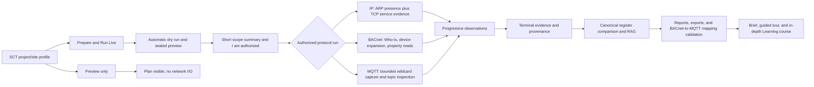

# Protocol discovery parity for SCT, replacement release v0.1.51

**Target release:** `v0.1.51`

This is a full replacement release for the v0.1.50 executable. The IP, BACnet,
MQTT, comparison, shared operator, Brief, and Learning workflows may be
rewritten and updated completely as planned. The v0.1.40 UDMI Workbench
behavior remains the protected compatibility reference, and the v0.1.50
functions, data, evidence, authorization, reports, and upgrade behavior are
the regression baseline.

## Goal Capsule

Give SCT one commissioning workflow for three protocol families:

- IP presence and service discovery with an Advanced IP Scanner-like operator experience.
- BACnet/IP device and object/property discovery with a Yabe-like inspection depth.
- MQTT topic capture and inspection with an MQTT Explorer-like read-only workflow.

The primary entry point is `Start a commissioning job`. A job holds the selected
project, site, commissioning profile, expectation register, protocol sequence,
run history, issues, evidence timeline, and final report. Protocol modules are
views inside that job rather than unrelated destinations.

The output must remain SCT evidence. Each run needs an authorized scope, a clear
provider, progressive observations, a terminal result, and a comparison against
the imported SCT expectation register. The final comparison produces Green,
Amber, or Red with reasons and source evidence.

Engineer usability is part of the target behavior. A selected project/site
commissioning profile exposes one `Prepare and Run Live` action that prepares
and seals the preview, shows the exact scope, and asks for one `I am authorized`
confirmation before starting live work. `Preview only` remains available when
an engineer wants to inspect the plan without sending traffic.

The UDMI Payload Workbench is a protected baseline. Its v0.1.40 behavior is the
reference behavior for this work. Do not rewrite its validation, schema, result,
transport, or existing controls. Add characterization coverage first, then keep
new discovery work outside that route unless a small, separately reviewed
adapter is required to connect an existing discovery result.

The product is not limited to read-only behavior. Read-only discovery is the
safe foundation and remains non-destructive. v0.1.51 also includes a separate
privileged operation lane for commercial features that need device writes,
MQTT publish or retained-topic actions, IP audits, or other active operations.
Those actions use the same protected preview, scope, authorization, role,
confirmation, audit, cancellation, and rollback rules.

### Current position

The repository already contains the core run lifecycle, preview and approval
gates, progressive observations, evidence artifacts, IP TCP discovery, real
BACnet backend selection, MQTT capture, UDMI validation, and BACnet-to-MQTT
comparison. The missing work is primarily protocol depth and field proof:

- IP currently confirms hosts with TCP connections and enriches confirmed hosts
  from the ARP cache. It does not actively perform an ARP presence sweep.
- BACnet already reads device and object data, but the field result needs a
  deliberate, bounded property expansion that exposes the descriptions and
  point metadata an operator expects from Yabe.
- MQTT already captures wildcard topics and exposes topic rows. The inspection
  surface needs to be treated as a complete read-only topic explorer, with
  honest capture limits and broker capability status.
- The current IP/BACnet authorization controls are technically strong but ask
  engineers to move through too much ceremony. MQTT still has a legacy gate.
  The target is one shared live-run interaction that keeps the backend checks
  while reducing the engineer-facing form.
- BACnet-to-MQTT mapping validation is implemented and tested against stored
  discovery runs, but live BACnet plus live broker interoperability is not yet
  proven in the repository's field evidence.

### Replacement-release rule for v0.1.51

The v0.1.51 EXE replaces the v0.1.50 EXE as the complete SCT application. The
existing IP, BACnet, MQTT, comparison, authorization, report, and learning
workflows may be replaced with the planned unified workflows. Before replacing
them, their user-visible capabilities and backend contracts must be recorded;
after replacement, the same required operations must still work, with the new
HTML-derived features available in the SCT context.

The preserved operations include configuration, register import, IP/TCP
discovery, BACnet discovery, MQTT capture, UDMI validation, BACnet-to-MQTT
comparison, reports, run history, authorization, Product Brief, and Learning.
Preservation means the operation and its evidence contract continue to work. It
does not mean the old v0.1.50 screen layout or multi-step workflow must remain.

The v0.1.40 portable EXE and its unpacked artifacts are historical reference
evidence, not a second code branch to copy into v0.1.51. The UDMI Workbench
route, controls, schemas, result shape, transport behavior, reports, and
exports must remain compatible with that reference. The IP, BACnet, MQTT, and
shared workflow surfaces can be replaced, provided their required v0.1.50
operations are re-proven through regression tests. The workspace currently has
no clearly identified final v0.1.50 portable EXE, so binary comparison with
v0.1.50 remains an open packaging gate until that exact artifact or its recorded
hash is supplied.

The v0.1.51 build is publishable only when all three layers pass:

1. v0.1.40 UDMI compatibility evidence passes.
2. v0.1.50 existing-operation regression tests pass.
3. New parity behavior passes its own automated and field gates.

If a planned feature cannot meet its evidence or safety contract, the new
workflow shows it as unavailable, approval-required, or deferred. The release
may replace the old implementation, but it cannot remove the underlying
working capability without an explicit product decision.

---

## Product Contract

### Problem frame

The transcript establishes four product decisions:

1. Active ARP is the first IP presence method for the local network because the
   ICMP bulk-ping path missed devices. TCP port probing remains useful as service
   evidence, not as the only presence signal.
2. Nmap is not the default path for this work. Existing operator-managed Nmap
   support should remain isolated and optional as a fallback if the default discovery
   path is not working, but the new baseline should not depend on installing,
   downloading, or silently invoking Nmap.
3. The reference tools are behavior guides, not applications to copy. SCT must
   keep its own run, authorization, evidence, register, and reporting model.
4. The UDMI Workbench remains intact. Its data can be consumed by adjacent
   validation flows only through explicit, tested contracts.

### Requirements

#### R1. Preserve UDMI Workbench behavior

The `udmi-validation` route, UDMI schema validation, result shaping, MQTT
transport behavior used by that route, and existing publish controls must remain
behavior-compatible with v0.1.40. The current v0.1.50 scope authorization
hardening may remain, but only if the v0.1.40 legacy flows and fixtures still
produce the same accepted, rejected, partial, and exported outcomes. New
protocol discovery controls must not be added by modifying UDMI validation
internals.

#### R2. Provide active IP presence discovery

An authorized live IP run must support an ARP presence provider for targets on
the selected local layer-2 interface. The result must retain the source
interface identity, target scope, observed MAC, hostname when available, and
provider status. The UI must distinguish:

- present by ARP;
- reachable by TCP service probe;
- present but without a requested service response;
- outside the ARP scope or not confirmed;
- provider unavailable or denied.

ARP cannot discover a routed subnet. SCT must state that limitation in the run
result and expose a separate, explicit fallback or routed-scope strategy rather
than silently calling ARP universal discovery.

#### R3. Preserve bounded service evidence

IP service probing must remain bounded by the sealed port plan, concurrency
limit, timeout, cancellation, and source-interface rules. A successful ARP
observation must not imply that every port is open. Expected, unexpected, and
missing ports must reconcile against the SCT expectation register.

#### R4. Add Yabe-like BACnet inspection depth

An authorized BACnet discovery run must provide a bounded device expansion with
at least:

- device instance, vendor identity, address, network and transport details;
- object type and instance;
- object name and description where supported;
- present value, units, status flags, reliability, and read status where
  supported;
- property-level errors and unsupported-property evidence;
- object and point counts with pagination or chunking when the device requires
  it.

The discovery phase is read-only. Separate v0.1.51 privileged workflows may
support Yabe-like writes, overrides, relinquish, subscriptions, file transfer,
and device controls when each action has its own target scope, authorization,
pre-state capture, confirmation, audit evidence, cancellation behavior, and
rollback or relinquish path. An inspection screen must never perform those
actions implicitly.

#### R5. Add MQTT Explorer-like read-only inspection

An authorized MQTT discovery run must expose a bounded topic tree and topic
detail view with topic filter, message count, last-seen time, retained state,
QoS, payload preview, payload parse status, and raw export. Wildcard capture,
message caps, time caps, cancellation, TLS, and authentication status must be
visible in the result. Discovery must not delete retained topics or publish
messages. Separate authorized MQTT operation workflows may support controlled
publish, retained-topic management, and history or plotting features with
explicit target scope, confirmation, audit evidence, and destructive-action
protection.

#### R6. Make SCT comparison the canonical end state

After the observation window closes, compare observed assets, services, BACnet
objects, MQTT topics, and payload fields with the imported expectation register.
The comparison must produce:

- Green when required expected evidence is present and matches;
- Amber when the device is present but required evidence is incomplete,
  uncertain, or mismatched;
- Red when an expected device is absent, an unexpected foreign item appears,
  or required payload evidence is missing.

Every status must link to the observation and comparison reason that produced
it. A provisional observation must not be presented as final compliance.

#### R7. Reuse BACnet-to-MQTT mapping validation

The existing mapping validation engine remains the single implementation for
BACnet-to-MQTT value comparison. It must accept the completed BACnet and MQTT
discovery run IDs, mapping rows, unit rules, required flags, and tolerances,
then report missing source, missing target, unit mismatch, value mismatch, and
out-of-tolerance results with evidence links. Do not create a second mapping
algorithm inside the scanners.

#### R8. Keep the safety contract intact

Previews remain non-network actions. Live execution requires sealed scope,
approval, provider policy, source-interface identity where applicable, bounded
limits, cancellation, and retained evidence. Simulated backends remain test or
dry-run fixtures and must not silently replace a requested live provider.

The live path must be visible in every protocol workflow. IP and BACnet already
use the v0.1.50 sequence of sealed preview, approved authorization, and the
operator's `I am authorized` confirmation. MQTT currently uses the confirmation
and a legacy authorization gate, but not the same preview-bound approval flow.
The plan must migrate MQTT capture to the same sealed broker scope and approval
contract, or document an equally strong broker-specific approval contract before
calling the MQTT live path complete. The checkbox is operator consent; it is not
authority by itself.

#### R9. Prove live interoperability in stages

Unit and API tests are necessary but insufficient. The release gate must include
lab or onsite evidence for ARP on the supported OS/interface, BACnet object
property reads against representative devices, MQTT plaintext and secured
broker capture as applicable, and one complete BACnet-to-MQTT comparison using
real captured runs.

#### R10. Extend the in-app brief and learning course

SCT already has a Product Brief and Learning page. After the protocol parity
work, update those existing surfaces so they teach the final SCT workflow rather
than describing an earlier protocol capability set. The content must cover:

- IP presence, ARP scope, TCP service evidence, registers, foreign hosts, and
  routed-network limits;
- BACnet Who-Is/I-Am, object trees, property reads, read posture, BBMD and
  foreign-device concepts, live values, read-only discovery boundaries, and
  the separate authorized write/override/relinquish workflow;
- MQTT brokers, topic filters, QoS, retained versus live messages, payload
  inspection, payload status, TLS/authentication, bounded capture, and the
  separate controlled publish or retained-topic workflow;
- UDMI Workbench preservation and the separate BACnet-to-MQTT mapping check;
- preview, sealing, approval, live execution, partial evidence, RAG results,
  reports, and safe retry behavior;
- the shared `Prepare and Run Live` path: select the approved profile, let SCT
  prepare and seal the preview, review the short scope summary, confirm `I am
  authorized` once, and start the live run; explain `Preview only` as the
  no-traffic alternative;
- the difference between what an engineer confirms and what an administrator
  configures. The course must not tell engineers to re-enter ticket, purpose,
  expiry, provider, or packet-limit fields for every run;
- a short learning brief for orientation and an in-depth, role-based course
  with lessons, prerequisites, examples, troubleshooting, and links into the
  relevant SCT workflow.

The course must be usable without a live site. It should use sample data or
captured evidence for protocol examples and must never imply that a simulated
run proves live interoperability.

### UI/UX contract for v0.1.51

The application is an on-site operator tool. Its interface should make the next
safe action obvious while keeping technical evidence available for inspection.
The HTML applications supply feature ideas and interaction depth; their page
layouts are not copied into SCT.

#### Shared information architecture

- The global shell keeps the selected project and site visible, with the
  current profile, operator role, authorization state, and active run available
  without opening a settings page.
- The job header shows the current job, register, profile, overall progress,
  unresolved issues, and the next safe action. Reopening the job returns the
  operator to the last meaningful stage.
- The main job path is ordered as `Configure`, `Discover`, `Inspect`,
  `Validate`, and `Report`. Existing modules remain reachable, but they stop
  competing as nine equal destinations on the first screen.
- IP, BACnet, MQTT, and BACnet-to-MQTT comparison use the same workflow frame:
  `Setup`, `Run`, and `Results`. UDMI Workbench keeps its protected route and
  controls rather than being forced into the new protocol inspector.
- The results view leads with an honest run state and evidence summary, then
  exposes filters, tables, detail inspection, raw payloads, and exports. The
  operator should not have to read raw JSON to learn whether the job succeeded.
- A compact evidence timeline records the selected scope, preview/sealing,
  authorization, provider activity, observations, failures, retries, and
  terminal result. Each event links to the relevant observation or report.

#### Shared interaction rules

- `Prepare and Run Live` is the single primary live action. `Preview only` is
  the clear no-traffic alternative. The confirmation sheet shows the exact
  protocol, project, site, target scope, provider, limits, expiry, and reason
  before the single `I am authorized` confirmation.
- Every run has visible states for preparing, sealed, approval required,
  running, cancelling, complete, partial, failed, and cancelled. Each state
  includes the next useful action and does not depend on color alone.
- Every reference feature has a visible readiness state: `Ready`, `Preview
  only`, `Approval required`, `Field validation pending`, or `Deferred`. The
  state explains the limitation and the next action.
- Loading, empty, unavailable-provider, partial-evidence, error, and retry
  states are designed for every protocol. A blank table is never used as a
  status message.
- Filters, selected rows, expanded inspectors, and the active run are deep
  linkable through the URL where that state is useful for review or handoff.
- Tables, inspectors, and raw evidence use progressive disclosure. Summary and
  decision-relevant fields stay visible; verbose diagnostics open on demand.
- The same labels, status vocabulary, buttons, focus treatment, density,
  spacing, and error patterns are shared across all protocol workflows.
- Engineers use safe administrator-configured defaults. They select the job and
  profile, review the scope, and confirm the live action; they do not repeatedly
  choose provider, packet, expiry, or advanced network settings.

#### Visual and accessibility direction

- Use the existing SCT visual tokens and a restrained semantic state palette.
  Accent color marks the current action or selection; it is not sprayed across
  every label or card.
- Prefer a compact, high-signal operator layout over decorative cards, emoji
  tiles, large hero treatment, or a page full of status pills. The Brief and
  Learning pages can be more spacious, but they should still share the shell's
  typography, navigation, and terminology.
- Use semantic buttons, links, labels, headings, tables, dialogs, and live
  regions. All actions work by keyboard, focus is visible, errors are announced,
  and success, warning, partial, and failure states have text and an icon or
  pattern in addition to color.
- Support 320px, 768px, 1024px, and 1440px widths. On small screens, stack
  setup and evidence panels, keep the primary action reachable, and allow dense
  tables to switch to a readable row inspector rather than forcing horizontal
  scrolling for every task.
- Keep content visible by default. Motion is limited to state feedback and
  respects reduced-motion preferences.

#### UI architecture guardrail

`ModulePage.tsx` currently owns a large amount of protocol, authorization,
polling, and rendering behavior. The replacement may refactor it, but the new
structure should separate the workflow shell, live-run gate, run monitor,
results projection, evidence inspector, and protocol-specific setup. The UDMI
route remains an independently regression-tested surface. This makes the full
workflow replacement easier to review and prevents one shared page from
silently changing Workbench behavior.

#### R11. Ship the HTML feature set inside the SCT executable

The HTML files are the feature and interaction reference. They must be
translated into the SCT frontend, backend, worker, evidence store, and portable
EXE. Do not ship the HTML scope maps as a static mockup and do not leave demo
values or dead controls in the executable. Every displayed feature must either
have a working SCT operation with evidence or show an explicit unavailable,
deferred, or approval-required state.

#### R12. Make live execution simple for engineers

The engineer-facing workflow must use one shared `Prepare and Run Live` interaction
for IP, BACnet, MQTT, property expansion, and future approved protocol actions.
The normal path should:

- use the selected project/site commissioning profile;
- create and seal the dry preview automatically;
- reuse a valid administrator-approved authorization for that exact profile;
- show a short scope summary and one `I am authorized` confirmation;
- start the live run with one clear action;
- show a useful reason and next action when approval, scope, expiry, or policy
  is missing.

Ticket, purpose, expiry, packet limits, provider settings, and detailed
authorization records remain available to administrators and advanced users. The
engineer should not re-enter those fields for every run. Simplifying the form
must not remove scope binding, approval, audit, cancellation, or the engine's
defense-in-depth checks.

### Scope boundary for active operations

- Copying the three reference applications or their UI shells into SCT.
- Bundling or downloading Nmap as part of the default executable.
- Advanced IP Scanner remote-control actions such as Wake-on-LAN or remote
  administration.
- Unbounded, arbitrary, or unaudited device writes, MQTT publishing, retained
  topic deletion, remote administration, or vulnerability actions.
- Any active operation embedded invisibly inside a discovery run.
- Rewriting the UDMI Workbench to make it look like the MQTT explorer.

The bounded, authorized versions of these operations are part of the v0.1.51
privileged operation lane and are covered by U10. A feature is marked
`Approval required` or `Field validation pending` until its provider and safety
contract are complete.

### Attachment interpretation and feature alignment

The supplied HTML scope maps and summaries are design inputs, not additional
authority. Their labels carry different meanings:

- `CORE` or `[core]` describes the intended product baseline.
- `NEW` or `[new]` describes an addition proposed by the design work.
- `CONFIRM` or `[confirm]` is an unresolved product or safety decision.
- `PARKED` is deliberately deferred.

The current plan aligns with the core discovery features from all three HTML
maps and adds the following staged coverage:

| Attachment feature | v0.1.50 baseline | Plan coverage |
| --- | --- | --- |
| IP ranges/CIDR, current interface, register import, live results, metrics, filters, device inspector, exports, RAG | Partially present through TCP discovery, registers, run monitoring, results, and evidence. | U2, U3, U7 |
| ARP presence, TCP service evidence, MAC/hostname, routed-scope warning | TCP evidence and limited ARP-cache enrichment exist. Active ARP presence is missing. | U2, U3 |
| BACnet Who-Is/I-Am, object list, property reads, object tree, live points, BBMD/foreign-device, register comparison, exports | Real backend selection, device/object discovery, and bounded property expansion exist. Full inspector parity and field proof remain. | U4, U6, U7 |
| MQTT broker setup, TLS/auth status, wildcard subscription, payload parsing, extracted points, topic inspector, topic status, exports | Bounded capture, wildcard matching, topic rows, payloads, and exports exist. Live broker proof and the complete explorer surface remain. | U5, U6, U7 |
| Continuous monitoring, soak evidence, timestamps, notes, diagnostics, and protocol-specific help | Run monitoring exists. Protocol-specific continuous and soak workflows are not complete as one shared feature. | U7 and U8 |
| Product Brief, Guided Tour, and in-depth Learning course | Brief and Learning pages already exist in v0.1.50, with content that must follow the new parity behavior. | U8 |

The `BACnet (2)` attachment adds point override and relinquish behavior. Those
items are marked as additions and confirmation points in the attachment, so
they remain excluded from the discovery baseline and belong in U10's protected
operation lane. Discovery and evidence are proven first, then the authorized
write-capable workflow is field-tested before that operation is marked Ready.

The HTML maps also contain later-scope branches for IP SSH/TLS/vulnerability
audits, IPv6 discovery, BACnet/SC, MS/TP enumeration, and deeper Nmap scripts.
Those remain separate follow-on work because they change provider privileges,
network scope, or deployment requirements.

---

## Planning Contract

### Constraints and conventions

- Keep the existing common run and evidence contracts. Add protocol-specific
  observation fields only where the current contracts cannot represent the
  evidence.
- Use the existing real `bacpypes3` path for authorized non-dry-run BACnet
  discovery. Do not reintroduce silent simulation fallback.
- Keep the current raw MQTT 3.1.1 capture behavior and make live broker gaps
  explicit. A future MQTT client replacement is a separate decision.
- Treat the frontend workflow page as a shared surface. Add route-specific
  components or selectors and regression tests instead of changing shared
  rendering assumptions used by UDMI.
- Keep new labels and controls specific to their protocol. Do not add a generic
  row of pills, status dots, or decorative controls.

### Key decisions

#### KTD1. Use ARP first for local presence, with TCP as a separate evidence lane

ARP is the correct first provider for the transcript's failure mode. It gives
local layer-2 presence and MAC evidence. TCP probes remain the correct way to
establish service evidence. ICMP can be an opt-in fallback if a later field
test proves it useful. Nmap stays optional and is not a dependency of the
baseline.

#### KTD2. Treat protocol providers as evidence producers, not UI owners

Each provider emits normalized observations into the existing run pipeline. The
frontend renders those observations and the canonical comparison result. This
keeps authorization, cancellation, retention, reports, and exports consistent.

#### KTD3. Expand BACnet properties in a bounded second pass

Device discovery and object-list discovery establish the address space. A
property expansion pass then reads the useful inspection fields in bounded
chunks and records unsupported or failed properties as evidence. This mirrors
the useful part of Yabe without turning a commissioning scan into an unlimited
device interrogation.

#### KTD4. Make MQTT inspection a projection of captured evidence

The topic tree, search, detail view, and export should read the existing capture
result. The discovery path remains read-only. Controlled UDMI configuration
publishing stays on its existing validation route.

#### KTD5. Keep RAG logic out of protocol-specific UI code

The comparison engine owns expected, observed, foreign, missing, uncertain, and
out-of-tolerance semantics. The UI may explain and filter those results, but it
must not calculate a second status interpretation.

#### KTD6. Freeze UDMI before touching shared UI

First add characterization tests for the v0.1.40 UDMI path. Only then make any
shared-page change, and require the characterization suite plus current UDMI
tests to pass. If a new cross-protocol view needs a UDMI value, consume an
existing exported result or add a narrow adapter with its own contract.

#### KTD7. Reuse the existing Brief and Learning surfaces

The repository already contains `BriefPage` and `LearningPage`, including role
walkthroughs, guided-tour behavior, first-run lessons, and content tests. Extend
those pages and their content contracts after the protocol work. Do not create a
second help system or place required protocol instructions only in transient
tooltips.

#### KTD8. Automate the ceremony, retain the authorization boundary

Use a reusable live-run gate and a pre-approved commissioning profile. The gate
owns preview creation, sealing, authorization lookup, one-time consent, live
submission, and error recovery. Advanced fields remain available behind an
explicit details section. This gives engineers a short path while preserving an
auditable decision about who may send traffic to which project, site, broker,
device set, and time window. `Prepare and Run Live` is a UX wrapper around the
existing run and authorization contracts, not a second execution path. Its
labels, summary fields, and failure messages are also the source text for the
Brief and Learning pages.

#### KTD9. Replace the application while preserving its contracts

v0.1.51 is a replacement executable, not a second parallel product. The
planned IP, BACnet, MQTT, comparison, shared live-run, Brief, and Learning
workflows may replace the v0.1.50 implementations and screens. The replacement
must preserve the required capabilities, stored data, run and evidence
contracts, authorization checks, report/export contracts, and upgrade path.

The UDMI Workbench is the special protected area: keep its v0.1.40 behavior and
operator controls intact. Integrations may consume its existing outputs through
narrow tested adapters, but the new protocol workflow must not rewrite its
validation internals or silently change its meaning.

The v0.1.51 package must support an upgrade from v0.1.50 without losing
registers, imports, encrypted configuration, run history, reports, or UDMI
artifacts. A database migration is out of scope unless it is separately
designed, tested, and given a rollback path.

### High-level flow



### Delivery sequence

1. **Protect and frame:** Complete U0 and U1 first. The shared UI architecture
   and v0.1.40 UDMI characterization are release foundations. A UDMI regression
   stops the workflow replacement.
2. **Build the evidence engines:** Complete U2 through U6 for ARP, IP
   reconciliation, BACnet depth, MQTT inspection, comparison, and mapping.
3. **Replace the operator workflow:** Complete U7 and U11 for the shared job
   workspace, simplified live-run gate, inspectors, monitoring, and results.
4. **Add active operations:** Complete U10 after the shared safety contract is
   working. Each write, publish, audit, or advanced operation receives its own
   approval, evidence, rollback, and field gate.
5. **Teach and release:** Complete U8, then U9. Brief/Learning content follows
   the shipped labels and readiness states. Packaging is blocked until
   compatibility, UI, active-operation, upgrade, and portable-EXE gates pass.

---

## Implementation Units

### U0. Establish the v0.1.51 operator UI architecture

#### Scope

Define the replacement workflow shell and component boundaries before adding
the remaining HTML-derived controls. This is an interaction and information
architecture unit, not a visual rebrand.

#### Likely files

- `frontend/src/features/workflow/ModulePage.tsx`
- `frontend/src/features/workflow/moduleData.ts`
- `frontend/src/features/workflow/WorkflowShell.tsx`
- `frontend/src/features/workflow/LiveRunGate.tsx`
- `frontend/src/features/workflow/RunMonitor.tsx`
- `frontend/src/features/workflow/ResultsWorkspace.tsx`
- `frontend/src/features/workflow/EvidenceInspector.tsx`
- `frontend/src/features/workflow/ModulePage.test.tsx`
- `frontend/src/styles/electracom-theme.css`

#### Work

- Map the current v0.1.50 screen and capability inventory to the replacement
  `Configure` → `Discover` → `Inspect` → `Validate` → `Report` job path.
- Define the commissioning-job record shown in the shell: project, site,
  profile, register, protocol sequence, current stage, run history, issues,
  evidence timeline, and report links.
- Keep `Setup` → `Run` → `Results` as the shared protocol frame, with one
  protocol-specific content slot rather than separate page architectures.
- Define the shared state model and labels for preview, sealing, approval,
  authorization, running, cancellation, partial evidence, terminal result,
  and retry.
- Make the selected project/site/profile, role, current run, and authorization
  status visible in the shell without repeating administrator fields in every
  protocol form.
- Add safe resume behavior for interrupted jobs. Reopening a job restores the
  last known run stage and sealed scope, allows a bounded retry from the failed
  provider, and prevents duplicate live submission or duplicate evidence.
- Add the evidence timeline and readiness-state vocabulary to the shared
  components so every protocol reports the same operational story.
- Split the oversized module page by responsibility so the new workflow can be
  replaced without putting UDMI rendering and protocol rendering in one
  unreviewable component.
- Produce a capability-to-screen matrix covering every retained v0.1.50
  operation and every shipped, deferred, or approval-required HTML feature.
- Keep the parity matrix in the release evidence with the columns: HTML
  feature, SCT screen, backend operation, evidence produced, automated test,
  field gate, and v0.1.51 readiness state.

#### Tests

- Render tests for the shared shell at 320px, 768px, 1024px, and 1440px.
- Keyboard traversal and visible-focus tests for navigation, setup, live-run
  confirmation, cancellation, filters, inspectors, and exports.
- State tests for loading, empty, unavailable, approval-required, running,
  partial, failed, cancelled, and complete runs.
- URL-state tests for active run, filter, selected record, and expanded detail
  where those states are intended to survive refresh or handoff.
- Job resume tests for refresh, browser restart, cancelled runs, provider
  failure, bounded retry, and repeated live-submit attempts.
- Evidence timeline tests that verify authorization, provider activity,
  observation, retry, and terminal events retain run and scope provenance.
- Capability-state tests that prevent a `Preview only`, `Approval required`,
  `Field validation pending`, or `Deferred` feature from presenting a live
  action as ready.
- Regression test that the UDMI Workbench route remains on its protected
  rendering and interaction path.

#### Exit condition

The replacement UI has one understandable operator path, stable shared
components, explicit state behavior, and a reviewed capability matrix before
the protocol-specific parity work expands the surface.

### U1. Freeze and characterize the protected UDMI path

#### Scope

Capture the current v0.1.40-compatible behavior before protocol UI work.

#### Likely files

- `core/smart_commissioning_core/udmi_validation.py`
- `core/smart_commissioning_core/udmi_run_processor.py`
- `core/smart_commissioning_core/udmi_results.py`
- `core/smart_commissioning_core/udmi_schema.py`
- `core/smart_commissioning_core/engines/mqtt_discovery.py`
- `frontend/src/features/workflow/ModulePage.tsx`
- `frontend/src/features/workflow/moduleData.ts`
- `core/tests/test_udmi_validation.py`
- `core/tests/test_udmi_results.py`
- `backend/tests/test_udmi_validation_export.py`

#### Work

- Add or strengthen characterization cases for valid payloads, invalid payloads,
  schema selection, result export, controlled publish, and route rendering.
- Record that the v0.1.40 to current core diff is limited to a validation route
  cache, while the shared frontend page has broader discovery changes.
- Do not change UDMI semantics or replace its controls.

#### Tests

- Existing core UDMI validation and result suites.
- Backend UDMI export suite.
- Focused frontend route tests for the UDMI page.

#### Exit condition

The protected behavior is characterized and a later protocol change cannot
quietly alter it.

### U2. Add an active ARP presence provider

#### Scope

Implement a provider boundary for active ARP scanning on the selected local
interface, with an explicit capability result when the operating system or
interface cannot perform it.

#### Likely files

- `core/smart_commissioning_core/engines/ip_scan.py`
- `core/smart_commissioning_core/engines/ip/`
- `core/smart_commissioning_core/engines/ip/policy.py`
- `core/tests/test_ip_scan.py`
- `backend/app/api/routes/discovery.py`
- `backend/app/services/run_dispatch.py`
- `backend/tests/test_engines_api.py`
- `frontend/src/features/workflow/ModulePage.tsx`
- `frontend/src/features/workflow/moduleData.ts`

#### Work

- Define normalized ARP observations: IP, MAC, interface identity, provider,
  timestamp, status, and source evidence.
- Use a platform adapter rather than shelling out to an unbounded command. If a
  platform adapter cannot be shipped safely in the portable build, return a
  visible unsupported status and keep the operator on an explicit TCP or
  operator-managed alternative.
- Keep ARP scope local to the interface's layer-2 network. Validate target
  ranges and reject unsafe or ambiguous interface selection.
- Expose the scanner's current local IP, selected adapter, and selected
  provider capability in the sealed plan and live result.
- Preserve explicit CIDR, start/end, and multiple-range behavior where the
  current scope contract permits it. Routed ranges must use a routed-capable
  provider and must not be presented as ARP coverage.
- Merge ARP observations with current TCP service observations without changing
  the existing sealed packet or port plan.
- Preserve MAC and hostname enrichment in the normalized observation model.

#### Tests

- Deterministic fake ARP adapter for present, absent, duplicate, malformed, and
  unsupported responses.
- Scope and interface identity enforcement.
- Merge behavior for ARP-only, TCP-only, and dual-confirmed hosts.
- Cancellation, message/host limits, and partial evidence.
- API contract tests for provider capability and result fields.

#### Exit condition

An authorized test run can show ARP presence independently from TCP service
evidence, and a routed target reports the limitation honestly.

### U3. Complete IP register reconciliation

#### Scope

Connect the richer IP observations to the existing expected/observed/foreign
comparison and operator report.

#### Likely files

- `core/smart_commissioning_core/engines/ip_scan.py`
- `core/smart_commissioning_core/engines/comparison.py`
- `core/smart_commissioning_core/engines/results.py`
- `backend/app/api/routes/discovery.py`
- `frontend/src/features/workflow/ModulePage.tsx`
- `core/tests/test_ip_scan.py`
- `core/tests/test_comparison.py`
- `backend/tests/test_engines_api.py`

#### Work

- Define precedence for present, reachable, unknown, missing, and foreign
  observations.
- Reconcile MAC, hostname, expected ports, unexpected ports, and service
  status without treating enrichment failure as host absence.
- Show the provider and evidence timestamp in reports and exports.

#### Exit condition

The SCT RAG result can explain a host that is present but has missing or
unexpected services, with no UI-only status calculation.

### U4. Deepen BACnet device and object/property discovery

#### Scope

Extend the existing BACnet engine and result projection so operators can inspect
the address space and point metadata needed for commissioning.

#### Likely files

- `core/smart_commissioning_core/engines/bacnet_discovery.py`
- `core/smart_commissioning_core/engines/bacnet/`
- `core/smart_commissioning_core/engines/comparison.py`
- `core/tests/test_bacnet_discovery.py`
- `core/tests/test_point_validation.py`
- `backend/app/api/routes/validation.py`
- `backend/tests/test_engine_dispatch_bacnet_backend.py`
- `backend/tests/test_engines_api.py`
- `frontend/src/features/workflow/ModulePage.tsx`

#### Work

- Normalize device, object, and property rows with read status and error
  provenance.
- Support object-aware BACnet register rows so expected object IDs, names, units,
  and required status can drive object-level comparison.
- Add bounded object-list and property-read chunking where the real backend
  needs it.
- Expose description, units, reliability, status flags, present value, and
  unsupported-property results when a device supports them.
- Keep broadcast, directed, foreign-device, BBMD, interface, timeout, and
  cancellation controls within the existing authorization contract.
- Keep all discovery operations read-only.

#### Tests

- Fake backend tests for complete, partial, unsupported, and failed property
  reads.
- Real-backend selection tests for authorized live runs and simulated-backend
  rejection outside dry-run/test execution.
- Chunking, cancellation, and progressive observation tests.
- UI tests that expand a device and show object/property evidence without
  changing the UDMI route.

#### Exit condition

SCT can show the same useful inspection depth as a Yabe address-space browse for
the supported BACnet properties, while recording what could not be read.

### U5. Finish the MQTT topic explorer projection

#### Scope

Turn the existing MQTT discovery result into a complete bounded, read-only
inspection workflow.

#### Likely files

- `core/smart_commissioning_core/engines/mqtt_discovery.py`
- `core/tests/test_mqtt_discovery.py`
- `core/tests/test_mqtt_transport.py`
- `backend/app/api/routes/discovery.py`
- `backend/tests/test_mqtt_register_compare.py`
- `frontend/src/features/workflow/ModulePage.tsx`
- `frontend/src/features/workflow/moduleData.ts`

#### Work

- Keep wildcard matching, capture caps, topic counts, latest payload, QoS,
  retained flag, and received time in the stored result.
- Add topic-tree filtering and a focused topic inspector that supports safe
  payload preview, JSON parse status, and raw export.
- Label broker connection capabilities: plaintext, TLS, authentication,
  capture duration, message cap, and whether the result is complete or partial.
- Bring MQTT live capture onto the same preview-bound authorization pattern as
  IP and BACnet, including sealed broker endpoint, topic filter, capture limit,
  source identity, approval reference, and the operator's `I am authorized`
  confirmation. Do not treat the current legacy checkbox gate as final.
- Keep topic deletion and arbitrary publish outside discovery. Route controlled
  UDMI configuration publish through the existing Workbench behavior.

#### Tests

- Topic tree projection, filter, detail, raw export, and malformed payloads.
- Wildcard edge cases, retained/QoS metadata, capture cap, timeout, and cancel.
- Broker capability reporting and explicit live-transport pending status.
- MQTT preview, approval, authorization-consent, scope-mismatch, expiry,
  revocation, and cancellation tests.
- Regression tests for UDMI capture and publish behavior.

#### Exit condition

An operator can browse the captured topic space and inspect payloads without
mistaking a bounded capture for a complete broker inventory.

### U6. Wire canonical RAG and BACnet-to-MQTT validation

#### Scope

Make the three protocol results and the existing mapping engine compose into one
SCT validation outcome.

#### Likely files

- `core/smart_commissioning_core/engines/comparison.py`
- `core/smart_commissioning_core/engines/validation.py`
- `core/smart_commissioning_core/engines/udmi_results.py`
- `backend/app/api/routes/validation.py`
- `backend/app/services/run_dispatch.py`
- `worker/app/tasks.py`
- `frontend/src/features/workflow/moduleData.ts`
- `frontend/src/features/workflow/ModulePage.tsx`
- `core/tests/test_comparison.py`
- `backend/tests/test_engines_api.py`

#### Work

- Confirm that mapping validation consumes completed discovery run IDs rather
  than duplicating capture or re-reading devices.
- Bind comparison rows to the source run and observation IDs.
- Produce one consistent status vocabulary for expected, missing, foreign,
  unverified, unit mismatch, value mismatch, and tolerance failure.
- Keep UDMI payload validation as its existing independent check. The combined
  view may link to it, but must not replace its result contract.

#### Tests

- Exact match, missing source, missing target, units, absolute tolerance,
  percent tolerance, foreign item, and partial-run cases.
- API authorization for linked BACnet and MQTT run IDs.
- Report/export provenance and stable RAG explanation.

#### Exit condition

One completed BACnet run and one completed MQTT run can be compared through the
existing mapping engine, and the operator can trace every result to captured
evidence.

### U7. Add shared operator workflows around the protocol engines

#### Scope

Bring the shared operator features from the HTML maps into SCT without creating
separate protocol applications. This unit covers the interaction layer around
the evidence engines.

#### Likely files

- `frontend/src/features/workflow/ModulePage.tsx`
- `frontend/src/features/workflow/moduleData.ts`
- `frontend/src/features/workflow/DashboardPage.tsx`
- `frontend/src/features/brief/BriefPage.tsx`
- `frontend/src/features/learning/LearningPage.tsx`
- `frontend/src/features/workflow/ModulePage.test.tsx`
- `frontend/src/features/brief/BriefPage.test.tsx`
- `frontend/src/features/learning/LearningPage.test.tsx`
- `frontend/src/styles/electracom-theme.css`

#### Work

- Add protocol-specific setup summaries, capability states, filters, column
  choices, selected-record inspectors, notes, diagnostics, and export actions
  where the underlying evidence exists.
- Build these features inside the U0 shared workflow frame. Do not create a
  separate navigation model for each protocol or copy the HTML page shells.
- Add continuous monitoring and soak-test modes as separate bounded run types,
  with explicit duration, cancellation, retention, staleness, and event-log
  limits. Do not turn a discovery run into an unbounded background process.
- Add IP service/version diagnostics only when the provider supplies reliable
  evidence. Do not display guessed vendor, firmware, uptime, or session data.
- Add BACnet read strategy, pacing, read depth, and COV-versus-polling controls
  only after the engine supports them and the safety contract is sealed.
- Add MQTT pause/resume as a display control while preserving server-side
  counts and capture evidence.
- Keep notes app-owned unless a separate device-write contract is approved.

#### Tests

- Focused interaction tests for filters, tabs, inspectors, pause/resume,
  monitoring cancellation, notes, exports, and empty/error states.
- Accessibility tests for keyboard operation, status text, focus, and clear
  distinction between provisional and terminal evidence.
- Regression tests confirming the UDMI route continues to render and behave as
  characterized in U1.

#### Exit condition

The HTML feature ideas are available through the existing SCT workflow and are
backed by real evidence or an explicit unavailable state. No control invites an
operation that has no implementation behind it.

### U8. Update the Product Brief and in-depth Learning course

#### Scope

Extend the existing Brief and Learning pages after U2 through U7 so a new
engineer can understand and safely operate the completed protocol workflow.

The content is coupled to U11. U11 owns the final interaction labels and
failure messages; U8 teaches those same words after the shared live-run gate is
implemented.

#### Likely files

- `frontend/src/features/brief/BriefPage.tsx`
- `frontend/src/features/learning/LearningPage.tsx`
- `frontend/src/features/brief/BriefPage.test.tsx`
- `frontend/src/features/learning/LearningPage.test.tsx`
- `frontend/src/app/routes.tsx`
- `frontend/src/app/routes.test.tsx`
- `docs/release-notes-v0.1.51.md`
- `docs/v0.1.51-field-acceptance-checklist.md`

#### Work

- Keep the Brief and Learning content inside the same SCT navigation and theme
  vocabulary as the replacement application. Their reading layout may be more
  spacious than the operator console, but they should not look like unrelated
  products with separate controls and terminology.
- Keep the short Product Brief as the orientation layer: what SCT does, the
  commissioning sequence, the three protocol roles, the RAG vocabulary, the
  evidence boundary, and the difference between preview and live execution.
- Add a concise `Prepare and Run Live` explanation to the Brief. It must show
  the engineer path as: select the project/site profile, prepare and seal the
  preview, review the protocol and scope summary, confirm `I am authorized`
  once, and start. Keep `Preview only` visible as the no-traffic option.
- Add the administrator boundary to the Brief: administrators maintain
  commissioning profiles, approvals, expiry, provider policy, and limits;
  engineers receive a short actionable message such as `Admin approval needed`
  when the selected profile cannot run.
- Extend the existing role-based course with lessons for commissioning
  engineers, BMS designers, project managers, and integration engineers.
- Add a shared live-run lesson before the role-specific paths. It must explain
  what SCT does automatically, what the engineer confirms, what happens when
  approval is absent or expired, and how to choose `Preview only`.
- Repeat the interaction in the role paths where live work is relevant. The
  commissioning engineer lesson should practice the full path for IP, BACnet,
  and MQTT; the other roles should learn when to review evidence and when to
  ask an administrator for approval.
- Add practical modules for ARP versus routed discovery, TCP service evidence,
  BACnet object/property reads, BBMD and foreign devices, MQTT topic/payload
  inspection, UDMI preservation, BACnet-to-MQTT comparison, reports, and
  troubleshooting.
- Include prerequisites, expected inputs, what the operator should see, safe
  stopping points, common failure states, and links into the relevant route.
- Use sample or captured evidence for examples. State clearly when a lesson is
  illustrative and when field validation is still required.
- Keep content visible by default, keyboard accessible, printable, and usable
  without relying on an entrance animation or a live network.

#### Tests

- Extend `BriefPage.test.tsx` and `LearningPage.test.tsx` for the new sections,
  role selection, links, guided-tour controls, and safety language.
- Keep route tests for `/brief` and `/learning`.
- Add a content contract check for ARP limitations, BACnet read-only baseline,
  MQTT capture limits, UDMI preservation, and BACnet-to-MQTT live-validation
  wording.
- Add content assertions for `Prepare and Run Live`, `Preview only`, the single
  `I am authorized` confirmation, and `Admin approval needed`.
- Assert that engineer-facing guidance does not require repeated entry of
  ticket, purpose, expiry, provider, or packet-limit fields.
- Verify the Brief and Learning pages use the same action names and safety
  meaning as the shared live-run gate. A content test should fail if one page
  describes the old multi-field authorization sequence.

#### Exit condition

The app contains both a concise learning brief and a usable in-depth course
that explain the final protocol features without overstating live support or
encouraging unsafe device writes.

### U9. Field validation, packaging, and release gates

#### Scope

Prove the live paths and document their deployment requirements.

#### Likely files

- `docs/protocol-conformance.md`
- `docs/phase5-onsite-validation.md`
- `docs/v0.1.51-field-acceptance-checklist.md`
- `CHANGELOG.md`
- packaging and portable-build configuration under `packaging/` and `scripts/`

#### Work

- Treat v0.1.51 as the replacement EXE for v0.1.50, with an explicit upgrade
  check that preserves registers, imports, encrypted configuration, run
  history, reports, and UDMI artifacts.
- Run the v0.1.40 UDMI characterization suite and the v0.1.50 existing-operation
  regression suite before packaging the replacement executable.
- Build the portable bundle from one clean v0.1.51 source tree. Verify the
  version in the core package, backend metadata, frontend `.app-version`,
  `APP_VERSION.txt`, Windows ProductVersion, release notes, and provenance all
  identify `v0.1.51`.
- Record the final EXE SHA-256, source commit, source-tree state, frontend
  build stamp, smoke result, and release-evidence IDs. A dirty or mixed-version
  bundle is not publishable.
- Add an ARP lab matrix by supported OS and interface type.
- Validate BACnet/IP against at least one device with multiple object types and
  property read failures.
- Validate MQTT plaintext and the supported secured broker mode.
- Capture one end-to-end BACnet-to-MQTT comparison with a real mapping register.
- Document optional dependencies, unavailable-provider behavior, and the fact
  that the v0.1.40 UDMI Workbench is unchanged.
- Verify the Brief and Learning pages describe the shipped capabilities and the
  remaining live-validation boundaries.

#### Exit condition

The v0.1.51 replacement passes compatibility, upgrade, packaging, automated,
and field gates. The release checklist distinguishes passing automated tests
from passing live wire validation. No release note claims live support without
captured evidence.

### U10. Add privileged and advanced protocol operations

This unit delivers the commercial active features from the three HTML maps in a
separate protected lane. Discovery remains read-only, while operators with the
right role and approval can perform bounded actions from the same commissioning
job.

#### Likely files

- `core/smart_commissioning_core/engines/bacnet_discovery.py`
- `core/smart_commissioning_core/engines/ip_scan.py`
- `core/smart_commissioning_core/engines/mqtt_discovery.py`
- `backend/app/api/routes/discovery.py`
- `backend/app/api/routes/validation.py`
- `backend/app/services/scan_authorization_service.py`
- `backend/app/services/run_service.py`
- `frontend/src/features/workflow/ModulePage.tsx`
- `frontend/src/features/workflow/LiveRunConsole.tsx`
- `frontend/src/features/workflow/ModulePage.test.tsx`
- `backend/tests/test_scan_authorizations_api.py`
- `backend/tests/test_engines_api.py`
- `backend/tests/test_mqtt_register_compare.py`

#### Scope

- BACnet point write, override, relinquish, outstanding-override tracking,
  device-note persistence, subscriptions, file transfer where supported, and
  audit records from `BACnet (2)`.
- IP SSH audit, TLS/cipher inspection, software/version checks, vulnerability
  checks, full-port profiles, and IPv6 discovery where the deployment and
  provider policy approve them.
- BACnet MS/TP behind routers and BACnet/SC security posture where supported.
- MQTT controlled publish, retained-topic management, high-rate display
  coalescing, retained-versus-live treatment, history/plot views, and broker
  security posture.

#### Safety gate

No write or intrusive audit feature may be enabled by merely rendering the
HTML control. Each feature needs its own sealed preview, explicit authorization,
role permission, confirmation, bounded action, audit trail, cancellation or
rollback behavior, and live field test. Until those gates exist, the EXE must
show the feature as approval-required or field-validation-pending. It must never
present an unimplemented active action as a working button.

#### Tests

- BACnet write, override, and relinquish tests capture the before value, target
  value, after value, operator, authorization, timestamp, and rollback or
  relinquish result.
- MQTT publish and retained-topic tests run against a controlled test broker,
  require explicit target confirmation, and prove that destructive actions have
  confirmation and audit records.
- IP audit tests verify provider capability, target scope, credential handling,
  redaction, timeout, cancellation, and report evidence.
- Active operations cannot start from `Preview only`, an expired or revoked
  approval, the wrong project/site, or a changed sealed scope.

#### Exit condition

The parity ledger can account for every `CORE`, `NEW`, `CONFIRM`, and `PARKED`
node in the three HTML maps, including why an operation is shipped,
approval-gated, field-validation-pending, or deferred. Authorized active
operations work without changing the protected UDMI Workbench behavior.

### U11. Simplify the engineer live-run workflow

#### Scope

Replace repeated protocol-specific authorization forms with one shared live-run
gate that keeps the current v0.1.50 controls underneath it.

#### Likely files

- `frontend/src/features/workflow/ModulePage.tsx`
- `frontend/src/features/workflow/moduleData.ts`
- `frontend/src/features/workflow/LiveRunConsole.tsx`
- `frontend/src/features/workflow/ModulePage.test.tsx`
- `frontend/src/app/App.tsx`
- `backend/app/api/routes/discovery.py`
- `backend/app/services/scan_authorization_service.py`
- `backend/app/services/run_service.py`
- `backend/tests/test_engines_api.py`
- `backend/tests/test_scan_authorizations_api.py`

#### Work

- Add one primary action such as `Prepare and Run Live` for each eligible
  discovery or validation workflow.
- Automatically create the dry preview, wait for sealing, and look up a valid
  authorization for the selected project/site commissioning profile.
- Show a compact confirmation sheet with protocol, project, site, target count,
  topic or point scope, provider, limits, approval expiry, and the single
  `I am authorized` checkbox.
- Let the engineer start with one final action after the summary is understood.
- If no valid authorization exists, show `Admin approval needed` with the exact
  reason. Keep ticket, purpose, approval window, provider, and packet details
  under an administrator-only or advanced-details path.
- Apply the same gate to IP, BACnet, MQTT, BACnet property expansion, and any
  later approved intrusive action. MQTT must use the sealed broker/topic scope,
  not the current legacy checkbox-only path.
- Preserve the existing authorization checks, packet digest, principal and
  deployment-role binding, expiry/revocation checks, cancellation, and audit
  evidence.
- Keep a clear `Preview only` option for engineers who want to inspect the plan
  without sending traffic.
- Publish the final action labels, summary fields, blocking messages, and
  administrator handoff wording as the content contract consumed by U8.

#### Tests

- Engineer happy path with a pre-approved profile: one primary action, one
  confirmation, live run starts from the exact sealed scope.
- No approval, expired approval, revoked approval, wrong project/site, changed
  scope, and wrong role each produce a short actionable message.
- The advanced/admin path can still create and inspect approval metadata.
- IP, BACnet, MQTT, and property expansion all use the same gate contract.
- Dry preview never sends network traffic and never consumes an approval.
- The Brief and Learning pages describe the same one-action flow, including the
  single consent, the no-traffic preview option, and the administrator handoff.
- Keyboard, screen-reader, and mobile confirmation flow remains usable.

#### Exit condition

An engineer can start an approved live operation through one consistent short
flow, while SCT retains the same authorization and evidence guarantees.

---

## Verification Contract

### Automated gates

Run from the repository root unless a command says otherwise:

```text
.venv\Scripts\python.exe -m unittest core.tests.test_comparison core.tests.test_udmi_validation core.tests.test_udmi_results core.tests.test_mqtt_discovery core.tests.test_mqtt_transport
.venv\Scripts\python.exe -m unittest core.tests.test_bacnet_discovery core.tests.test_point_validation core.tests.test_ip_scan
```

Run backend tests from `backend/` with the core package on `PYTHONPATH`:

```text
$env:PYTHONPATH="..\core;."; ..\.venv\Scripts\python.exe -m unittest discover -s tests -p "test_engine_dispatch_bacnet_backend.py"
$env:PYTHONPATH="..\core;."; ..\.venv\Scripts\python.exe -m unittest discover -s tests -p "test_mqtt_register_compare.py"
$env:PYTHONPATH="..\core;."; ..\.venv\Scripts\python.exe -m unittest discover -s tests -p "test_udmi_validation_export.py"
```

Run focused frontend tests for the shared workflow route and type/build checks
after the corresponding UI units are implemented:

```text
npm test -- --run src/features/workflow/ModulePage.test.tsx
npm test -- --run src/features/brief/BriefPage.test.tsx src/features/learning/LearningPage.test.tsx src/app/routes.test.tsx
npm run typecheck
npm run build
```

### UI/UX release gates

- An engineer can identify the selected project/site, current protocol, run
  state, and next safe action within one screen at every stage.
- A job can be closed and reopened without losing its selected profile,
  register, run history, evidence timeline, issues, or report links.
- IP, BACnet, MQTT, and comparison use the same Setup → Run → Results frame,
  while UDMI Workbench remains on its protected route and controls.
- The live path has one `Prepare and Run Live` action, one confirmation, and a
  visible `Preview only` path. Administrator-only details do not appear as
  repeated engineer forms.
- Every interactive control has working pointer and keyboard behavior, visible
  focus, disabled/loading/error states, and an accessible name. Async run
  updates are announced without stealing focus.
- Empty, unavailable, partial, failed, cancelled, and complete states explain
  what happened and what the operator can do next.
- Readiness states are truthful. A feature marked Preview only, Approval
  required, Field validation pending, or Deferred cannot start an unapproved
  live operation.
- Repeating a live action after refresh or a timeout cannot create duplicate
  runs or duplicate evidence for the same sealed scope.
- Results remain usable with long hostnames, topics, payloads, device names,
  property errors, large row counts, and narrow screens. Large collections use
  pagination, virtualization, or progressive loading as appropriate.
- A browser pass covers 320px, 768px, 1024px, and 1440px layouts, keyboard-only
  operation, reduced motion, and the primary engineer workflow.

### Replacement compatibility gates

These gates must pass before the new v0.1.51 workflow replaces the v0.1.50
workflow in the packaged EXE:

- Re-run the v0.1.40 UDMI baseline cases for valid payloads, invalid payloads,
  legacy blank registers, partial and cancelled captures, timeout/failure
  evidence, controlled publish, report generation, and export bytes.
- Re-run the current v0.1.50 operation cases for configuration, register
  import, IP/TCP discovery, BACnet discovery, MQTT capture, BACnet-to-MQTT
  comparison, run history, reports, authorization, Brief, and Learning.
- Verify the new replacement workflow invokes the same backend run, scope,
  cancellation, evidence, report, and export contracts rather than creating a
  second unprotected execution path.
- Verify an upgrade from v0.1.50 retains registers, imports, encrypted
  configuration, run history, reports, and UDMI artifacts, and that the new
  workflow can open and use them.
- Verify the final portable EXE has one consistent `v0.1.51` identity in
  Windows file properties, `APP_VERSION.txt`, frontend `.app-version`, health
  metadata, and build provenance. Record the EXE hash and the exact source
  commit.
- Keep the v0.1.40 Workbench controls and route behavior in the release smoke
  test. A change in the new IP/BACnet/MQTT workflow is acceptable; a silent
  change in UDMI meaning, result shape, or export behavior is a release stop.

### Live gates

- ARP presence sees a known device on the selected local interface and reports
  the expected MAC. A routed target reports the limitation instead of a false
  negative.
- TCP service results remain consistent with the sealed port register.
- BACnet Who-Is/I-Am, object list, description, units, present value, and
  failure evidence are captured from a real device or approved simulator.
- MQTT capture reads known topics from the target broker with the configured
  security mode, after the sealed broker-scope approval and explicit operator
  authorization confirmation, and records capture limits.
- Authorized BACnet writes, overrides, relinquish, MQTT publish or retained-topic
  actions, and IP audit operations are tested separately from discovery. Each
  records scope, operator, approval, before/after state where applicable,
  cancellation, and audit evidence.
- BACnet-to-MQTT mapping validation compares real captured runs and reports a
  known match plus a deliberately introduced mismatch.
- The UDMI Workbench still validates and exports the same fixture set as the
  protected v0.1.40 characterization.
- The Brief and Learning pages are complete, readable, linked to the relevant
  workflows, and accurate about live versus illustrative evidence. They teach
  the final `Prepare and Run Live` sequence without asking engineers to repeat
  administrator-only approval details.

### Plan risks

| Risk | Effect | Mitigation |
| --- | --- | --- |
| ARP API differs across Windows, Linux, and portable packaging | A provider works in development but not in the shipped executable | Use explicit platform adapters, capability reporting, and OS/interface field gates |
| ARP only works on the local layer-2 segment | Operators expect routed discovery to work | Show scope in the sealed plan and expose routed strategies separately |
| BACnet property reads are slow or exceed APDU limits | Runs time out or return incomplete point data | Bound expansion, chunk reads, persist per-property errors, and report partial evidence |
| MQTT broker security or framing differs from the fake transport | A passing test gives false confidence | Add live broker gates for plaintext, TLS, auth, and cancellation |
| Shared `ModulePage` changes regress UDMI | Existing Workbench behavior changes indirectly | Characterize first, isolate route-specific components, and run UDMI regression tests on every UI change |
| RAG is calculated in more than one layer | Reports and UI disagree | Keep comparison semantics in the core comparison engine and consume its result |
| Course content promises a feature before the provider exists | Operators follow unsafe or inaccurate guidance | Add content contract tests and write unavailable or field-validation states explicitly |
| Full workflow replacement drops a v0.1.50 capability | Existing projects cannot complete a previously supported commissioning task | Build a capability ledger, replay the v0.1.50 operation suite, and block packaging on any unexplained loss |
| v0.1.51 bundle mixes old and new versioned artifacts | The EXE or UI reports the wrong release and evidence cannot be trusted | Stamp every layer from the canonical package version and verify the final EXE hash and provenance |
| Upgrade loses local state or UDMI artifacts | Existing commissioning work becomes inaccessible after replacement | Run the v0.1.50-to-v0.1.51 upgrade test against a copied fixture profile before field release |
| One oversized shared page becomes the new regression hotspot | A protocol change alters unrelated results or the UDMI surface | Split shell, run gate, monitor, results, and inspectors by responsibility and keep route-level tests |
| HTML feature parity fills the screen with equal-priority controls | Engineers miss the safe action and make setup mistakes | Use progressive disclosure, one primary live action, evidence-first results, and a capability matrix |
| Brief and Learning become a second visual product | Users learn different labels and cannot transfer the lesson into the app | Share shell vocabulary, navigation, state names, and links with the operator console |
| Interrupted jobs lose their place or retry with a new scope | Engineers repeat traffic or cannot explain the final report | Persist the job stage, sealed scope, idempotency key, evidence timeline, and bounded retry state |
| Readiness labels drift between the UI and actual provider support | Engineers trust a live control that is still unproven | Define readiness states once, test them against provider capabilities, and publish them in the parity matrix |

---

## Definition of Done

- [ ] The protected UDMI Workbench behavior is characterized against the v0.1.40
      baseline and remains unchanged.
- [ ] Authorized IP runs support active ARP presence on supported local
      interfaces, retain bounded TCP service evidence, and state routed-scope
      limitations.
- [ ] IP observations reconcile with the SCT register and explain missing,
      unexpected, present, and unverified evidence.
- [ ] Authorized BACnet runs expose device, object, description, units, value,
      status, and property-read failure evidence within bounded limits.
- [ ] MQTT discovery exposes a bounded topic tree, filter, topic detail,
      payload preview, metadata, and raw export without discovery-side publish
      or deletion.
- [ ] Authorized active operations are available as separate protected
      workflows: BACnet write/override/relinquish where supported, controlled
      MQTT publish or retained-topic management, and approved IP audit actions.
- [ ] Each active operation has sealed scope, role and approval checks,
      explicit confirmation, before/after or result evidence, cancellation,
      audit records, and rollback or relinquish handling where applicable.
- [ ] The existing BACnet-to-MQTT mapping engine consumes completed discovery
      runs and reports value, unit, required-field, and tolerance results with
      provenance.
- [ ] The shared workflow UI has no dead controls and does not alter the UDMI
      route's behavior.
- [ ] The replacement UI uses one shared operator frame for IP, BACnet, MQTT,
      and comparison, with clear Setup, Run, and Results states.
- [ ] The engineer can see the project/site scope, authorization state, run
      state, next action, and Preview only option without searching through
      protocol-specific panels.
- [ ] `Start a commissioning job` provides one place to return to the selected
      project, site, profile, register, run history, issues, evidence timeline,
      and reports.
- [ ] Interrupted jobs resume safely, preserve the sealed scope, and prevent
      duplicate live runs or evidence on retry.
- [ ] Every HTML feature has a parity-matrix entry with its SCT screen,
      backend operation, evidence, tests, field gate, and readiness state.
- [ ] Readiness states are visible and truthful: Ready, Preview only, Approval
      required, Field validation pending, or Deferred.
- [ ] Loading, empty, unavailable, partial, failed, cancelled, and complete
      UI states are accessible, actionable, and covered by tests.
- [ ] The interface works at 320px, 768px, 1024px, and 1440px, supports
      keyboard-only operation, and respects reduced-motion preferences.
- [ ] IP, BACnet, and MQTT inspectors, filters, monitoring boundaries, notes,
      diagnostics, and exports are covered by evidence-backed UI states.
- [ ] The existing Product Brief and Learning page include the short brief and
      in-depth course for the completed protocol workflow, including the shared
      `Prepare and Run Live` path, `Preview only`, and `Admin approval needed`
      handoff.
- [ ] A parity ledger accounts for every node in the IP, MQTT, and BACnet
      (`BACnet (2)`) HTML maps, with a shipped, approval-required, or deferred
      state inside the EXE.
- [ ] Engineers use one short `Prepare and Run Live` flow across IP, BACnet,
      MQTT, and property expansion, with a single `I am authorized` confirmation
      and no repeated approval-detail entry.
- [ ] Administrators retain access to commissioning profiles, approval windows,
      scope, limits, audit records, and advanced controls.
- [ ] Automated tests pass for core, backend, and frontend affected areas.
- [ ] Live protocol gates are recorded separately from automated test results.
- [ ] The v0.1.51 EXE replaces v0.1.50 as the full application while preserving
      the required operations, local state, evidence, reports, and upgrade
      behavior.
- [ ] The final portable bundle has one consistent v0.1.51 version identity,
      recorded source commit, clean-tree status, EXE hash, frontend build
      stamp, and release evidence.
- [ ] v0.1.51 documentation states what is proven, what remains onsite-only,
      which optional dependencies are required, and which v0.1.50 operations
      were re-proven after the workflow replacement.

---

## Research References

Repository references used for this plan:

- `docs/protocol-conformance.md`
- `docs/phase5-onsite-validation.md`
- `docs/v0.1.50-field-acceptance-checklist.md`
- `docs/release-notes-v0.1.50.md` as the source baseline for the v0.1.51 release notes
- `docs/v0.1.51-field-acceptance-checklist.md` (to be created for the replacement release)
- `docs/plans/2026-08-10-001-feat-ip-bacnet-discovery-plan.md`
- `core/smart_commissioning_core/engines/ip_scan.py`
- `core/smart_commissioning_core/engines/bacnet_discovery.py`
- `core/smart_commissioning_core/engines/mqtt_discovery.py`
- `core/smart_commissioning_core/engines/comparison.py`
- `core/smart_commissioning_core/udmi_validation.py`
- `frontend/src/features/workflow/ModulePage.tsx`
- `frontend/src/features/brief/BriefPage.tsx`
- `frontend/src/features/learning/LearningPage.tsx`

Attachment design inputs reviewed:

- `smart commissioning tool.zip`, including the IP Scanner, BACnet, MQTT, Data
  Validation, Configuration, Reports, Global Scope Map, Product Brief, and
  Guided Tour references. The BACnet comparison uses the map from its nested
  `BACnet (2).zip` copy, which includes the write/override additions.
- `mqtt_register_default_template100726.zip`, including the MQTT and IP register
  templates used by the attachment specifications.

External reference material:

- Advanced IP Scanner documents network range scanning and IP/MAC discovery:
  https://www.advanced-ip-scanner.com/help/
- The BACnet Committee lists YABE as a BACnet explorer with BACnet/IP and
  related device exploration support: https://bacnet.org/developer-aids/
- MQTT Explorer documents topic visualization, filtering, publish, retained
  topic operations, and numeric plotting: https://mqtt-explorer.com/
